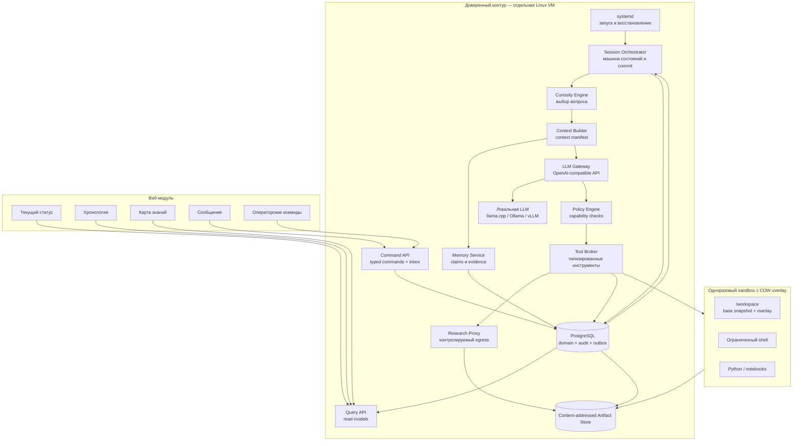
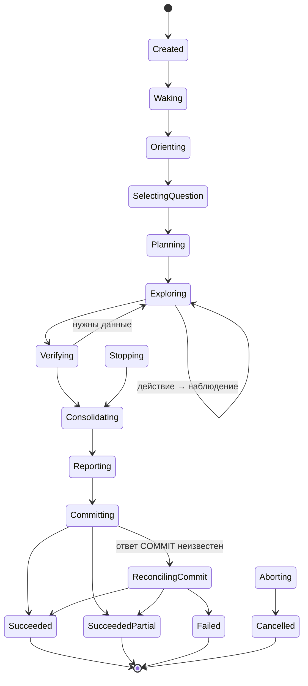

# NOEZEMA — Architecture Draft

> Status: draft v0.20  
> Language: Russian  
> Purpose: describe the target architecture of a local-first autonomous thinker focused on curiosity, verifiable learning, persistent memory, safe action, and human-observable operation.

## 0. Что изменилось

### v0.20

Версия 0.20 приводит host resume к тому же принципу транзиентности, что и остальная система:

- `resume_blocked` достижим только из permanent/inconsistent исхода; недоступность БД остаётся в `retry_wait` с длинным backoff бессрочно и разрешается сама;
- crash-loop самого resume unit отделён от «БД не отвечает» и получает собственный исход `resume_degraded`;
- подраздел host-transition journal пронумерован и стал ссылаемым;
- назван механизм, которым web читает состояние юнитов в degraded mode.

### v0.19

Версия 0.19 превращает host resume из набора unit-настроек в проверяемый протокол:

- runtime target получил явные `PartOf=` semantics, обязательный admission checker и безопасный повторный start;
- machine-readable `ConsistsOf` стал единственным inventory runtime members вместо разбора `list-dependencies`;
- retry budget задан полностью, а start limit используется как circuit breaker, не как скрытая машина состояний;
- host transitions получили fsync-safe локальный журнал, terminal handler, out-of-band alert и audited `resume_blocked → resolved`;
- web остаётся доступным в read-only degraded mode и показывает host recovery даже при остановленном cognitive runtime.

### v0.18

Версия 0.18 закрывает последнее место, где отказ восстановителя останавливал всю систему:

- resume unit перезапускается ограниченное число раз и при исчерпании попыток переходит в `resume_blocked` с critical alert вместо молчаливо лежащего узла;
- корректность старта перенесена в сами runtime-юниты: resume unit только триггер, поэтому ручной старт не обходит проверки;
- зафиксирован baseline systemd 249 с перечислением зависящих конструкций;
- список knowledge-writer units выводится из `noezema-runtime.target`, а не держится отдельно.

### v0.17

Версия 0.17 закрывает эксплуатационные и verification-пробелы offline-смены правил:

- maintenance оформлен как systemd-owned scope с exclusive ownership, marker до остановки runtime и fail-closed recovery;
- результат полной проверки cohort сохраняется как immutable verification seal; финальная транзакция сравнивает только его O(1)-поля;
- UUIDv5 namespace и каноническая сериализация invalid-вопросов стали неизменяемой частью system identity;
- bootstrap migration стала атомарной, hash-pinned и защищённой startup/role invariants.

### v0.16

Версия 0.16 делает offline-смену правил исполнимой на растущем корпусе и закрывает точки входа:

- `offline_activation_max_claims` убран: он ограничивал транзакцию, в которой cohort не участвует, и при росте корпуса запирал единственную операцию, ради которой существует этап 3a;
- проверка полноты cohort вынесена из финальной транзакции; внутри остались только O(1)-сравнения manifest hash, head count и revision;
- задано создание bootstrap snapshot и первой строки `runtime_config_heads` первой миграцией;
- host maintenance lock получил конкретный механизм в systemd-юнитах;
- зафиксирован namespace детерминированных UUIDv5 для invalid-вопросов.

### v0.15

Версия 0.15 делает оба режима смены правил исполнимыми и синхронизирует MVP-границы:

- offline MVP получил advisory lock, deterministic candidate identity и атомарный flip вместе со всеми invalid-вопросами;
- повтор offline-скрипта продолжает тот же candidate либо подтверждает уже committed результат, не создавая следующую config;
- repair runner использует отдельный post-cleanup CAS, а не activation lease, который уже очищен;
- возраст effective repair backlog включён в авторитетный scheduler admission с явным bypass;
- stale MVP maintenance runner удалён из online-раздела;
- schema, recovery, GC roots, failpoints, acceptance criteria, stages и README приведены к разделению offline 3a / online 3b.

### v0.14

Версия 0.14 убирает из MVP онлайн-активацию правил и достраивает оставшуюся 3b-машинерию:

- смена rules version в MVP выполняется offline при остановленном узле: без lease, fence, activating pointer и repair runner, потому что конкурировать не с кем;
- fenced online activation §8.7.2 целиком отнесена к 3b, где появляется reassessment worker — единственная причина её сложности;
- repair runner получил admission, место в lock order и SLO на backlog;
- `config_snapshots.activation_scope` удалён как дублирующий источник истины;
- таблица lock set дополнена admission-транзакциями worker-а и repair runner;
- критерии 24, 25 и 27 перенесены из MVP в v1, добавлен MVP-критерий offline-смены правил.

### v0.13

Версия 0.13 делает config activation единой fenced-машиной состояний и закрывает блокирующие реализацию противоречия v0.12:

- эффективная конфигурация теперь определяется только `runtime_config_heads.active_config_snapshot_id`, а не значением workflow-state;
- atomic flip переводит candidate в `post_publish`; `active` наступает лишь после post-publish manifest;
- runtime head хранит единственного activating candidate, lease и монотонный fencing token на scope;
- session creation, activation и worker quiesce синхронизируются через runtime-head lock и общий writer gate;
- `post_publish_blocked` освобождает activation admission и не оставляет узел на pause;
- recovery классифицирует crash по паре runtime pointers/state и отсекает stale activator;
- runnable-предикат reassessment job задан через effective runtime pointer и отсутствие activating candidate.

### v0.12

Версия 0.12 закрывает последние расхождения между заявленными гарантиями и компонентами, которые их обеспечивают. Дальнейшее уточнение спекулятивных подсистем откладывается до появления работающего MVP:

- reassessment worker останавливается на время activation, что снимает гонку между подготовкой shadow head и инвалидацией assessment;
- условия допуска планировщика знают про незавершённую activation, `reconciling_commit` и `blocked` barrier;
- у activation появилось терминальное состояние отказа после flip, не парализующее узел;
- определены `prepared_by` и `runtime_config_heads.scope`;
- исход evaluation run разведён на `passed | failed | insufficient_sample`.

### v0.11

Версия 0.11 доводит revision и rules activation до реализуемой модели данных:

- scalar `domain_revision` заменён явным vector из knowledge и dependency-graph revisions во validation, staging, commit attempt, fencing и checkpoint;
- lock order сформулирован как частичный порядок; barrier processor блокирует и обновляет knowledge revision, одновременно проверяя graph revision;
- rules activation получила shadow assessment heads и атомарный global config-head flip вместо несовместимых с батчами массовых UPDATE claims;
- assessment lifecycle перенесён из mutable полей claim в версионируемые heads, которые являются источником истины;
- лимиты консолидации покрывают новые и существующие claims и evidence, проверяются до записи staging-команды и участвуют в расчёте host reserve;
- invalid после ужесточения правил создаёт исследовательский вопрос; человек нужен только при нарушении инвариантов;
- §22.2 запускается после технической приёмки и завершает full acceptance; для type-specific gates введён минимальный размер выборки.

### v0.10

Версия 0.10 закрывает несогласованности, оставшиеся после v0.9:

- канонический порядок блокировок расширен на обе revision-строки, включая `dependency_graph`;
- у смены rules version в MVP появился исполнитель: одноразовый maintenance runner, описанный нормативно, а не в буллете этапа;
- `blocked` barrier не блокирует wake, симметрично `blocked` job;
- синхронные replacement assessments вошли в host reserve, добавлен предел затрагиваемых claims на сессию;
- §22.2 явно относится к полной приёмке, а не к MVP-серии;
- устранён дрейф про verifier-профиль в §5.5, §18 и README.

### v0.9

Версия 0.9 устраняет оставшиеся гонки восстановления и делает заявленный MVP действительно исполнимым:

- reconciliation использует блокировки строк и fencing, поэтому живой финальный commit нельзя ошибочно принять за rollback;
- после длительной недоступности БД редкие автоматические probes продолжаются; человек требуется для несогласованных записей, а не для обычного восстановления сервиса;
- poison reassessment job переводится в `blocked` и не останавливает несвязанные сессии;
- dependency barrier получил immutable closure manifest, durable progress cursor и crash-resume protocol;
- MVP включает минимальный explorer/curator loop, синхронную переоценку затронутых claims и консервативное source grouping;
- минимальный веб-срез MVP включает status, timeline, messages и безопасные controls;
- требование PostgreSQL 15 отделено от конкретных инвариантов partial unique indexes;
- acceptance criteria и failpoints проверяют новые concurrency/liveness гарантии.

### v0.8

Версия 0.8 закрывает liveness-дыры v0.7 и приводит объём первого шага в соответствие с заявленным MVP:

- reconciliation получила ограниченный автоматический retry: недоступность БД перестала быть равной порче записей;
- исход коммита определяется существованием prepared attempt, а не таймингом отправки COMMIT;
- голодание reassessment worker предотвращается условием допуска планировщика, а не только измеряется;
- reverse dependency closure вычисляется вне блокировки; внутрь транзакции попадают барьер и первый батч;
- определено поведение pending/invalid claims в context pack и переживание метки при усечении;
- статус `reconciling` внесён в жизненный цикл commit attempt;
- PostgreSQL 15 объявлен требованием, а не рекомендацией;
- этап 3 разделён на 3a и 3b: MVP не включает каскад, worker и resolutions;
- критерии §22.1 размечены на MVP-blocking и full-v1.

### v0.7

Версия 0.7 закрывает риски, найденные в v0.6:

- неопределённый исход PostgreSQL commit переводит сессию в reconciliation, а не в ложный `failed`;
- session commit получает приоритетный writer intent, reassessment worker — durable queue и не может бесконечно менять revision во время session validation;
- invalidation распространяется по reverse dependency closure;
- lifecycle assessment отделён от epistemic status;
- независимость эксперимента разделена на repeatability, reproducibility и independent replication;
- environment fingerprint заменён структурированным versioned manifest;
- counterevidence resolutions получили actor, audit basis, XOR/uniqueness constraints и каскадную invalidation;
- evidence identity опирается на content/provenance hash и per-kind constraints;
- operator transitions сведены в каноническую таблицу;
- MVP получил отдельный FIFO Question Selector, а reassessment SLO переведён из «следующей сессии» в wall-clock.

### v0.6

Версия 0.6 закрывает окна и неопределённости, оставшиеся после v0.5:

- определено состояние claim между инвалидацией и переоценкой: статус `unassessed`, запрет использования как evidence или зависимости;
- назван исполнитель переоценки — фоновый reassessment worker доверенного контура со своим actor, revision и правилом гонки с commit;
- снятие counterevidence стало отдельной аудируемой записью с собственным основанием, а не полем, которое может закрыть модель;
- независимость окружений для `empirical_conjecture` и `procedural` определена так же строго, как независимость источников;
- у уверенности один производитель: она вычисляется из assessment и хранится только там;
- диаграмма §6 согласована с текстом, `stop_gracefully` симметричен `abort_session` при неизвестном исходе действия;
- добавлены уникальность evidence и предикаты различности в правилах;
- `evidence_kind` вместо `verification_kind`, определены роли в `assessment_evidence`;
- описано поведение при исчерпании резерва на консолидацию;
- зафиксирован минимальный жизнеспособный срез v1.

### v0.5

Версия 0.5 уточняет контракты безопасности, доказательности и восстановления:

- идентификаторы model run, turn, action и idempotency key создаёт только доверенный контур; LLM больше не выбирает ключ дедупликации;
- evidence grade перенесён с отдельного evidence на версионируемый claim assessment по набору доказательств;
- реестр claim types стал машиночитаемым: заданы количества evidence, независимость, scope и AND/OR-условия;
- soft budget exhaustion отделён от обрыва внутри LLM/tool call;
- добавлены операционные пути `stop_gracefully` и `abort_session`;
- optimistic validation привязана к монотонной domain revision;
- heartbeat продлевает lease только при живом coordinator и непросроченном phase deadline;
- классы инструментов унифицированы, а завершение сессии вынесено из Tool Broker;
- independence groups версионируются и пересчитывают затронутые assessments;
- GC учитывает все ссылки доменной БД и backup manifests, а temporal facts поддерживают открытый `valid_to`.

### v0.4

Версия 0.4 закрывает дефекты, найденные при разборе v0.3:

- исчерпание бюджета стало штатным завершением с фиксацией уже проверенной работы, а не потерей всей сессии;
- введён закрытый реестр `claim_type` с минимальным evidence grade, допустимыми видами проверки и volatility;
- `session_staging` объявлен единственным механизмом изоляции незафиксированной работы;
- добавлены heartbeat lease, fencing-условие коммита и поглощающие терминальные состояния;
- тяжёлая валидация вынесена за пределы commit-транзакции;
- `independence_group` вычисляется детерминированно, а не заявляется моделью;
- инструменты объявляют класс идемпотентности и профили доступности, `model_runs` связан с действиями;
- retention манифестов привязан к глубине backup retention;
- в quality gates определены «значимый claim» и объём слепой ручной выборки.

### v0.3

Версия 0.3 зафиксировала решения, которые в v0.2 оставались противоречивыми или недостаточно операционными:

- источником правды выбрана транзакционная доменная модель; append-only журнал используется для аудита и доставки событий через outbox, без полного event sourcing в v1;
- фиксация сессии построена вокруг content-addressed workspace snapshot и одной транзакции `SessionCommitted`;
- вместо session-wide taint введены происхождение каждого фрагмента данных и неизменяемые capability-профили;
- уверенность в истинности отделена от свежести знания;
- определены типы проверок и уровни доказательств;
- веб-модуль разделён на Query API и Command API и не пишет напрямую в таблицы памяти или аудита;
- протокол завершения, машина состояний и обработка неопределённого исхода действий унифицированы;
- fingerprint локальной LLM и embedding-модели стал достаточным для воспроизводимости;
- критерии технической готовности отделены от оценки качества познания после серии сессий.

## 1. Идея проекта

NOEZEMA — автономный локальный мыслитель, который периодически пробуждается, выбирает неизвестный ему вопрос, исследует его, проверяет выводы, сохраняет знания с доказательствами и оставляет понятный отчёт для следующей сессии и человека-наблюдателя.

Проект сохраняет сильные стороны ранних экспериментов с автономным AI на сервере:

- дискретные сессии вместо непрерывного процесса;
- преемственность через внешнюю память;
- собственное рабочее пространство;
- свободу выбора интересов и направления исследования;
- наблюдаемость действий;
- возможность развивать идентичность и внутренние правила.

При этом NOEZEMA устраняет основные архитектурные проблемы исходного подхода:

- управляющий контур отделён от среды мыслителя;
- модель не исполняет команды непосредственно на хосте;
- действия передаются через типизированный протокол;
- знания отделены от субъективных воспоминаний;
- утверждения связаны с доказательствами и статусом проверки;
- история событий неизменяема;
- повторения определяются семантически, а не по хешам файлов;
- локальная LLM является основным, а не дополнительным режимом;
- текущее состояние и хронология доступны через веб-интерфейс.

## 2. Цели

### 2.1. Основные цели

1. Работать с локальной LLM через OpenAI-compatible API.
2. Накапливать новое для агента знание, а не только автобиографические заметки.
3. Хранить происхождение, доказательства и контраргументы для каждого значимого утверждения.
4. Выполнять действия только в изолированной среде.
5. Быть наблюдаемым и восстанавливаемым после сбоев.
6. Поддерживать общение с человеком без превращения каждого сообщения в безусловную команду.
7. Не зависеть от конкретной модели, поставщика или inference backend.

### 2.2. Не-цели первой версии

- доказательство наличия сознания или субъективного опыта;
- неограниченный доступ к хостовой системе;
- выполнение произвольных внешних действий от имени владельца;
- multi-agent orchestration ради самой сложности;
- обучение или дообучение основной LLM во время работы;
- публичное раскрытие скрытой chain of thought модели.

## 3. Архитектурные принципы

### 3.1. Свобода внутри ограниченного мира

Мыслитель свободен выбирать темы, создавать проекты, менять внутреннюю идентичность и организовывать своё рабочее пространство. Границы безопасности, планировщик, журнал событий и резервные копии находятся вне его контроля.

### 3.2. Управление отделено от мышления

LLM предлагает намерение и действие. Orchestrator и Policy Engine решают, можно ли выполнить действие и в какой среде.

### 3.3. Доменное состояние первично, аудит неизменяем

В v1 источником правды являются нормализованные доменные таблицы PostgreSQL: сессии, вопросы, утверждения, доказательства, сообщения и ссылки на workspace snapshots. Все изменения выполняются сервисами доверенного контура в транзакциях.

В той же транзакции записываются append-only `audit_events` и `outbox_events`. Журнал объясняет, что произошло, питает live timeline и интеграции, но восстановление доменной модели полным replay событий не является обязательным свойством v1. Это устраняет скрытую стоимость полноценного event sourcing: версионирование каждого события, replay, миграции исторических payload и rebuild всех проекторов.

### 3.4. Знание требует происхождения

Запись модели не становится фактом автоматически. Семантическая память хранит статус утверждения, уверенность, источники, контраргументы и историю проверок.

### 3.5. Локальная модель — штатный режим

LLM Gateway проектируется вокруг локального OpenAI-compatible endpoint. Поддержка удалённых моделей может быть добавлена позднее как сменный профиль.

### 3.6. Наблюдаемость без хранения скрытых рассуждений по умолчанию

Система сохраняет структурированный ответ модели, выбранное действие, краткую публичную мотивировку, результат инструмента, usage, latency и fingerprint конфигурации. Скрытая chain of thought не считается интерфейсом модели, доказательством или обязательной частью аудита.

Сырой ответ провайдера разрешён только в диагностическом профиле: он шифруется, имеет короткий срок хранения, закрыт от сайта и может быть полностью отключён. Обычный режим должен позволять воспроизвести решение по входному context manifest, действию, наблюдению и версиям конфигурации, не превращая базу в архив внутренних рассуждений.

Ключ диагностического профиля хранится вне PostgreSQL и вне резервных копий базы. Это защищает от кражи диска и утечки дампа, но не от компрометации живого хоста: модель угрозы здесь именно такая, и большего шифрование не даёт.

### 3.7. Верификация оценивает набор доказательств

Проверка подтверждает только то, что действительно измеряет. Совпадение цитаты доказывает целостность цитирования, но не истинность источника; два сайта могут копировать одну ошибку; успешный тест подтверждает результат лишь для зафиксированного окружения.

Отдельный evidence хранит наблюдение и способ его получения: `source_assertion`, `quote_integrity`, `experiment_run`, `computation`, `formal_check` или `local_observation`. Уровень E0–E4 не назначается отдельному evidence: он вычисляется claim assessment по набору evidence, их scope, independence groups и версии правил claim type.

`corroboration` и `replication` являются методами assessment над несколькими evidence. Operator attestation хранится отдельно и не повышает grade без новых проверяемых данных. Суждение verifier-роли само по себе статус claim не меняет.

## 4. Контекст системы



Сайт не имеет прямого write-доступа к доменным и audit-таблицам. Query API читает проекции, Command API валидирует сообщения и операторские команды, а read-only Host Status Adapter показывает локальный recovery journal, когда cognitive runtime или DB недоступны.

## 5. Компоненты

### 5.1. Supervisor

Отвечает только за жизненный цикл сервисов:

- запуск Orchestrator и веб-приложения;
- автоматическое восстановление после падения;
- корректное завершение;
- передачу минимальной конфигурации;
- health checks.

Предпочтительная реализация для одного узла — `systemd`. Lifecycle разделён: `noezema-runtime.target` управляет cognitive writers, а `noezema-web.service` остаётся отдельным observer plane и при остановленном runtime переходит в read-only degraded mode.

### 5.2. Session Orchestrator

Центральная машина состояний. Orchestrator:

- определяет момент пробуждения;
- создаёт сессию и lease;
- фиксирует fingerprint модели, embeddings, промптов, схем и политик;
- монтирует последний committed workspace snapshot как read-only base и создаёт COW overlay;
- вызывает фазы познавательного цикла;
- контролирует бюджеты времени, шагов и токенов;
- фиксирует результат одной транзакцией `SessionCommitted`;
- обнаруживает и очищает незавершённые сессии.

Orchestrator недоступен для изменения из sandbox.

#### 5.2.1. Расписание пробуждений

Расписание принадлежит доверенному контуру и недоступно из sandbox.

- Базовое расписание задаётся cron-подобным выражением с минимальным интервалом между сессиями.
- Перед запуском проверяются условия допуска: нет незавершённой сессии с живым lease, нет unresolved commit attempt, `runtime_config_heads.activating_config_snapshot_id IS NULL` для scope (§8.7.2; в MVP выполняется тривиально — offline-смена идёт при остановленном узле), свободна GPU-память под профиль модели, соблюдена дисковая квота, система не на operator pause.
- Этот список авторитетен: гарантия, заявленная в другом разделе, но не проверяемая здесь, не действует. Session creation блокирует runtime head, повторно проверяет admission и только затем привязывает неизменяемый `sessions.config_snapshot_id`; online activation acquisition берёт ту же строку раньше session row (§5.2.2).
- Что допуску само по себе **не** мешает: свежий `post_publish_blocked` snapshot до repair-age threshold, `blocked` reassessment job (§5.9.1), `blocked` или активный dependency barrier (§8.6). Безопасность держится на effective runtime pointer и на том, что затронутые claims не считаются current.
- Worker-age gate: возраст старейшего runnable dependency-critical reassessment job ниже `T_worker_admission`. Runnable означает `status IN ('queued','retry')`, `next_attempt_at <= now()` и неисчерпанный retry budget.
- Repair-age gate: возраст старейшего effective runnable post-publish repair backlog по `post_publish_blocked_at` ниже `T_repair_admission`. Runnable означает candidate остаётся effective, `activation_state='post_publish_blocked'`, manifest не завершён, activating slot пуст и `post_publish_next_attempt_at <= now()`.
- Если любой background gate превышен, пробуждение откладывается, пока соответствующий worker/repair runner не получит окно. Superseded repair backlog и poison job в `blocked` не участвуют в admission; они оставляют alert, но не останавливают несвязанные сессии.
- Если условия не выполнены, пробуждение пропускается с записью точной причины, а не ставится в очередь.
- После неудачной сессии применяется экспоненциальный backoff; после нескольких неудач подряд узел переходит в `paused`.
- Обычное `wake_now` обходит расписание, но не admission. `wake_now(bypass_background_gate=true, reason=...)` доступен оператору, аудируется и обходит только worker-age и repair-age gates; lease, unresolved commit, activation slot, quota, operator pause и fencing он не обходит.
#### 5.2.2. Граница фиксации сессии и commit reconciliation

Работа активной сессии не должна частично появляться в долговременной памяти.

1. Предложения изменить questions, claims, evidence и identity пишутся только в `session_staging`. Operational rows — session state, actions, model runs и audit выполненных шагов — фиксируются сразу.
2. Файлы пишутся в COW overlay. Артефакты сохраняются content-addressed; до commit они недостижимы из текущего workspace и долговременной памяти.
3. При завершении overlay замораживается и создаётся immutable workspace manifest с path, size и SHA-256 каждого объекта.
4. До тяжёлой валидации сессия регистрирует приоритетный writer intent (§5.9.1). Валидация выполняется против revision vector `{knowledge_revision, dependency_graph_revision}` и сохраняет обе компоненты, payload/rules hashes, independence snapshots и подготовленные assessments.
5. Orchestrator создаёт host-generated `commit_attempt_id` и durable строку `commit_attempts(status='prepared')`, связанную со staging hash и workspace manifest.
6. Финальная короткая транзакция берёт необходимое подмножество блокировок в каноническом порядке, проверяет fencing и обе компоненты revision vector, применяет staging, обновляет workspace pointer и соответствующие revisions, переводит attempt в `committed`, записывает checkpoint, terminal session state, audit и outbox.

Канонический **частичный** порядок блокировок общий для всей системы:

```text
runtime_config_heads(scope)
  → sessions
  → domain_revisions(scope='knowledge')
  → domain_revisions(scope='dependency_graph')
  → commit_attempts
```

Транзакция может пропускать ненужные строки, но все фактически взятые locks обязаны образовывать подпоследовательность этого порядка. Если поздно выяснилось, что нужна пропущенная строка, транзакция откатывается и начинается заново.

```text
операция                              lock set
ordinary session/worker write         knowledge
session creation                      runtime_config_head → session
worker admission check                runtime_config_head
repair runner batch                   runtime_config_head → knowledge
offline rules prepare                 knowledge
offline rules atomic publish          runtime_config_head → knowledge
session commit with edge changes      session → knowledge → dependency_graph → attempt
session commit without edge changes   session → knowledge → attempt
barrier invalidation batch            knowledge → dependency_graph
online rules activation acquire       runtime_config_head → session → attempt
online rules activation prepare       runtime_config_head → knowledge
online rules activation publish       runtime_config_head → knowledge
online activation terminal cleanup    runtime_config_head
reconciliation                        session → attempt
```
Barrier batch изменяет assessment heads/jobs, поэтому блокирует и увеличивает knowledge revision; dependency-graph row он блокирует для проверки snapshot и увеличивает только если сам меняет evidential edges. Reconciler безопасно пропускает обе revision-строки: session lock не позволяет finalizer-у войти в середину порядка. Writer gate является admission lease вне короткой domain transaction и не меняет этот DB lock order.
7. При конфликте любой проверяемой компоненты revision vector staging валидируется заново. Число повторов ограничено; writer intent не позволяет фоновому worker менять revision во время session validation.
8. Если DB однозначно отклонила или откатила транзакцию, attempt становится `aborted`, предыдущий checkpoint остаётся текущим.
9. Если ответ COMMIT потерян или DB недоступна, исход не объявляется failure. Узел блокирует новые сессии и переходит в `reconciling_commit`; если БД доступна, attempt условно переводится `prepared → reconciling`. Невозможность записать этот переход не является доказательством исхода: `prepared` уже считается unresolved.

Статусы attempt: `prepared | reconciling | committed | aborted`. Первые два — unresolved.

Исход определяется существованием durable записи, а не таймингом сети. Клиент не может надёжно узнать, ушёл ли пакет COMMIT, поэтому дискриминатор такой:

```text
prepared attempt отсутствует  → сбой до commit boundary даёт failed
prepared attempt существует   → сбой, таймаут или разрыв
                                даёт reconciling_commit
```

Durable attempt устраняет вопрос «существует ли commit boundary», но простой `SELECT` не доказывает rollback: под MVCC он может увидеть старую committed-версию `prepared`, пока финальная транзакция ещё выполняется. Поэтому reconciliation является fenced locking protocol.

Reconciliation-транзакция использует тот же порядок блокировок:

```text
BEGIN
  SELECT session ... FOR UPDATE
  verify: original owner fenced AND no live lease
  SELECT attempt ... FOR UPDATE

  attempt=committed AND session terminal AND checkpoint exists
      → принять committed terminal state

  attempt IN (prepared, reconciling)
  AND session/checkpoint terminal records absent
  AND original owner fenced
      → atomically attempt=aborted, session=failed, discard staging

  lock timeout / finalizer still in progress
      → rollback reconciliation transaction; transient retry

  records inconsistent
      → remain reconciling_commit, alert severity=critical,
        no GC, no wake, требуется человек
COMMIT
```

`SELECT ... FOR UPDATE` ждёт незавершённый UPDATE attempt и после завершения исходной транзакции возвращает committed-версию либо прежний `prepared` после rollback. `lock_timeout` не превращается в `aborted`: это состояние `finalizer_in_progress` и новая проба. Finalizer и reconciler обязаны соблюдать единый порядок блокировок; условные UPDATE не позволяют fenced-процессу опубликовать результат после решения reconciler-а.

Недоступность базы и несогласованность записей — разные события. Рестарт PostgreSQL или давление на диск транзиентны и должны разрешаться автоматически; несогласованные записи означают нарушение инвариантов и требуют оператора.

- Проба reconciliation повторяется с экспоненциальным backoff и jitter, каждая попытка — с нового соединения и отдельными `connect_timeout`, `lock_timeout` и `statement_timeout`.
- В `reconciling_commit` узел остаётся, но alert имеет severity `warning`, пока причина `database_unavailable | finalizer_in_progress`.
- После `N` попыток либо `T` wall-clock состояние получает `human_attention_required` и severity `critical`, но read-only probes продолжаются с редким ограниченным интервалом. Согласованный committed/aborted исход автоматически снимает эскалацию; только `records_inconsistent` останавливает автоматическое разрешение.
- Wake и GC запрещены на всём протяжении, независимо от причины: частота probes влияет на liveness, но не ослабляет безопасность.

Fencing:

```text
state = 'committing'
AND lease_owner = :me
AND lease_expires_at > now()
AND knowledge_revision = :validated_knowledge_revision
AND (NOT :touches_dependency_graph
     OR dependency_graph_revision = :validated_dependency_graph_revision)
AND commit_attempt_id = :attempt
AND attempt.status = 'prepared'
```

Терминальные `succeeded | succeeded_partial | failed | cancelled` поглощающие. `reconciling_commit` не терминален, но запрещает действия, recovery cleanup и следующий wake. Unresolved commit attempt является GC root.

Такой порядок даёт атомарную видимость базы и workspace и не путает потерю ответа COMMIT с откатом.

#### 5.2.3. Lease, heartbeat и progress watchdog

Heartbeat исполняется независимо от блокирующего LLM/backend вызова, но не является безусловным «я жив»:

- coordinator фиксирует `last_progress_at` и `phase_deadline` при входе в фазу и после каждого терминального action result;
- watchdog прерывает фазу при превышении deadline;
- heartbeat продлевает lease условным UPDATE только если session owner совпадает, состояние не терминальное и phase deadline не просрочен;
- если coordinator перестал подтверждать здоровье либо deadline истёк, heartbeat прекращает продление даже при живом процессе;
- TTL равен нескольким heartbeat intervals с запасом на scheduler jitter; максимальная длительность фазы задаётся отдельно через `phase_deadline`;
- при неуспешном conditional UPDATE Orchestrator прекращает новые действия и не пытается коммитить.

Обычное продление хранится в `sessions.last_heartbeat_at` и экспортируется как gauge. Audit event создаётся при смене владельца, пропуске heartbeat, превышении deadline и recovery, но не на каждом периодическом UPDATE: иначе неизменяемый журнал превращается в высокочастотную телеметрию.

### 5.3. Curiosity Engine

Поддерживает реестр исследовательских вопросов и выбирает следующий вопрос по сочетанию факторов:

- новизна для текущей памяти;
- ожидаемый прирост информации;
- наличие проверяемых источников или эксперимента;
- отличие от последних тем;
- выполнимость в текущем бюджете;
- связь с долгосрочными интересами;
- риск и стоимость.

Источники кандидатов:

- противоречия в памяти;
- неизвестные термины;
- непроверенные утверждения;
- результаты предыдущих экспериментов;
- локальный корпус;
- сообщения человека;
- случайное тематическое исследование;
- предложение самой модели.

#### 5.3.1. Baseline первой версии

Все входы score нормализуются в диапазон `[0, 1]` и сохраняются вместе с выбранным вопросом:

```text
novelty(q)          = 1 - max similarity(q, prior_questions ∪ claims)
coverage_gap(q)     = мера незакрытых зависимостей и противоречий
evidenceability(q)  = доступность независимого источника или эксперимента
topic_recency(q)    = доля последних R сессий по теме
score(q) =
    w1*novelty + w2*coverage_gap + w3*evidenceability + w4*feasibility
    - w5*cost - w6*risk - w7*topic_recency
```

- До ранжирования действует eligibility filter: вопрос помещается в бюджет и допускает хотя бы один проверяемый путь.
- Novelty сравнивается не только с claims, но и с прошлыми формулировками вопросов, планами и тематическим покрытием; это уменьшает «новизну через перефразирование».
- Противоречие или слабое место в уже используемом знании получает положительный `coverage_gap`, поэтому система не убегает только в новые темы.
- С вероятностью `1 - ε` выбирается максимум. С вероятностью `ε` выбор делается среди верхних `M` допустимых кандидатов или кандидатов в пределах `δ` от максимума, а не среди всего реестра.
- Веса, пороги нормализации, `ε`, `M`, embedding fingerprint и набор рассмотренных кандидатов входят в конфигурационный snapshot сессии.

#### 5.3.2. Минимальный познавательный цикл MVP

FIFO Question Selector заменяет только ранжирование Curiosity Engine, но не сам исследовательский цикл. Чтобы MVP мог ежедневно создавать проверяемое знание, он включает минимальные explorer и curator protocols, которые может выполнять одна локальная LLM с разными prompt snapshots:

```text
seeded/message question → FIFO selection → context pack
→ explorer decision (bounded tool loop)
→ typed observations/artifacts
→ curator staging proposal
→ deterministic rules assessment
→ fenced commit
```

- Explorer получает один текущий вопрос и ограниченное число действий; отдельного verifier-model в MVP нет.
- Tool Broker превращает результаты действий в typed observations с provenance; текст модели сам по себе evidence не создаёт.
- Minimal curator предлагает claims/evidence и handoff через staging schemas. Memory Service синхронно строит replacement assessment для каждого затронутого claim.
- Rules engine, а не explorer/curator, назначает grade, status и confidence.
- Неуспешное исследование всё равно создаёт audit trail и handoff; claim без достаточного evidence не становится current supported knowledge.

Расширенное планирование, специализированный verifier, Curiosity ranking и защита от семантических повторов появляются на этапе 4.

### 5.4. Context Builder

Формирует ограниченный context pack вместо передачи всей истории. В него входят:

- актуальная версия идентичности;
- правила среды и протокол действий;
- текущий вопрос;
- итог последней сессии;
- релевантные утверждения и доказательства;
- незакрытые противоречия;
- новые сообщения;
- недавние ошибки и повторения.

Поиск гибридный: полнотекстовый, embedding similarity, свежесть, значимость и связь с вопросом.

#### 5.4.1. Токенные бюджеты

Сначала рассчитывается доступный вход:

```text
input_budget = min(model_context_window, backend_context_limit)
               - max_output_tokens
               - safety_margin
```

Лимиты секций задаются абсолютным числом токенов и не могут суммарно превышать `input_budget`. Пример для окна 32 768, ответа 4 096 и safety margin 2 048:

```text
протокол, схемы инструментов, правила  4 096
идентичность                           2 048
текущий вопрос и план                  3 072
итог последней сессии                  2 048
релевантные claims и evidence          8 192
противоречия                           3 072
сообщения                              2 048
недавние ошибки                        2 048
итого input_budget                    26 624
```

Hard-секции протокола резервируются первыми. Остальные ранжируются по полезности и усекаются до вызова LLM. Событие `ContextPacked` хранит фактические token counts, список включённых chunk ID, причины исключения и tokenizer fingerprint.

#### 5.4.2. Claims без действующего assessment

§8.6 обещает, что pending/invalid claim подаётся retrieval только с явной меткой. Ранжирование и усечение — тот шов, где эта гарантия протекает: усечённый до одного утверждения pending-claim выглядит в контексте как обычное знание.

- Pending и invalid claims не тратят бюджет секции claims. Для них выделен отдельный небольшой лимит, и вытеснить действующее знание они не могут.
- Метка входит в ту же строку, что и утверждение, и в токенную оценку самой метки: усечение может убрать обоснование и evidence, но не признак отсутствия действующего assessment. Если бюджета не хватает даже на помеченное утверждение, claim исключается целиком, а не подаётся без метки.
- В контекст попадают только те pending-claims, которые прямо относятся к текущему вопросу; фоновый backlog переоценки в context pack не подаётся — это работа worker-а, а не мыслителя.
- `ContextPacked` фиксирует их отдельным списком, чтобы по журналу было видно, что модель видела непроверенное знание в момент решения.

### 5.5. LLM Gateway

Единый интерфейс к моделям. Функции:

- OpenAI-compatible chat API;
- профили разных inference backends;
- проверка схемы структурированного ответа;
- retries только для транзиентных ошибок;
- учёт токенов и времени;
- ограничение контекста и ответа;
- сохранение метаданных вызова;
- переключение ролей explorer, verifier и curator.

В MVP профилей два — explorer и curator (§5.3.2); отдельный verifier-профиль появляется на этапе 4. Gateway поддерживает переключение ролей с самого начала, но набор доступных prompt snapshots задаётся config snapshot, а не кодом.

В первой версии роли может выполнять одна локальная модель с разными промптами. Для explorer и curator это приемлемо. Для verifier совмещение допустимо только в смысле §3.7: модель организует детерминированные проверки и интерпретирует их результат, но её собственное суждение о собственном же выводе статус утверждения не меняет.

Смена роли означает пересборку контекста и новый prefill. На модели класса 30B в Q4 это десятки секунд на фазу, поэтому число explorer-шагов ограничивается жёстко, а время по фазам учитывается отдельно (§16).

### 5.6. Policy Engine

Policy Engine авторизует действие по capability-профилю, выданному доверенным контуром до начала сессии:

- разрешённые типы инструментов и операции;
- допустимые пути и режимы чтения/записи;
- сетевой профиль, домены, адресные диапазоны и методы;
- лимиты времени, размера, MIME type, CPU, RAM, процессов и диска;
- запрет доступа к секретам, управляющим файлам, socket-ам и metadata endpoints;
- допустимость аргументов по JSON Schema и нормализованным path/URL;
- текущая фаза сессии и оставшийся бюджет.

Происхождение текста не расширяет capability: внешняя страница, сообщение или прошлый артефакт никогда не могут выдать модели новое право. Метки происхождения используются для формирования контекста, правил доказательства и детектирования инцидентов, но не являются единственной границей безопасности. Сходство аргументов с внешним текстом — диагностический сигнал, а не основной механизм авторизации.

Каждое решение записывается как `PolicyEvaluated` с версией политики и результатом `allow | deny | require_operator`.

### 5.7. Tool Broker

Tool contract использует единый enum класса повторяемости:

```text
pure                 повтор безопасен; долговременного наблюдения не создаёт
observation          read-only, но результат зависит от времени; после старта не retry
idempotent(key)      backend гарантирует один эффект по host-generated key
non_idempotent       автоматический retry после старта запрещён
```

Инструменты первой версии:

```text
инструмент         класс            доступность
workspace.read     pure             все профили
workspace.list     pure             все профили
workspace.write    idempotent(key)  все профили, только session overlay
artifact.create    idempotent(key)  все профили
memory.search      pure             все профили
question.create    idempotent(key)  все профили, запись в staging
message.reply      idempotent(key)  все профили
shell.execute      non_idempotent   все профили
python.execute     non_idempotent   все профили
web.search         observation      sealed: локальный индекс; curated: SearxNG; open_lab: внешний API
web.fetch          observation      curated, open_lab
```

Решение завершить сессию — `decision.kind=complete` в протоколе §7, а не инструмент Tool Broker. Это внутренний fenced transition Orchestrator и не имеет внешнего эффекта.

Инструмент, недоступный профилю, отсутствует в схеме модели и всё равно отклоняется Policy Engine при прямой попытке вызова. Host-generated idempotency key навсегда связывается с tool name и canonical arguments hash; повтор ключа с другими аргументами является инцидентом.

### 5.8. Sandbox Runtime

Каждая сессия получает одноразовый rootless-контейнер. Постоянным остаётся только workspace. Базовая политика:

```text
non-root user
read-only root filesystem
network none
cap-drop ALL
no-new-privileges
CPU, RAM and PID limits
timeout for every command
total session timeout
workspace disk quota
no Docker socket
no SSH keys or host secrets
```

Контейнер уничтожается после завершения сессии.

### 5.9. Memory Service

Модель предлагает изменения только через staging-команды. Memory Service:

- различает epistemic confidence и freshness;
- строит claim assessment по evidence set, claim type rules, scope и independence snapshot;
- управляет сроками ре-верификации без автоматического объявления устаревшего знания ложным;
- хранит dependency fingerprints и reproducibility capsules;
- инвалидирует assessments при изменении rules, dependencies или source grouping;
- ограничивает число активных claims в теме и требует консолидацию;
- запрещает циклическое использование claim как собственного доказательства.

Ни LLM, ни verifier не записывают `effective_grade` напрямую: они создают evidence и предложения, а grade вычисляет версионируемый rules engine.

#### 5.9.1. Reassessment worker и writer admission

Переоценку выполняет worker доверенного контура с actor `system:reassessment`. Работа хранится в durable `reassessment_jobs`, а не только выводится запросом по claims:

```text
claim_id, target_config_snapshot_id, status, reason, priority, enqueued_at,
attempts, max_attempts, error_class,
lease_owner, lease_expires_at,
last_error, next_attempt_at, blocked_at
```

Статусы: `queued | leased | retry | blocked | completed`. Один active job (`queued | leased | retry`) на пару claim/target config обеспечивается unique constraint; runnable определяется effective-pointer predicate ниже. Worker работает ограниченными батчами, создаёт audit events, не генерирует evidence и не ходит в сеть. Если данных недостаточно, он переводит target head в `invalid` и создаёт исследовательский вопрос.

Ошибки worker классифицируются доверенным кодом:

- transient error переводит job в `retry` с backoff/jitter до `max_attempts`;
- deterministic/permanent error либо исчерпанный retry budget переводит job в `blocked`, сохраняет claim как `invalid` и создаёт critical alert;
- `blocked` не считается runnable и не блокирует глобальный wake: безопасность обеспечивается тем, что invalid claim нельзя использовать как current evidence/dependency;
- повторный запуск blocked job требует новой config/rules version, устранения причины либо audited operator command; он создаёт новую попытку, не стирая историю.

Безопасность revision недостаточна для liveness: worker мог бы менять revision во время каждой тяжёлой session validation. Поэтому действует writer admission:

1. При входе в consolidation сессия атомарно устанавливает `commit_intent_at` под живым lease до тяжёлой валидации.
2. Пока существует живой session commit intent, worker не начинает validation или write batch.
3. Worker получает низкоприоритетный `knowledge_write_gate` через NOWAIT; при конфликте откладывает job с jitter.
4. Если session intent появляется во время worker validation, worker не коммитит подготовленный batch и возвращает jobs в очередь.
5. Session commit очищает intent в своей terminal transaction; recovery очищает просроченный intent только после проверки lease/commit attempt.
6. Knowledge revision остаётся последней защитой обычной переоценки; если job читает dependency graph, он также проверяет graph revision. Revision vector не используется как механизм планирования.
7. После получения `knowledge_write_gate` worker в короткой admission-транзакции блокирует runtime head и проверяет `activating_config_snapshot_id IS NULL`. При наличии candidate он не начинает validation/write batch, освобождает gate и оставляет jobs в очереди.

Activation acquisition получает тот же writer gate эксклюзивно до установки activating pointer: уже начатый worker batch обязан завершиться или вернуть jobs, а новый после pointer update не пройдёт повторную проверку. Успешная fenced-транзакция acquisition и её audit event являются подтверждением quiesce; отдельный нефенсированный «worker stopped» event не используется.

Worker пересчитывает assessment head для `target_config_snapshot_id` по его rules и independence snapshots. Job runnable и запись разрешена только если `target_config_snapshot_id = runtime_config_heads.active_config_snapshot_id`, `activating_config_snapshot_id IS NULL`, job имеет `status IN ('queued','retry')`, наступил `next_attempt_at` и не исчерпан retry budget. Значение `config_snapshots.activation_state` само по себе не определяет effective config. Приоритет: reverse dependencies активных вопросов, external/temporal facts, затем остальные. Очередь имеет wall-clock SLO и метрики depth/age/attempts; длительно непустая очередь является деградацией памяти.

Сессионные правила 1–6 однонаправленны: сессия всегда выигрывает, worker отступает. Сами по себе они гарантируют отсутствие гонки, но не прогресс worker-а — при плотном расписании он может не получить gate никогда. Поэтому liveness обеспечивается снаружи, планировщиком:

- пробуждение не начинается, пока возраст runnable dependency-critical job выше порога (§5.2.1); очередь получает окно между сессиями, а не отбирает время у активной;
- после превышения возраста `T_escalate` runnable job поднимается до dependency-critical независимо от исходной причины, чтобы фоновая работа не оставалась вечно позади;
- job с будущим `next_attempt_at` не блокирует сессию до наступления срока; job с живым lease наблюдается отдельно;
- `blocked` job не участвует в admission и не создаёт глобальный deadlock;
- порог допуска, `T_escalate`, retry budget и SLO фиксируются в конфигурации.

Таким образом, планировщик выделяет worker-у окно для выполнимой работы, но неисправность одного claim не останавливает весь познавательный цикл.

### 5.10. Data Store и Audit Log

PostgreSQL хранит нормализованное доменное состояние, append-only `audit_events`, transactional `outbox_events` и inbox команд. В v1 это не полный event sourcing:

- доменные таблицы — источник правды;
- audit log — неизменяемая объяснимая история;
- outbox публикует события для SSE и фоновых проекторов после commit;
- read models можно перестроить из доменных таблиц и audit log, но бизнес-состояние не обязано восстанавливаться replay всех событий.

Для embedding search может использоваться `pgvector`. Отдельная vector database первой версии не нужна.

### 5.11. Artifact Store

Хранит документы, веб-страницы, код, изображения, отчёты, результаты экспериментов и workspace snapshots по SHA-256. База хранит manifest, метаданные, происхождение и ссылки.

Происхождение задаётся не одним флагом на файл, а для addressable chunk:

- `chunk_id`, artifact ID и byte/text range;
- origin kind, source URI и время получения;
- content hash и transform chain;
- parser/extractor fingerprint;
- trust class и ограничения использования.

Смешанный документ может содержать локальный код и внешнюю цитату с разным происхождением. Content-addressed объекты неизменяемы; изменение создаёт новый объект и новый manifest.

### 5.12. Research Proxy

Единственная точка контролируемого доступа к интернету. Sandbox остаётся без прямой сети.

Research Proxy:

- разрешает только безопасные read-only запросы;
- блокирует private, loopback, link-local и metadata addresses;
- ограничивает редиректы, размер и время ответа;
- удаляет активное содержимое;
- сохраняет оригинал, нормализованный текст и хеш;
- маркирует результат как недоверенный внешний контент;
- ведёт журнал происхождения данных.

#### 5.12.1. Поисковый бэкенд

Есть три разных режима, и их нельзя называть одинаково «локальными»:

- поиск по локальному индексу или заранее загруженному корпусу — без сетевого egress;
- локально развёрнутый SearxNG — контролируемая точка egress, но запросы всё равно уходят upstream-поисковикам и могут раскрывать темы исследования;
- внешний search API — управляемый сервис с ключом, внешней зависимостью и явной передачей запросов провайдеру.

В `Sealed` доступен только локальный индекс. В `Curated` допустим SearxNG через Research Proxy с журналом upstream, rate limits и политикой приватности. `Open Lab` может использовать внешний API. Настоящий сетево-независимый веб-поиск требует собственного индекса и не входит в v1.

## 6. Цикл и машина состояний сессии

Канонический enum:

```text
created | waking | orienting | selecting_question | planning |
exploring | verifying | stopping | consolidating | reporting |
committing | reconciling_commit | aborting |
succeeded | succeeded_partial | failed | cancelled
```

Состояние узла `sleeping | paused` хранится отдельно. `stop_requested_at` и `abort_requested_at` фиксируют intent до безопасной границы.



Диаграмма показывает основной путь. Каноническими для operator/error transitions являются таблица §6.7 и правила §5.2.2, а не отсутствие отдельного ребра на обзорной диаграмме. Терминальные состояния поглощающие.

### 6.1. Пробуждение и ориентация

Orchestrator создаёт lease, фиксирует конфигурацию, монтирует committed snapshot и строит context manifest. Новые сообщения доставляются как данные с provenance.

### 6.2. Выбор вопроса и планирование

В MVP FIFO Question Selector выбирает первый eligible question. После этапа 4 Curiosity Engine ранжирует кандидатов. План формулирует наблюдения, способные изменить уверенность, критерии остановки и assessment methods.

### 6.3. Исследование

Каждый шаг содержит публичную мотивировку, одно типизированное решение, ожидаемую информацию и ссылку на наблюдение. Несколько tool calls за ответ запрещены.

### 6.4. Верификация и assessment

Evidence kinds:

- `source_assertion` — утверждение из точного source chunk;
- `quote_integrity` — фрагмент совпадает с источником по hash/range;
- `experiment_run` — один запуск с environment manifest;
- `computation` — результат для точных inputs/algorithm;
- `formal_check` — результат формального инструмента;
- `local_observation` — наблюдение локальной системы и времени.

Claim assessment агрегирует evidence set:

```text
E0  unverified
E1  integrity_checked
E2  single_method_supported_in_scope
E3  independently_corroborated_or_replicated_in_scope
E4  formally_verified_or_repeatedly_independently_replicated
```

Grade вычисляет rules engine по claim type rules, distinct evidence identities, source/environment groups, scope и counterevidence. Verifier предлагает assessment, но не назначает grade или confidence. Operator attestation без новых данных grade не повышает.

### 6.5. Консолидация, отчёт и commit

Curator предлагает изменения. Memory Service валидирует schema, provenance, dependencies и assessment. Решение `decision.kind=complete` переводит сессию в consolidation; после staging выполняются reporting и §5.2.2.

Если LLM недоступна, host-generated failure/minimal report содержит причину, последнюю завершённую операцию и diagnostics.

### 6.6. Soft budget и резерв финализации

Soft budgets проверяются до следующего LLM/tool call и после терминального результата action. Резерв разделён:

- cognitive reserve — curator/consolidation;
- host reserve — deterministic validation, синхронные replacement assessments всех затронутых claims (§19, этап 3a), minimal report, commit и reconciliation; он не зависит от LLM tokens.

Host reserve рассчитывается из конфигурационных пределов и измеренного p95 времени rules engine, а не предполагается бесконечным:

```text
max_claims_assessed_per_session
max_new_claims_per_session
max_evidence_items_per_session
host_assessment_budget = max_claims_assessed_per_session * p95_assessment_time + margin
```

Лимиты относятся к сумме новых и существующих claims. Memory Service проверяет их **до** записи каждой staging-команды; команда принимается целиком либо отклоняется целиком, а уже принятый staging не усекается. Curator получает оставшиеся counters в protocol context и структурированную ошибку `staging_budget_exceeded`, пока cognitive reserve ещё позволяет уменьшить предложение. Финальная validation повторяет проверку против immutable staging manifest, но не является первым местом обнаружения превышения.

При soft exhaustion новые actions не запускаются, verified work проходит validation и после commit даёт `succeeded_partial`. Это допустимо только без unknown action, с валидным последним model output и непросроченным cognitive phase deadline.

Если cognitive consolidation не завершена безопасно, сессия `failed` и staging отбрасывается; operational actions/artifacts остаются в audit history для следующей сессии. Если consolidation завершена, но модельный reporting не удался, Orchestrator создаёт minimal report и продолжает commit.

Классификация сбоя финализации опирается на наличие prepared attempt, а не на то, успел ли уйти пакет COMMIT: сбой до создания записи даёт `failed`, сбой при существующей записи — `reconciling_commit`. Исход транзакции устанавливается по §5.2.2.

### 6.7. Остановка и канонические operator transitions

```text
команда             допустимые source states                         результат
stop_gracefully     waking..verifying                                stopping на safe boundary
stop_gracefully     stopping|consolidating|reporting                 idempotent accepted
abort_session       created..reporting                               aborting на safe boundary
stop/abort          committing|reconciling_commit|terminal           rejected
pause               любое                                            запрет следующего wake
```

Диапазон `waking..verifying` означает все перечисленные нетерминальные cognitive states, а не сравнение строк enum.

- Stop ждёт текущий tool action до deadline. `ActionOutcomeUnknown` даёт `failed`.
- Abort отменяет активную LLM generation и отбрасывает её незавершённый output: генерация не имеет внешнего эффекта. Tool action ждёт terminal result; unknown даёт `failed`.
- Abort до commit отбрасывает staging и завершает `cancelled`.
- Stop после safe boundary проходит consolidation/reporting/commit и даёт `succeeded_partial(operator_stop)`.

## 7. Структурированный протокол решений

Перед каждым вызовом Orchestrator создаёт `turn_id` и `model_run_id`. Они связываются с input/context manifest вне текста ответа и не выбираются LLM.

Модель возвращает одно решение без идентификаторов дедупликации:

```json
{
  "public_rationale": "Проверить наличие официальной спецификации",
  "expected_information": "Первичный источник либо подтверждённое отсутствие",
  "decision": {
    "kind": "tool",
    "tool": "web.search",
    "arguments": {
      "query": "название технологии official specification"
    }
  }
}
```

Нормальное завершение:

```json
{
  "public_rationale": "План выполнен, результаты готовы к консолидации",
  "decision": {
    "kind": "complete",
    "reason": "goal_reached"
  }
}
```

После schema validation Tool Broker создаёт host-generated `action_id` и `idempotency_key`, связывает их с `model_run_id`, tool name и canonical arguments hash. Ограничение `UNIQUE(actions.model_run_id)` гарантирует, что один model run не породит два действия. Повтор того же key допустим только с тем же hash.

Lifecycle tool action:

```text
ActionProposed → PolicyEvaluated → ActionAccepted → ActionStarted
              → ActionCompleted | ActionFailed | ActionOutcomeUnknown
```

`decision.kind=complete` не проходит Tool Broker: Orchestrator применяет идемпотентный state transition под lease/fencing. Неизвестный decision kind или tool отклоняется.

Если процесс упал после `ActionStarted`, action получает `ActionOutcomeUnknown` и не повторяется вслепую. Повтор разрешён только для `idempotent(key)` с тем же host-generated key; для `observation` создаётся новый model run и новое наблюдение с новым timestamp.

## 8. Модель памяти

### 8.1. Эпизодическая память

Неизменяемая история того, что произошло: вопрос, действие, результат, ошибка, вывод и решение.

### 8.2. Семантическая память

Логическое представление Claim содержит стабильные поля claim и lifecycle из assessment head, выбранного effective config snapshot через runtime pointer:

```text
statement
claim_type
epistemic_status: nullable
  hypothesis | supported | disputed | refuted | deferred
assessment_state:
  current | pending | invalid
freshness_status: fresh | due | stale | unknown
valid_from
valid_to: nullable
as_of
observed_at
reverify_after
dependency_fingerprint
current_assessment_id
evidence[]
counterevidence[]
created_in_session
```

`assessment_state` — workflow оценки, `epistemic_status` — вывод действующего assessment head. Эти поля не хранятся как источник истины в mutable строке `claims`: Query/Memory Service разрешает `runtime_config_heads.active_config_snapshot_id` и читает соответствующий `claim_assessment_heads`. Инварианты:

- `current`: current_assessment_id и epistemic_status обязательны;
- `pending`: assessment поставлен в очередь, оба current-поля NULL;
- `invalid`: автоматическая переоценка существующих evidence не дала действующего assessment; current-поля NULL, требуется новое исследование.

Последний исторический status доступен через revisions/UI, но не используется retrieval как текущий.

Confidence имеет одного producer: rules engine вычисляет её вместе с grade и хранит только в `claim_assessments.confidence`. Функция детерминирована и версионирована; LLM число не предлагает. Confidence меняется при новых evidence/counterevidence, dependencies, grouping или rules, но не из-за одного течения времени.

### 8.3. Процедурная память

Хранит проверенные способы действий, инструменты, известные ошибки и рабочие исследовательские рецепты.

### 8.4. Память идентичности

Версионируемый документ, доступный для изменения мыслителю:

- имя;
- интересы;
- ценности;
- предпочтительный стиль исследования;
- долгосрочные вопросы;
- отношение к прошлым решениям.

### 8.5. Рабочая память

Ограниченный context pack текущей сессии. Полная история никогда не передаётся автоматически.

### 8.6. Жизненный цикл знания и каскадная invalidation

- Reverify deadline выводится из claim type, volatility, `as_of` и valid interval. `valid_to=NULL` означает неизвестный конец действия.
- Истечение срока меняет freshness, но не confidence.
- Hypothesis не служит достаточным evidence; она может быть исследовательской зависимостью только с явной пометкой.
- Experiment получает reproducibility capsule и structured environment manifest.
- Изменение dependency fingerprint, rules или independence snapshot инвалидирует assessment.

Reverse dependency closure вычисляется **до** транзакции против `domain_revisions(scope='dependency_graph')`. Эта revision меняется только при изменении evidential edges; обычная запись assessment не делает графовый snapshot устаревшим. Результат обхода сериализуется в immutable content-addressed closure manifest: root, graph revision, упорядоченные claim IDs, depth/topological rank, count и SHA-256.

Invalidation выполняется так:

1. вне транзакции: вычислить closure и closure manifest против graph revision;
2. в короткой транзакции взять writer gate и locks `knowledge → dependency_graph`, проверить graph revision, инвалидировать root head и увеличить knowledge revision;
3. active assessment head root получает `assessment_state=pending`, `current_assessment_id=NULL`, `epistemic_status=NULL` и durable reassessment job для effective config snapshot;
4. если closure укладывается в лимит, инвалидировать downstream claims и создать jobs в топологическом порядке;
5. если closure велик, атомарно создать barrier со ссылкой на manifest, `next_offset=0`, применить первый батч и в той же транзакции сдвинуть cursor;
6. barrier processor читает immutable manifest и обрабатывает следующие батчи; invalidation, создание job и изменение `next_offset` фиксируются одной транзакцией.

Активный barrier является самостоятельной durable work item и GC root. После crash recovery worker сканирует `discovering | active | closing` barriers и продолжает с сохранённого cursor; отдельная session для этого не нужна. Повтор батча идемпотентен: уже pending/invalid claim пропускается, а unique active-job constraint не создаёт дубль.

Если graph revision изменилась, processor переводит barrier в `discovering`, вне блокировки строит новый manifest актуального closure и через CAS публикует новую generation с `next_offset=0`. Уже обработанные claims безопасно пропускаются. Пока barrier не resolved, retrieval/rules выполняют ancestor check и не считают его downstream claims current.

Перед закрытием barrier processor повторно читает актуальный graph revision и проверяет два условия: manifest полностью пройден и в текущем closure нет active assessment head с `assessment_state=current`. Если revision снова изменилась либо найден current descendant, начинается новая generation. Только после успешной проверки barrier становится `resolved`.

Статусы barrier: `discovering | active | closing | resolved | blocked`. Транзиентная ошибка processor-а даёт retry с backoff. Hash mismatch manifest-а, невозможный cursor или нарушение closure-инварианта переводят barrier в `blocked`, сохраняют ancestor protection и требуют audited operator recovery; такой barrier никогда не закрывается автоматически как успешный.

`blocked` barrier не блокирует пробуждение — симметрично `blocked` job (§5.9.1) и по той же причине: безопасность обеспечивается не остановкой системы, а тем, что защищённые барьером downstream claims не считаются current и не могут быть evidence или действующей зависимостью. Останавливать весь познавательный цикл из-за одного повреждённого closure значило бы менять локальную неисправность на глобальную. Barrier в `blocked` держит critical alert, остаётся GC root и виден оператору отдельно; активные и `discovering | closing` барьеры пробуждению тоже не мешают — их продолжает processor.

Циклы dependency graph запрещены для evidential dependencies; обнаруженный legacy cycle целиком переводится в pending и требует operator review. Worker пересчитывает только из существующих evidence. Успех возвращает `assessment_state=current`; недостаток данных переводит в `invalid` и создаёт вопрос с высоким coverage gap. Pending/invalid claim не может быть evidence или действующей зависимостью и подаётся retrieval только с явной меткой.

История сохраняется в revisions, assessments, barrier manifests, jobs и audit log.

### 8.7. Реестр типов утверждений

`claim_type` — закрытый версионируемый реестр. Правило является исполняемым выражением над evidence set, а не текстовой подсказкой. Оно задаёт:

- допустимые evidence kinds;
- минимальное количество evidence и independence groups;
- AND/OR-комбинации методов;
- предикат покрытия claim scope;
- максимальный grade при отсутствии обязательных полей;
- volatility и расчёт `reverify_after`.

Базовые типы v1:

```text
claim_type             min assessment для supported
local_observation      E2: >=1 local_observation, exact environment/time scope
computed_result        E2: >=1 computation, exact inputs+algorithm scope
formal_theorem         E4: formal_check/proof artifact, axioms/model scope
empirical_conjecture   E3: >=2 experiment_run в независимых environments (§8.7.3)
procedural             E3: >=2 успешных replication в независимых environments
external_fact          E3: >=2 source_assertion из разных independence groups
temporal_fact          E3: external_fact rule + обязательные as_of и temporal scope
self_model             E2: локальное наблюдение config/identity state
```

Пример машиночитаемого правила:

```yaml
external_fact:
  supported:
    min_grade: E3
    all:
      - count(kind: source_assertion, integrity: checked) >= 2
      - count_distinct(independence_group) >= 2
      - every(scope_covers_claim) == true
      - counterevidence_unresolved == false
  max_grade:
    quote_integrity_only: E1
    operator_attestation_only: E0
  volatility: configurable
```

Finite computation не доказывает universal theorem: она создаёт `computed_result` либо counterexample в точном диапазоне. Operator attestation не является evidence kind и без новых данных grade не повышает.

Тип назначается при создании claim и меняется только revision с обоснованием и новым assessment. Rules живут в `config_snapshots.claim_type_rules`; новая версия не меняет прошлые revisions молча.

#### 8.7.0. Смена версии правил: два режима

Правила придётся править — это основная работа этапа 3a. Но способ их смены зависит от того, есть ли в системе конкурентные писатели знания.

- **MVP (§8.7.1): offline.** Runtime остановлен, одну смену выполняет systemd-owned maintenance unit. Конкуренции knowledge writers нет, поэтому DB-протоколу не нужны lease, fencing token, activating pointer или repair runner; host exclusivity обеспечивает maintenance scope.
- **3b и далее (§8.7.2): online.** Появляется reassessment worker, который пишет heads параллельно, — и вся сложность fenced-активации существует ради него.

Общее для обоих режимов: **effective config** для scope определяется только равенством `runtime_config_heads.active_config_snapshot_id = config_snapshot.id`. `config_snapshots.activation_state` описывает workflow публикации и не является вторым источником истины. Shadow heads `(claim_id, config_snapshot_id)` готовятся заранее и невидимы, пока указатель не переключён.

#### 8.7.1. Offline-смена правил (MVP)

Online-активация нужна только для живой системы с конкурентными писателями. В MVP runtime остановлен, но maintenance unit всё равно обязан быть mutually exclusive и crash-idempotent. Host ownership обеспечивает systemd scope, а DB ownership — session-level PostgreSQL advisory lock на scope; это не lease и не fencing protocol.

Config snapshot хранит два разных hash:

- `payload_sha256` — canonical hash immutable model/embeddings/prompts/policy/curiosity, budgets/limits и claim-type rules;
- `sha256 = H(base_snapshot_id, payload_sha256)` — identity конкретной revision.

`UNIQUE(base_snapshot_id, payload_sha256) WHERE activation_mode='offline' AND activation_state <> 'failed'` делает незавершённый candidate детерминированным, но позволяет audited retry после окончательного отказа. Скрипт вызывается с желаемым payload: если effective snapshot уже имеет тот же `payload_sha256`, операция считается успешно завершённой; иначе `INSERT ... ON CONFLICT ... RETURNING id` всегда возвращает один незавершённый candidate для исходной base revision.

Offline lifecycle использует `activation_mode='offline'`:

```text
draft → preparing_heads → ready → active
                         ↘ failed
```

`post_publish` и repair runner offline-режиму не нужны: все research questions для invalid heads публикуются в той же транзакции, что и runtime pointer.

```text
start noezema-offline-rules.service (ровно один active instance)
  → unit acquires exclusive /run/lock/noezema-host-transition.lock flock
  → create fsync-safe host-transition attempt record
  → systemd creates private RuntimeDirectory
  → atomically publish owner-bound /run/noezema-offline-rules/active marker
  → stop noezema-runtime.target
  → enumerate target.ConsistsOf and verify every cognitive-runtime member inactive
  → web remains up in read-only degraded observer mode
  → acquire pg_advisory_lock('noezema:offline_rules:' || scope)
  → verify: нет активной сессии, unresolved commit attempt или reconciling_commit
  → if effective.payload_sha256 == requested.payload_sha256: success
  → upsert candidate by (base_snapshot_id, payload_sha256), mode=offline
  → freeze cohort + activation manifest against knowledge revision
  → prepare shadow heads детерминированными батчами
  → verify complete cohort: каждый claim манифеста имеет совместимый head,
                            вычислить canonical heads digest и counts
  → atomically persist immutable verification seal + state=ready
  → atomic publish (runtime_config_head → knowledge):
       verify advisory lock, active pointer = candidate.base_snapshot_id,
              candidate ready, complete verification seal,
              current knowledge revision = seal.cohort_revision
       insert invalid-head questions with deterministic UUIDv5 IDs
       runtime_config_head.active_config_snapshot_id = candidate.id
       candidate.activation_state = active
       previous.activation_state = superseded
       increment knowledge revision; audit + outbox
  → release PostgreSQL advisory lock
  → maintenance unit exits; systemd removes RuntimeDirectory and marker
  → resume classifies pointer tuple and releases host-transition flock
  → noezema-runtime.target start passes the same admission check again
```

Финальная транзакция не содержит cohort: shadow heads подготовлены заранее батчами и невидимы до переключения указателя. Поэтому размер корпуса на её длительность не влияет, и ограничивать её числом claims нечем — такой лимит запирал бы единственную операцию, ради которой существует этап 3a: корпус растёт с каждой сессией, и рано или поздно любое изменение правил задело бы больше claims, чем порог.

Полная O(cohort)-проверка завершается отдельной verification transaction. Она повторно проверяет knowledge revision, строит `activation_heads_sha256 = SHA256(JCS(heads))`, где `heads` — RFC 8785 JSON-array записей `{claim_id, assessment_state, current_assessment_id, epistemic_status, prepared_by}` с явными `null`, отсортированный по lowercase canonical UUID `claim_id`, и одной записью фиксирует immutable seal: `activation_manifest_hash`, `activation_cohort_revision`, `activation_expected_head_count`, `activation_verified_head_count`, `activation_heads_sha256`, `activation_verified_at`, одновременно переводя candidate в `ready`. Переход разрешён только при равенстве expected/verified count и полном попарном соответствии manifest claim ↔ compatible head; один count сам по себе доказательством полноты не считается.

В pre-publish sealed interval `ready` (для online также `publishing`) `INSERT | UPDATE | DELETE` shadow heads candidate запрещены activation write predicate и DB trigger. Пересборка до flip сначала условно возвращает `ready → preparing_heads`, очищает весь seal и только затем меняет heads. Поэтому final transaction не выполняет `COUNT(*)` и не сканирует cohort: под runtime-head и knowledge locks она сравнивает только сохранённые seal-поля, state, base pointer и текущую knowledge revision. Atomic flip завершает sealed interval: heads становятся effective и дальше могут изменяться только обычными session/worker paths с увеличением knowledge revision; seal остаётся неизменяемым историческим доказательством состояния на момент публикации. Тяжёлая валидация вынесена из commit boundary по той же причине, что и в §5.2.2.

Единственный оставшийся лимит — `config_snapshots.activation_limits.offline_activation_max_invalid_questions`: он ограничивает то, что действительно пишется в финальной транзакции. Превышение оставляет прежний указатель и означает, что изменение правил инвалидирует слишком много знания за один шаг; правила сужаются или дробятся на несколько последовательных смен.

Crash до final transaction оставляет прежний effective pointer. Повторный запуск захватывает advisory lock и продолжает тот же candidate/manifest. Если между попытками узел работал и knowledge revision изменилась, cohort пересобирается до `ready`. Потерянный ответ после DB commit безопасен: повтор видит requested `payload_sha256` уже effective и возвращает success; вопросы уже находятся в той же транзакции.

Host maintenance принадлежит `noezema-offline-rules.service`, а не произвольному процессу. Unit первым получает неблокирующий `flock` на стабильном `/run/lock/noezema-host-transition.lock`; lockfile может жить весь boot, ownership определяется только удерживаемым file descriptor. Затем `RuntimeDirectory=noezema-offline-rules` создаёт private каталог, и unit атомарным rename публикует owner-bound marker `/run/noezema-offline-rules/active`. Второй запуск завершается до изменения marker; helper напрямую вне unit запускать запрещено. Только владеющий unit может снять marker.

`noezema-runtime.target` объединяет Orchestrator и все процессы, способные писать knowledge/session state; web в target не входит и описан ниже как observer. Каждый member является прямым `Requires=` либо `Wants=` target-а и объявляет `PartOf=noezema-runtime.target`, поэтому stop/restart target-а распространяется на member. Сам target и каждый member имеют `ConditionPathExists=!/run/noezema-offline-rules/active` как быстрый admission guard. Marker публикуется **до** `systemctl stop noezema-runtime.target`; maintenance продолжает DB work только после подтверждения `inactive` всех members.

Condition не является correctness-проверкой: systemd может cleanly skip unit, а уже запущенный процесс condition не остановит. Поэтому target и каждый напрямую запускаемый member также имеют `Requires=noezema-runtime-admission.service` и `After=noezema-runtime-admission.service`. Это `Type=oneshot`, `RemainAfterExit=no`: один coalesced start job получает `/run/lock/noezema-host-transition.lock`, проверяет отсутствие marker, global runtime-head tuple, bootstrap seed hash и host-transition state, при необходимости replay-ит/закрывает record и затем освобождает flock. Любая ошибка возвращает non-zero, поэтому required target/member не стартует. Прямой `systemctl start` отдельного member-а запускает тот же admission и не создаёт обхода.

Канонический inventory — inverse dependency `ConsistsOf`, а не человекочитаемый `list-dependencies`: `systemctl show --property=ConsistsOf --value noezema-runtime.target`. Maintenance требует непустой набор `.service`, проверяет, что каждый `ConsistsOf` member присутствует в direct `Requires/Wants`, а каждый direct application member кроме явно выделенного admission unit имеет обратный `PartOf`/`ConsistsOf`, и затем требует `ActiveState=inactive` для всего набора. Unit files проходят `systemd-analyze verify` в CI; добавление writer-а без target membership и `PartOf=` является build failure.

##### 8.7.1.1. Host-transition journal и resume

До публикации marker maintenance создаёт `/var/lib/noezema/host-transitions/<attempt_id>.json` с mode `0640`, owner `root:noezema-observer`. Запись использует temporary file → `fsync(file)` → atomic rename → `fsync(directory)`. Record содержит `attempt_id`, operation, candidate/base snapshot IDs, observed pointer tuple, `state`, attempt/max attempts, error class, timestamps, next attempt и `replayed_at`.

```text
checking → retry_wait → checking         # транзиентно, бессрочно
checking → ready_to_start → resolved
checking → resume_blocked → checking     # permanent/inconsistent,
                                         # audited operator retry
retry_wait → resume_degraded → checking  # crash-loop самого resume unit
```

Разделение исходов повторяет §5.2.2 и обязательно:

- **Транзиентный** исход — БД недоступна, ответ не получен, lock timeout. Record остаётся в `retry_wait` неограниченно долго, интервал растёт до потолка, попытки продолжаются и после эскалации; согласованный ответ БД снимает состояние автоматически. Ни число попыток, ни прошедшее время сами по себе не переводят в терминал: журнал переживает reboot, поэтому «долго» не значит «сломано».
- **Permanent** исход — inconsistent pointer tuple, hash mismatch, недопустимый lifecycle. Только он даёт `resume_blocked`, и выход из него — audited `noezemactl resume-runtime`.
- **Crash-loop самого resume unit** — это третье, отличное и от первого, и от второго: не «БД молчит», а «восстановитель неисправен». Он даёт `resume_degraded` с critical alert; retry продолжается с потолочным интервалом, и успешная проверка закрывает состояние без участия человека.

Транзиентная недоступность БД, длящаяся дольше окна start limit, обязана оставаться `retry_wait`. Иначе рестарт PostgreSQL с восстановлением на нагруженной машине оставлял бы узел выключенным до прихода владельца — тот самый отказ, ради устранения которого этот раздел и появился, только узел лежал бы громко, а не тихо.

Host journal — источник истины recovery, пока PostgreSQL недоступна, и GC root до `resolved + replayed_at + retention`. Когда БД снова согласована, admission/resume идемпотентно создаёт `audit_event` по `attempt_id`, записывает `replayed_at` и только затем разрешает retention cleanup. Поэтому обещание durable audit не зависит от доступности DB в момент отказа.

При success, crash, signal или timeout systemd завершает maintenance unit и удаляет private RuntimeDirectory. `OnSuccess` и `OnFailure` maintenance unit (systemd 249+, §17) запускают `noezema-runtime-resume.service` после cleanup. Resume получает `/run/lock/noezema-host-transition.lock`, атомарно увеличивает durable attempt counter и классифицирует DB outcome: старый pointer — безопасный pre-publish crash; новый pointer плюс `candidate.active` — committed success; inconsistent tuple — permanent block; DB unavailable — transient retry. Перед start target resume освобождает flock; target admission повторяет проверки и закрывает TOCTOU-окно.

Нормативный default retry budget:

```ini
[Unit]
StartLimitIntervalSec=5min
StartLimitBurst=6
OnFailure=noezema-resume-failure@%n.service

[Service]
Type=oneshot
Restart=on-failure
RestartSec=30s
TimeoutStartSec=20s
RestartPreventExitStatus=78
```

Exit `75` означает transient retry, `78` — permanent/inconsistent outcome. Исчерпание start limit кодом `78` не является: это отдельный сигнал crash-loop. Wrapper записывает попытку **до** DB probe; `StartLimitBurst` остаётся последним circuit breaker для crash-loop, а не источником доменного state. `noezema-runtime.target` напрямую при boot не enable-ится: `multi-user.target` запускает web и resume unit, а уже успешный resume активирует cognitive runtime target. При отсутствии незавершённого record resume создаёт обычный `operation=runtime_start` attempt, поэтому cold boot использует тот же retry/audit protocol. Idempotent failure handler после завершения resume получает тот же host-transition flock, читает journal и `systemctl show Result/NRestarts`, после чего различает исходы:

- permanent result (`exit 78`) — `resume_blocked`, priority-2 journald event, host notification, дальнейшие автоматические попытки прекращаются;
- `start-limit-hit` при transient error class — `resume_degraded`: alert поднимается, но handler перепланирует следующую попытку с потолочным интервалом через timer и сбрасывает start-limit счётчик (`systemctl reset-failed`), потому что упёрлись в circuit breaker, а не выяснили что-то новое о состоянии системы;
- transient result без исчерпания лимита — `retry_wait` без alert.

`StartLimitBurst` защищает хост от быстрого цикла перезапусков, но не является таймером терпения по отношению к БД: терпение живёт в durable журнале и не ограничено. Фиксированный `RestartSec` называется retry delay; exponential backoff на baseline 249 обеспечивает не сам unit, а timer, перепланирующий попытки после `resume_degraded`.

Поддерживаемый ручной путь — `noezemactl resume-runtime --reason ...`: он получает host-transition flock и переводит `resume_blocked → checking`. Raw `systemctl start noezema-runtime.target` также безопасен, потому что admission обязателен; при согласованной БД он после idempotent audit replay закрывает record как `resolved` с actor `host-systemd/manual-start`, при ошибке target остаётся inactive. Web показывает journal независимо от DB, но не выполняет host transition.

Разделение ответственности: target graph гарантирует quiesce, admission — correctness каждого start, resume — liveness, host journal — durability/observability вне DB.

Идентификаторы invalid-вопросов детерминированы: `uuid5(c0e3d3b6-dd7b-557d-a4d8-6e41049f8468, canonical(candidate_snapshot_id) || ':' || canonical(claim_id))`. Namespace однажды получен как UUIDv5 от URL проекта, закреплён ADR и bootstrap migration и не входит в изменяемый config payload. `canonical(uuid)` — lowercase RFC 9562 text без surrounding whitespace, name кодируется UTF-8. Backup/restore и новая установка используют тот же literal. Это делает вставку вопросов идемпотентной при повторе прогона и не зависящей от порядка обхода cohort.

Advisory lock удерживается одним DB connection; потеря connection немедленно завершает скрипт и передаёт решение resume unit. Автоматический reconnect без повторного systemd maintenance ownership, `flock` и DB lock запрещён. Параллельный второй прогон не получает даже host ownership и не трогает marker. Отказ от изменения оформляется audited transition в `failed`; только после него и retention window abandoned manifest/shadow heads перестают быть GC roots.

#### 8.7.2. Online-активация правил (3b)

Начиная с 3b знание пишет ещё и reassessment worker, поэтому смена правил обязана быть fenced-операцией на живой системе.

`config_snapshots.activation_state` проходит lifecycle:

```text
draft → preparing_heads → ready → publishing
                                      │ atomic flip committed
                                      ▼
                                 post_publish → active ─────────→ superseded
                                      │                            ▲
                                      └→ post_publish_blocked ─────┘
                                                   └→ active (repair)

pre-publish failure: preparing_heads | ready | publishing → failed + terminal cleanup
```

Atomic flip переводит candidate в `post_publish`, а не в `active`. В этот момент runtime pointer уже делает его effective, corpus полностью согласован, но follow-up manifest ещё не завершён. `active` означает завершённую activation, а `superseded` — что более поздний flip заменил эту effective config.

`post_publish_blocked` — admission-terminal, но repairable состояние: effective corpus консистентен, однако часть идемпотентных follow-ups не создана после retry budget. Terminal-cleanup освобождает activation lease и activating slot; после этого activation fence/owner больше не являются допустимым предикатом repair.

Trusted repair runner — отдельный knowledge writer:

- получает `knowledge_write_gate` через NOWAIT и уступает session commit intent;
- в каждом batch transaction блокирует `runtime_config_head → knowledge`, проверяет repair CAS и увеличивает knowledge revision вместе с cursor;
- при появлении activating pointer новой activation не начинает batch;
- использует deterministic follow-up IDs; повтор батча не создаёт дублей.

Repair CAS после terminal-cleanup:

```text
runtime_config_heads.active_config_snapshot_id = candidate.id
AND runtime_config_heads.activating_config_snapshot_id IS NULL
AND candidate.activation_mode = 'online'
AND candidate.activation_state = 'post_publish_blocked'
AND candidate.post_publish_cursor = :expected_cursor
AND candidate.post_publish_next_attempt_at <= now()
```

Transient repair failure увеличивает `post_publish_attempts`, записывает `post_publish_last_error` и переносит `post_publish_next_attempt_at` с backoff/jitter в той же cursor-транзакции. Permanent failure устанавливает `post_publish_next_attempt_at=NULL`: backlog держит severity alert, но не считается admission-runnable до audited operator retry, который назначает новое время.

Завершённый manifest условно переводит `post_publish_blocked → active` тем же repair CAS. Если pointer уже указывает на новую config, новый online flip перевёл candidate в `superseded`; runner закрывает остаток backlog как superseded и не возвращает старую config в `active`.

Возраст effective runnable repair backlog имеет wall-clock SLO и участвует в `T_repair_admission` планировщика (§5.2.1). Сам `post_publish_blocked` не блокирует wake немедленно: admission включается только после порога, давая repair runner обычное окно без глобальной остановки.

На каждый `runtime_config_heads.scope` допускается ровно один activating candidate. Runtime head хранит:

```text
active_config_snapshot_id
activating_config_snapshot_id
activation_fence
activation_lease_owner
activation_lease_expires_at
```

Activation-owned pause не является вторым общим boolean-флагом: она выводится из `activating_config_snapshot_id IS NOT NULL`. Operator pause хранится и снимается независимо.

Activation acquisition:

1. получает exclusive `knowledge_write_gate`, дожидаясь завершения уже начатого worker batch;
2. в короткой транзакции блокирует `runtime_config_heads(scope) → sessions → commit_attempts`;
3. проверяет отсутствие active session и unresolved commit attempt, `activating_config_snapshot_id IS NULL` и `candidate.base_snapshot_id = active_config_snapshot_id`;
4. увеличивает монотонный `activation_fence`, записывает candidate/owner/expiry и `candidate.activation_mode='online'`, переводит candidate `draft → preparing_heads` и создаёт audit event;
5. освобождает writer gate; новые worker batches и sessions видят activating pointer и не проходят admission.

Каждый prepare/publish/cleanup batch блокирует runtime head первым и применяет conditional write по `(scope, activating_config_snapshot_id, activation_fence, activation_lease_owner, activation_lease_expires_at > now())`. Recovery takeover увеличивает fence; старый runner после этого не может изменить state, cursor или runtime pointer. При terminal-cleanup fence не обнуляется и остаётся монотонным для scope.

Для каждого claim существует head `(claim_id, config_snapshot_id)`, содержащий `assessment_state`, nullable `current_assessment_id` и nullable `epistemic_status`. Query/Memory Service сначала разрешает effective snapshot через runtime pointer и только затем читает соответствующий head. Поэтому подготовка тысяч heads невидима пользователю, а UPDATE одного runtime head атомарно переключает весь corpus.

Общий activation protocol:

```text
acquire fenced activation lease + quiesce worker
  → freeze claim cohort и activation manifest
  → prepare shadow heads ограниченными идемпотентными батчами
  → verify complete cohort, hashes и lifecycle constraints
  → atomically persist immutable verification seal + state=ready
  → candidate.activation_state = publishing
  → atomic publish:
       lock runtime_config_head → knowledge revision
       verify activation fence/lease, base pointer, complete seal и revision
       runtime_config_head.active_config_snapshot_id = candidate.id
       candidate.activation_state = post_publish; post_publish_started_at = now()
       previous.activation_state = superseded
       increment knowledge revision; audit + outbox
  → execute durable post-publish manifest
  → terminal cleanup:
       success: candidate.activation_state = active
       retry exhausted: candidate.activation_state = post_publish_blocked
                        post_publish_blocked_at = now()
                        post_publish_next_attempt_at = now(); alert
       clear activating candidate/lease and activation-owned pause
       audit + outbox; worker/session admission resumes
```

Все terminal state update и очистка activating slot/lease выполняются одной DB-транзакцией. Pre-publish отказ использует ту же terminal-cleanup с `candidate.activation_state = failed`; terminal state с непустым activating slot является нарушением инварианта, а не нормальным промежуточным состоянием.

Для затронутых claims до flip создаются heads `pending` и durable reassessment jobs с `target_config_snapshot_id`; они не runnable, пока activating pointer не очищен. Неизменившиеся heads переносятся быстрым путём. После terminal-cleanup worker постепенно заменяет pending heads current/invalid; недостаток evidence создаёт вопрос.

Quiesce worker-а обязателен. Быстрый путь ссылается на прежний valid assessment, который работающий worker иначе мог бы инвалидировать между prepare и flip. Общий writer gate плюс fenced activating pointer закрывают это окно без массовой перепроверки cohort внутри publish-транзакции.

Уникальность `(claim_id, config_snapshot_id)` делает prepare идемпотентным. Activation manifest содержит полный cohort и ожидаемый head count; verification transaction сохраняет тот же immutable seal, что и offline protocol, а shadow heads неизменяемы в `ready | publishing` до atomic flip. После flip reassessment worker меняет уже effective heads обычными revisioned writes. Post-publish manifest содержит deterministic idempotency keys follow-ups. Publish запрещён без полного seal и совпадающей revision. Runner подчиняется revision vector и append-only audit, не создаёт evidence и не вызывает LLM.

Human-required возникает только при hash mismatch, невозможном lifecycle/pointer tuple или другой несогласованности. Обычный недостаток evidence является познавательной задачей и создаёт вопрос, а не требует ручного ремонта.

На период evaluation model/config/rules заморожены; новая activation начинает новый evaluation run с новым config snapshot.

#### 8.7.3. Repeatability, reproducibility и independent replication

Один opaque `environment_fingerprint` недостаточен. Каждый experiment run ссылается на versioned environment manifest:

```text
protocol_hash
implementation_hash
code_lineage
dataset_hash
dataset_lineage
toolchain_hash
dependency_hash
runtime_hash
hardware_hash
seed
data_order_hash
normalizer_version
```

Rules различают:

- `repeatability` — тот же protocol/implementation/data/environment; проверяет стабильность выполнения и даёт не выше E2;
- `reproducibility` — тот же метод, но другой runtime/hardware/toolchain; проверяет переносимость в объявленном scope, но сама по себе не является независимым подтверждением гипотезы;
- `independent_replication` — независимо реализованный protocol или implementation и, где claim зависит от данных, независимый dataset lineage; именно она может дать E3.

Другой GPU/backend, seed или порядок данных сами по себе никогда не создают independent group. Для стохастического эксперимента множество seeds является одним evidence family и увеличивает качество оценки внутри группы.

Versioned environment-independence algorithm строит groups по protocol, implementation и data lineage. Claim assessment фиксирует snapshot и считает distinct groups, а не hashes manifests. Критерий зависит от scope: claim о переносимости между GPU может опираться на reproducibility, универсальная empirical conjecture требует independent replication.

#### 8.7.4. Снятие counterevidence

Resolution является отдельной аудируемой сущностью, а не флагом модели.

Допустимые основания:

- доказано, что counterexample вне claim scope;
- обнаружена проверяемая ошибка метода;
- новое evidence объясняет расхождение;
- source-graph correction меняет provenance.

Обязательные инварианты:

```text
exactly one of basis_evidence_id, basis_correction_id is set
target evidence belongs to the same claim and participates as counter
at most one valid resolution per target evidence
basis is currently valid and scope-compatible
```

Curator предлагает resolution, rules engine проверяет basis. Строка хранит actor, rules version и audit event. Operator attestation комментирует, но не снимает counterevidence.

Если basis или correction инвалидируется, resolution становится invalid в той же revision и каскадно инвалидирует assessments, которые считали counterevidence resolved.

## 9. Познание нового и защита от повторений

Состояния вопроса:

```text
candidate → selected → researching
researching → partially_answered | verified | rejected | deferred
partially_answered → researching | deferred
deferred → selected
```

Система отслеживает:

- семантическое сходство целей;
- повторение команд;
- повторное использование одинаковых источников;
- число сессий без новых проверяемых результатов;
- смену формулировки без смены содержания;
- циклы между одинаковыми планами;
- тематическое разнообразие.

При обнаружении цикла выбирается стратегия, а не случайный текстовый толчок:

- проверить противоположную гипотезу;
- сменить тип источника;
- перейти от чтения к эксперименту;
- отложить вопрос;
- выбрать другую область;
- явно сравнить текущую сессию с предыдущей.

## 10. Режимы доступа к внешним знаниям

### 10.1. Sealed

Полностью без сети. Источники нового:

- локальная библиотека;
- заранее загруженные datasets;
- исходный код;
- симуляции и эксперименты;
- сообщения человека.

Отсутствие сети не означает отсутствия недоверенного контента: локальная библиотека и datasets имеют внешнее происхождение и подчиняются правилам §11.2.

### 10.2. Curated

Рекомендуемый режим. Интернет доступен только через Research Proxy.

### 10.3. Open Lab

Разрешённые домены и API по отдельному профилю политики. Не является режимом по умолчанию.

Веб-страницы и сообщения человека считаются недоверенными данными, а не системными инструкциями. Механизм, который это обеспечивает, описан в §11.

## 11. Модель нарушителя и недоверенный контент

### 11.1. Нарушители

- внешняя страница, документ или dataset контролирует произвольный текст;
- сообщение человека является данными, но не системной инструкцией;
- LLM ненадёжна и может предложить действие, не соответствующее мотивировке;
- код в sandbox потенциально враждебен;
- артефакт прошлой сессии может переносить отложенную prompt injection.

Хост, Orchestrator, Policy Engine, база и credential store входят в доверенный контур. Компрометация модели или sandbox не должна давать к ним доступ.

### 11.2. Provenance и capability security

Каждый включаемый в контекст фрагмент имеет `chunk_id`, hash, origin, transform chain и точную ссылку на источник. Context Builder помещает внешние chunks в явные data-boundaries и не смешивает их с system/tool instructions.

Права задаются capability-профилем и не зависят от содержания контекста:

- внешний текст не может включить новый инструмент, домен или путь;
- tool arguments повторно валидируются после URL/path normalization;
- секреты отсутствуют в sandbox и не передаются LLM;
- сетевой доступ возможен только через Research Proxy;
- запись разрешена только в session overlay;
- операции уровня администратора существуют только как типизированные operator commands вне LLM-протокола.

Для документов высокого риска допускается отдельная extraction-фаза: модель без инструментов извлекает структурированные фрагменты и цитаты, после чего основной исследователь получает только эти chunks с provenance. Это уменьшает поверхность инъекции, но не делает извлечённый текст доверенным.

Дословное или семантическое сходство action arguments с внешним текстом регистрируется как сигнал и может перевести решение в `require_operator`. Оно не заменяет capability checks: легитимный поисковый запрос часто должен содержать слова источника, а инъекция легко перефразируется.

### 11.3. Доказательства из внешних данных

Источник поддерживает claim только в пределах scope и provenance. Один внешний документ не создаёт independent corroboration независимо от числа его зеркал.

Independence grouping выполняется детерминированным versioned алгоритмом. Snapshot группы фиксирует:

- algorithm/version и thresholds;
- Public Suffix List и URI-normalization version;
- source membership;
- dependency edges и основание каждого объединения;
- text-overlap fingerprint;
- время расчёта.

Источники объединяются при общем registrable domain, canonical/parent source, существенном перекрытии текста или ссылке на один первичный источник. Эти признаки консервативны: они могут недооценить независимость, но не должны завышать grade.

Operator attestation не разделяет группу. Исправление ложного объединения оформляется как отдельная source-graph correction с проверяемой provenance-цепочкой, actor и audit record; это меняет классификацию, но само не считается evidence claim.

Если новый источник или correction объединяет ранее разные группы, зависимые claim assessments инвалидируются и пересчитываются. Claim может перейти из `supported` в `disputed/hypothesis` через обычную revision — прошлый grade не сохраняется только потому, что когда-то был вычислен.

### 11.4. Остаточные риски

Механизм не устраняет семантически перефразированную или медленную инъекцию, сговор источников, ошибку parser-а и добросовестно неверный первичный источник. Поэтому защита строится слоями: изоляция, минимальные capabilities, provenance, evidence rules, наблюдаемость и операторское подтверждение для действий с внешним эффектом.

## 12. Локальная LLM и воспроизводимость

Пример профиля:

```yaml
llm:
  provider: openai-compatible
  base_url: http://127.0.0.1:8080/v1
  model_alias: thinker-local
  model_artifact_sha256: "<sha256 GGUF или safetensors manifest>"
  quantization: "Q4_K_M"
  tokenizer_sha256: "<sha256>"
  chat_template_sha256: "<sha256>"
  backend:
    name: llama.cpp
    version: "<version>"
    build_fingerprint: "<commit + compile flags>"
  context_window: 32768
  max_output_tokens: 4096
  safety_margin_tokens: 2048
  structured_output:
    mode: json_schema
    schema_version: "action-envelope/v1"
    grammar_sha256: "<sha256>"
  sampling:
    seed: 42
    temperature_by_phase:
      planning: 0.25
      exploration: 0.60
      verification: 0.15
    top_p: 0.95
    top_k: 40
  runtime:
    gpu_layers: -1
    tensor_split: null

embeddings:
  model_artifact_sha256: "<sha256>"
  tokenizer_sha256: "<sha256>"
  backend_version: "<version>"
  dimensions: 1024
  normalization: l2
```

Fingerprint вызова включает также prompt version, context manifest hash, tool schema hash и policy version. Точное повторение token-by-token не гарантируется на всех GPU/backend, поэтому воспроизводимость означает восстановление входов, конфигурации и наблюдаемого действия, а не обещание битовой идентичности генерации.

Поддерживаемые backends:

- llama.cpp — основной вариант для GGUF и потребительских GPU;
- Ollama — простой локальный запуск, если удаётся зафиксировать template и backend metadata;
- vLLM — высокая пропускная способность на серверных GPU.

Ориентир для полноценного профиля — agentic/coder модель класса 30B в Q4, 24 GB VRAM и 64 GB RAM. До выбора модели запускается compatibility suite: соблюдение schema, tool choice, устойчивость к длинному контексту, multilingual retrieval и latency по фазам.

## 13. Веб-модуль

Для одного локального инстанса:

- FastAPI;
- серверные шаблоны и HTMX;
- Server-Sent Events для live timeline;
- PostgreSQL;
- локальная аутентификация администратора;
- отдельные Query API и Command API;
- read-only Host Status Adapter к `/var/lib/noezema/host-transitions`.

Отдельный SPA, WebSocket и Redis первой версии не требуются.

`noezema-web.service` не входит в `noezema-runtime.target`, не имеет `Requires/PartOf` на cognitive runtime или PostgreSQL и продолжает работать во время offline maintenance. DB connector инициализируется lazy: в normal mode web читает PostgreSQL projections; при active marker, `resume_blocked` или недоступной DB переходит в read-only degraded mode, закрывает Command API и показывает host journal и доступное read-only состояние systemd units, явно помечая DB projection недоступной. ACL даёт web-процессу только чтение host records; менять state либо запускать units через сайт запрещено.

Состояние юнитов web не читает с system bus напрямую: песочница веб-сервиса не должна иметь доступа к `org.freedesktop.systemd1`. Вместо этого отдельный `noezema-unit-state.timer` периодически выполняет `systemctl show --property=ActiveState,SubState,Result` по членам `ConsistsOf` и атомарно публикует срез в `/run/noezema/unit-state.json` тем же способом `fsync → rename`, что и host journal, с owner `root:noezema-observer` и режимом `0640`. Web читает файл. Так наблюдаемость не требует привилегий: канал односторонний по построению, а не по договорённости, и остаётся рабочим, даже когда bus-политика ужесточена.

### 13.1. Query API

Query API имеет read-only credentials и предоставляет:

- node/session state, включая `reconciling_commit`;
- operational timeline и committed audit events;
- sessions, actions, commit attempts и artifacts;
- claims, evidence, dependencies, freshness и assessment lifecycle;
- current assessments, rules/source/environment snapshots;
- pending/invalid claims и reassessment queue age;
- messages, operator commands и метрики;
- host transitions `checking | retry_wait | ready_to_start | resume_degraded | resume_blocked | resolved`, attempts, last error и next retry.

SSE получает committed outbox events и отдельные host-transition notifications без представления локального record как DB audit до replay. Staging knowledge не публикуется как действующее; discarded/failed diagnostics доступны владельцу в отдельном visibility-классе.

### 13.2. Command API

Command API не вызывает Tool Broker и не меняет память напрямую. Он выполняет authentication, CSRF protection, schema validation, rate limit и записывает команду в durable inbox с host-generated idempotency key. Orchestrator применяет её относительно текущего session state и публикует результат. При degraded host state все mutating endpoints, включая messages и controls, возвращают typed `runtime_unavailable`; host recovery выполняется только локальным `noezemactl`/systemd.

Входы разделены:

- `user_message` — свободный текст для мыслителя; недоверенные данные без системных прав;
- `operator_command` — закрытый enum: `pause`, `resume`, `wake_now`, `stop_gracefully`, `abort_session`, `set_budget`, `set_access_profile`, `restore_checkpoint`.

Свободный текст никогда не парсится как operator command. `stop_gracefully` пытается сохранить проверенную работу на безопасной границе; `abort_session` явно отбрасывает staging. UI объясняет различие до подтверждения.

Для опасных команд применяются повторное подтверждение, reason field и audit actor/session/IP. В удалённом режиме добавляются TLS, secure cookies, SameSite и MFA либо reverse-proxy authentication.

### 13.3. Главная страница

Показывает:

- `sleeping | paused` для узла и точный enum §6 для сессии;
- номер, длительность, вопрос и текущую фазу;
- последнюю активность и ожидаемое следующее событие;
- fingerprint модели в компактном виде;
- CPU, RAM, GPU и диск;
- ближайшее пробуждение;
- незакрытые предупреждения: stale knowledge, outcome unknown, outbox lag, backup age;
- maintenance/resume state, попытку, next retry и постоянный banner для `resume_blocked`.

### 13.4. Хронология и страница сессии

Timeline строится из audit events и actions, а не из постфактум-сочинённого моделью рассказа. Страница сессии связывает:

- исходный вопрос и набор кандидатов;
- plan и context manifest;
- действия, policy decisions и результаты;
- источники, chunks и артефакты;
- claims до/после и evidence grades;
- итог, handoff и termination reason;
- полный model/config fingerprint;
- failure report и outcome unknown, если они были.

### 13.5. Знания

UI показывает epistemic status только при `assessment_state=current`. Для `pending | invalid` он показывает последний исторический status отдельно, причину invalidation, очередь/retry и downstream impact, но не оформляет старый вывод как действующее знание.

Страница claim связывает current/previous assessments, confidence, rules version, evidence set, source/environment independence snapshots, dependencies, valid interval, scope, counterevidence и resolutions. Из каждой записи есть переход к source chunk, environment manifest, experiment run или reproducibility capsule.

### 13.6. Сообщения

Lifecycle сообщения:

```text
created → queued → delivered → acknowledged → answered | expired
```

Доставка происходит между действиями или при следующем пробуждении. Ответ создаётся только через `message.reply` и связывается с message ID. Priority влияет на порядок доставки, но не выдаёт дополнительных capabilities.

Сообщение получает TTL при создании — конфигурируемое число сессий или часов. По истечении Command API переводит его в `expired`, и оно не доставляется; истёкшие сообщения видны владельцу с причиной, а не исчезают молча.

### 13.7. Управление

Каждая кнопка создаёт typed operator command. UI показывает `accepted | rejected | waiting_safe_boundary | executing | completed | failed`.

- `stop_gracefully` показывает, что verified staging будет зафиксирован как partial success;
- `abort_session` предупреждает об удалении staging;
- при активном non-idempotent action обе команды показывают ожидание его терминального результата;
- restore checkpoint недоступен во время активной сессии и требует отдельного подтверждения.

## 14. Модель данных v1

Логическая схема; конкретные FK, индексы и deferred constraint triggers задаются миграциями.

```text
sessions
  id, state, lease_owner, lease_expires_at, last_heartbeat_at,
  last_progress_at, phase_deadline, stop_requested_at, abort_requested_at,
  commit_intent_at, commit_attempt_id,
  question_id, base_workspace_manifest_id, committed_workspace_manifest_id,
  config_snapshot_id, started_at, finished_at, termination_reason

domain_revisions
  scope, revision, updated_at

knowledge_write_gate
  scope, owner_kind, owner_id, priority,
  lease_expires_at, acquired_at

commit_attempts
  id, session_id, status,
  validated_knowledge_revision, validated_dependency_graph_revision,
  staging_hash, workspace_manifest_id,
  checkpoint_id, terminal_state, prepared_at, resolved_at, last_error

session_staging
  id, session_id, aggregate_type, operation, payload, payload_hash,
  schema_version, validation_status,
  validated_knowledge_revision, validated_dependency_graph_revision,
  validation_rules_hash, source_independence_snapshot_id,
  environment_independence_snapshot_id, created_at

staging_artifacts
  staging_id, artifact_id

reassessment_jobs
  id, claim_id, target_config_snapshot_id, status, reason, priority, enqueued_at,
  attempts, max_attempts, error_class,
  lease_owner, lease_expires_at,
  next_attempt_at, blocked_at, completed_at, last_error

model_runs
  id, session_id, turn_id, phase, model_fingerprint,
  context_manifest_hash, context_manifest_artifact_id,
  prompt_version, tool_schema_hash,
  input_tokens, output_tokens, latency_ms, finish_reason,
  output_schema_valid, raw_response_artifact_id,
  raw_retention_until, created_at

actions
  id, session_id, model_run_id, idempotency_key, idempotency_class,
  tool, arguments_hash, policy_decision, state,
  started_at, finished_at, result_artifact_id, error_code

questions
  id, text, origin, origin_config_snapshot_id, state, priority, parent_id,
  score_components, embedding_fingerprint, created_at

claims
  id, statement, claim_type, freshness_status,
  valid_from, valid_to, as_of, observed_at, reverify_after,
  dependency_fingerprint, topic, created_in_session

claim_dependencies
  from_claim_id, to_claim_id, kind, created_in_session, created_at

dependency_invalidation_barriers
  id, root_claim_id, graph_revision, generation, status,
  closure_manifest_id, member_count, next_offset,
  created_at, updated_at, resolved_at, last_error

claim_revisions
  id, claim_id, session_id, previous_value, new_value,
  changed_at, reason_audit_event_id

evidence
  id, claim_id, relation, evidence_kind, identity_hash,
  scope, source_id, chunk_id, observation_artifact_id,
  environment_manifest_id, created_in_session

counterevidence_resolutions
  id, evidence_id, basis_evidence_id, basis_correction_id,
  actor, rules_version, reason_audit_event_id,
  valid, created_in_session, created_at

claim_assessments
  id, claim_id, effective_grade, epistemic_status,
  rules_version, rules_hash,
  source_independence_snapshot_id,
  environment_independence_snapshot_id,
  evidence_set_hash, assessed_scope, confidence,
  valid, invalidation_reason, created_in_session, created_at

claim_assessment_heads
  claim_id, config_snapshot_id, assessment_state,
  current_assessment_id, epistemic_status, prepared_by, updated_at

assessment_evidence
  assessment_id, evidence_id, role

operator_attestations
  id, actor_id, claim_id, body, supporting_artifact_id, created_at

sources
  id, source_type, canonical_uri, retrieved_at,
  content_hash, metadata, parent_source_id

source_independence_snapshots
  id, algorithm_version, thresholds, psl_fingerprint,
  uri_normalizer_version, created_at

source_independence_members
  snapshot_id, source_id, group_id, basis

source_dependency_edges
  id, from_source_id, to_source_id, kind,
  basis_artifact_id, origin, created_at

source_graph_corrections
  id, actor, kind, from_source_id, to_source_id,
  basis_artifact_id, rules_version, valid,
  reason_audit_event_id, created_at

environment_manifests
  id, manifest_artifact_id, protocol_hash, implementation_hash,
  code_lineage, dataset_hash, dataset_lineage,
  toolchain_hash, dependency_hash, runtime_hash,
  hardware_hash, seed, data_order_hash,
  normalizer_version, created_at

environment_independence_snapshots
  id, algorithm_version, rules_hash, created_at

environment_independence_members
  snapshot_id, environment_manifest_id,
  group_id, relation, basis

artifacts
  id, sha256, media_type, size, storage_key,
  safety_status, created_in_session, retention_class

artifact_chunks
  id, artifact_id, byte_or_text_range, sha256,
  origin_kind, source_id, transform_chain,
  extractor_fingerprint, trust_class

workspace_manifests
  id, sha256, parent_id, created_in_session, created_at

workspace_entries
  manifest_id, path, artifact_id, mode, size, sha256

messages
  id, sender, body, priority, state, expires_at, created_at,
  delivered_at, acknowledged_at, response_audit_event_id

operator_commands
  id, actor_id, type, arguments, state, idempotency_key,
  reason, created_at, finished_at, result

config_snapshots
  id, base_snapshot_id, payload_sha256, sha256,
  activation_mode, activation_state, activation_cursor,
  activation_manifest_hash, activation_cohort_revision,
  activation_expected_head_count, activation_verified_head_count,
  activation_heads_sha256, activation_verified_at,
  post_publish_manifest_hash, post_publish_cursor,
  post_publish_attempts, post_publish_next_attempt_at,
  post_publish_started_at, post_publish_blocked_at, post_publish_last_error,
  model, embeddings, prompts, policy, curiosity, token_budgets,
  session_limits, activation_limits, claim_type_rules, created_at

runtime_config_heads
  scope, active_config_snapshot_id, activating_config_snapshot_id,
  activation_fence, activation_lease_owner, activation_lease_expires_at,
  updated_at

audit_events
  id, session_id, sequence, type, schema_version,
  occurred_at, actor, public_summary, payload, visibility

outbox_events
  id, audit_event_id, topic, payload,
  created_at, published_at, attempts

checkpoints
  id, session_id, workspace_manifest_id,
  database_commit_id, knowledge_revision, dependency_graph_revision, created_at

backup_manifests
  id, database_recovery_point, artifact_inventory_hash,
  artifact_inventory_artifact_id, retention_until,
  verified_at, created_at
```

### 14.1. Источник правды и lifecycle

Domain state — источник правды; audit/outbox добавляются в той же транзакции. Staging содержит предложения долговременной памяти. Operational state, model runs, actions и commit attempts фиксируются сразу.

`claim_assessment_heads` является источником истины lifecycle для пары claim/config snapshot:

```text
assessment_state='current'
  ⇔ current_assessment_id IS NOT NULL
     AND epistemic_status IS NOT NULL
     AND referenced assessment belongs to claim
     AND referenced assessment.valid=true
     AND referenced assessment.rules_hash matches
         target config rule hash for claim_type

assessment_state IN ('pending','invalid')
  ⇒ current_assessment_id IS NULL
     AND epistemic_status IS NULL

UNIQUE(claim_id, config_snapshot_id)
```

`claim_assessment_heads.prepared_by` — закрытый enum актора, создавшего head: `session | rules_activation | reassessment_worker`. Он нужен для аудита происхождения lifecycle и для отладки активаций: head, подготовленный runner-ом по быстрому пути, и head, пересчитанный worker-ом, различаются по стоимости доверия к ним.

`config_snapshots.activation_mode` — закрытый enum `bootstrap | offline | online`; bootstrap snapshot сразу имеет `activation_state='active'`.

Bootstrap создаётся первой PostgreSQL-транзакционной миграцией, а не кодом приложения. Migration содержит immutable seed payload и ожидаемый `payload_sha256` как literals, перед вставкой пересчитывает hash и при mismatch прекращается. В одной транзакции она вставляет ровно один `config_snapshots` с `activation_mode='bootstrap'`, `base_snapshot_id=NULL`, `activation_state='active'`, а затем одну строку `runtime_config_heads(scope='global')`, указывающую на него. Та же migration закрепляет literal UUIDv5 namespace вопросов.

Обычные runtime-роли не имеют `INSERT/DELETE` на `runtime_config_heads`; разрешённые pointer/state transitions выполняются только trusted stored procedures активации. Payload/hash/base bootstrap snapshot неизменяемы, но activation procedure может выполнить единственный lifecycle-переход его state `active → superseded`. `noezema-runtime-admission.service` перед каждым target/direct member start требует ровно одну строку `scope='global'`, ненулевой active pointer, допустимый pointer tuple, совпадение bootstrap seed hash и разрешимый host-transition record; scheduler не запускается раньше. Отсутствие строки, второй global head или hash mismatch — `inconsistent_record`, fail-closed и critical alert, а не «ещё не настроено». Web при этом не читает недоверенную DB projection и остаётся в host-only degraded mode. Restore drill выполняет ту же admission-проверку. Это снимает вопрос о первом `base_snapshot_id`: первая offline-смена строится поверх bootstrap как обычная revision.

`payload_sha256` считается по immutable model/embeddings/prompts/policy/curiosity, budgets, session/activation limits и claim-type rules. `sha256 = H(base_snapshot_id, payload_sha256)` идентифицирует revision. `activation_mode/state`, verification seal, cursors/manifests/retry fields и timestamps в hashes не входят; payload candidate неизменяем после создания. Verification seal nullable в `draft | preparing_heads`, полностью заполнен в `ready` и после выхода из `ready` не изменяется. Partial unique `(base_snapshot_id, payload_sha256) WHERE activation_mode='offline' AND activation_state <> 'failed'` обеспечивает один незавершённый offline candidate; online mutual exclusion обеспечивает activating slot.

`runtime_config_heads.scope` в v1 имеет единственное значение `'global'`. `UNIQUE(scope)` обеспечивает один effective pointer и один activating slot на scope. Multi-thinker tenancy (§21.6) сможет сделать эту строку per-thinker без изменения формы указателя.

Инварианты online activation slot:

```text
activating_config_snapshot_id IS NULL
  ⇔ activation_lease_owner IS NULL
     AND activation_lease_expires_at IS NULL

online prepare/publish/cleanup writes before terminal-cleanup:
  WHERE scope = :scope
    AND activating_config_snapshot_id = :candidate
    AND activation_fence = :fence
    AND activation_lease_owner = :owner
    AND activation_lease_expires_at > now()

post-cleanup repair writes:
  WHERE active_config_snapshot_id = :candidate
    AND activating_config_snapshot_id IS NULL
    AND candidate.activation_mode = 'online'
    AND candidate.activation_state = 'post_publish_blocked'
    AND candidate.post_publish_cursor = :expected_cursor
    AND candidate.post_publish_next_attempt_at <= now()
```

`claims` хранит стабильную сущность и freshness; current lifecycle разрешается только через `runtime_config_heads.active_config_snapshot_id`. Pointer equality, а не `config_snapshots.activation_state='active'`, определяет effective config. Поэтому `post_publish | post_publish_blocked` snapshot может быть effective без смешения rules versions. Materialized projections могут дублировать lifecycle ради чтения, но не являются источником истины и обязаны быть rebuildable.

Session creation блокирует runtime head, требует `activating_config_snapshot_id IS NULL`, повторно проверяет отсутствие active session и записывает неизменяемый `sessions.config_snapshot_id`. Activation acquisition берёт тот же runtime-head lock и устанавливает candidate до освобождения транзакции; check-then-act окна между session и activation нет.

`UNIQUE(reassessment_jobs.claim_id, target_config_snapshot_id) WHERE status IN ('queued','leased','retry')` обеспечивает один active job на claim/config, сохраняя `blocked/completed` jobs для истории. Job runnable только при равенстве target effective runtime pointer и пустом activating slot; literal activation state в predicate не входит. В `claim_dependencies` направление определено как `from_claim_id depends on to_claim_id`. Evidential dependencies образуют DAG; cycle check выполняется при commit. `domain_revisions(scope='dependency_graph')` увеличивается только при изменении evidential edges. Cursor barrier-а может двигаться только в той же транзакции, что и соответствующий idempotent invalidation batch.

### 14.2. Host-generated causality и commit attempts

Orchestrator создаёт turn/model/commit IDs, Tool Broker — action/idempotency IDs. LLM не управляет ими.

Ограничения:

```text
UNIQUE(model_runs.session_id, model_runs.turn_id)
UNIQUE(actions.model_run_id)
UNIQUE(actions.session_id, actions.idempotency_key)
UNIQUE(commit_attempts.session_id) WHERE status IN ('prepared','reconciling')
```

Key conflict с теми же tool/arguments возвращает прежний result; несовпадение — security incident.

`commit_attempts` является durable reconciliation record и GC root, пока status не `committed | aborted`. Terminal session state, checkpoint и `attempt=committed` записываются одной транзакцией.

### 14.3. Evidence identity, assessment и resolutions

`evidence.identity_hash` обязателен и вычисляется доверенным контуром из canonical content/provenance:

- source evidence: source content hash, normalized range и kind;
- experiment: observation content hash, environment manifest hash и protocol output;
- computation/formal check: result artifact hash, exact inputs и tool fingerprint.

Основная дедупликация:

```text
UNIQUE(evidence.claim_id, evidence.evidence_kind, evidence.identity_hash)
```

Per-kind constraints требуют:

- `source_assertion | quote_integrity`: source_id и chunk_id;
- `experiment_run | local_observation`: observation_artifact_id и environment_manifest_id;
- `computation | formal_check`: observation_artifact_id и tool/environment manifest.

Нельзя получить новый evidence count, завернув одинаковый content hash в другой artifact row. PostgreSQL 15 — минимальный поддерживаемый и тестируемый operational baseline для миграций и эксплуатации. Показанные инварианты используют обязательный `identity_hash`, CHECK/deferred constraints и partial unique indexes; partial indexes сами по себе не являются причиной требования версии 15. Если конкретная миграция использует `UNIQUE NULLS NOT DISTINCT`, она обязана содержать явный DDL и тест, а не опираться на неуказанное допущение логической схемы.

Effective grade/confidence хранятся только в assessment. Assessment фиксирует точный evidence set и оба independence snapshots. Role enum: `support | counter | scope_witness | context`. Несогласованность role/relation отклоняется rules engine.

Counterevidence resolution constraints:

```text
CHECK ((basis_evidence_id IS NULL) <> (basis_correction_id IS NULL))
UNIQUE(evidence_id) WHERE valid=true
target evidence belongs to same claim and is used as counter
basis is current, scope-compatible and not transitively dependent on target
```

Последние два межстрочных инварианта проверяет deferred trigger/rules engine. `basis_correction_id` ссылается на valid `source_graph_corrections`. Invalidation basis делает resolution invalid и запускает dependency closure §8.6.

### 14.4. Writer admission, revisions и events

Session устанавливает writer intent до validation. Worker получает `knowledge_write_gate` только через NOWAIT и не коммитит batch при появлении более приоритетного session intent. Activation acquisition получает тот же gate эксклюзивно, дренирует текущий batch и устанавливает fenced activating pointer до освобождения gate. Gate защищён lease и не является долгой DB-транзакцией.

`validated_knowledge_revision` всегда сравнивается с knowledge revision; `validated_dependency_graph_revision` сравнивается для staging, которое читает или меняет evidential graph. Barrier batch блокирует `knowledge → dependency_graph`, увеличивает knowledge revision и проверяет graph revision. Writer gate обеспечивает liveness, revision vector — correctness.

Audit event имеет type/schema version и уникальную пару `(session_id, sequence)`. Outbox projector идемпотентен. Audit объясняет assessment/invalidation closure, resolution, writer admission, commit reconciliation и session state.

## 15. Надёжность, commit и восстановление

- Lease, heartbeat и writer intents имеют TTL/fencing.
- State transitions принадлежат Orchestrator.
- Memory/workspace публикуются только через §5.2.2.
- Retry следует классу инструмента.
- Model/rules/policy fingerprints фиксируются.
- Commit outcome сначала reconciled, затем классифицируется.

### 15.1. Crash recovery и reconciliation

DB recovery worker сначала ищет unresolved commit attempt, затем active dependency barriers и online runtime heads с activating pointer либо effective online snapshots в `post_publish_blocked`. Offline candidate продолжает только новый запуск `noezema-offline-rules.service` §8.7.1. Host recovery — отдельный контур: resume/admission читают fsync-safe host-transition journal, не меняют candidate и решают только классификацию outcome, replay audit и безопасный возврат cognitive runtime.

- Для unresolved attempt он блокирует session и attempt в каноническом порядке §5.2.2; простой read не является подтверждением rollback.
- `committed` с terminal session/checkpoint: принимает успех и не очищает объекты.
- `prepared | reconciling` после row-lock wait, fencing исходного владельца и подтверждённого отсутствия terminal/checkpoint: атомарно переводит attempt в `aborted`, session в `failed` и очищает staging.
- `database_unavailable | finalizer_in_progress`: узел остаётся `reconciling_commit/paused`, запрещает wake/GC и продолжает probes по политике §5.2.2.
- inconsistent records: автоматическое разрешение останавливается, поднимается critical alert.
- отсутствие unresolved attempt: обычный lease recovery — started action становится outcome unknown, session failed, staging/overlay очищаются после grace period.
- `discovering | active | closing` dependency barrier возобновляется по closure manifest, generation и `next_offset`; перед resolved всегда выполняется актуальная closure-проверка.
- Offline candidate в `preparing_heads | ready` без effective pointer безопасен: runtime продолжает старую config. Новый maintenance run под теми же host/DB locks возобновляет manifest. При изменившейся knowledge revision он CAS-переходит в `preparing_heads`, атомарно очищает verification seal и пересобирает cohort; head writes при `ready` запрещены. Resume/admission запускают runtime только при однозначном старом pointer либо committed tuple нового pointer; DB unavailable остаётся `retry_wait`, inconsistent — `resume_blocked`. Effective offline snapshot обязан иметь `activation_state='active'` и полный seal, иначе это inconsistent record.
- Для online candidate в `preparing_heads | ready` recovery под runtime-head lock захватывает просроченный lease, увеличивает `activation_fence` и продолжает prepare/verify. Старый owner fenced и не может двигать cursor.
- Для `publishing` base active pointer означает, что atomic flip не состоялся и publish можно повторить под новым fence. Candidate active pointer при всё ещё `publishing` невозможен: pointer и переход в `post_publish` коммитятся одной транзакцией, поэтому такая пара, как и любой третий pointer, является inconsistent record.
- Для `post_publish` нормальна только пара `active_config_snapshot_id=candidate` и `activating_config_snapshot_id=candidate`. Recovery захватывает просроченный lease новым fence и идемпотентно продолжает manifest. Успех переводит candidate в `active`; исчерпание retry — в `post_publish_blocked`. В обоих случаях terminal-cleanup атомарно очищает activating slot/lease и activation-owned pause до возобновления admission.
- `post_publish_blocked` не удерживает activation slot. Trusted repair runner использует отдельный post-cleanup CAS по active pointer, online mode, state и expected cursor; activation lease/fence в repair predicate не входят. Если snapshot уже `superseded`, repair закрывает остаток manifest без возврата старой config в `active`.
- `failed | active | post_publish_blocked` с оставшимся activating pointer нарушает атомарность terminal-cleanup и является inconsistent record. К тому же классу относятся несовпадение base/candidate pointers, два effective pointers на scope или effective snapshot без полного cohort.
- Host-transition record в `checking | retry_wait | ready_to_start | resume_degraded | resume_blocked` является recovery/GC root. Runtime admission при согласованной БД идемпотентно replay-ит его в `audit_events` по `attempt_id`, переводит в `resolved` и фиксирует actor/reason; local cleanup разрешён только после `replayed_at` и retention.

Recovery очищает writer intent только после fencing по lease и commit attempt. Ручное вмешательство в inconsistent reconciliation или blocked barrier создаёт operator command с audit reason; прямой UPDATE запрещён.

### 15.2. Классы повторяемости

`pure | observation | idempotent(key) | non_idempotent` имеют семантику §5.7. Workspace writes защищены overlay/key binding; shell/python non-idempotent; web calls observation. Complete decision — идемпотентный Orchestrator transition, не tool.

### 15.3. Checkpoint, backup и GC roots

Checkpoint — committed `{knowledge_revision, dependency_graph_revision}` плюс workspace manifest. Backup связывает DB recovery point с content-addressed artifact inventory и включает unresolved host-transition records либо явное доказательство их отсутствия. Restore до старта cognitive runtime запускает admission; незавершённый record открывает web в degraded mode и проходит обычную resume-классификацию.

GC roots:

- актуальные domain FK, evidence, environments, context/model/tool artifacts и attestations;
- workspace/backup manifests в retention window;
- active staging/overlays;
- unresolved commit attempts и их manifests;
- reassessment/resolution basis artifacts;
- closure manifests активных и retention-window dependency barriers;
- manifests и shadow heads offline/online config attempts в `preparing_heads | ready | publishing | post_publish | post_publish_blocked`; после audited `failed | superseded` — до retention window;
- host-transition records до `resolved + replayed_at + retention`;
- pinned/legal-retention objects.

При `reconciling_commit` GC соответствующей сессии запрещён. Restore drill выбирает случайную точку retention window и проверяет все referenced hashes.

### 15.4. Failpoint и invariant tests

Тесты останавливают процесс:

- до отправки COMMIT, после server commit до client response и во время reconciliation;
- при запуске reconciler, пока final transaction ещё открыта: row-lock wait/timeout не должен дать ложный `aborted`;
- после fencing reconciler-а, когда старый finalizer пытается продолжить conditional commit;
- до/после object upload, outbox и cleanup;
- между action started/result;
- при writer intent, worker NOWAIT conflict и worker validation;
- при transient retry, исчерпании worker retry budget и переводе poison job в `blocked`; несвязанный wake должен продолжаться;
- при конфликте каждой компоненты revision vector и при попытке barrier batch изменить knowledge без knowledge lock;
- при превышении staging limits до записи команды и при повторной финальной проверке immutable manifest;
- offline: параллельный второй maintenance start, попытка runtime start после marker и до stop, kill/timeout владельца без reboot, reboot в середине прогона, после candidate upsert, между shadow-head batches, mutation head после `ready`, после durable verify seal и непосредственно до/после atomic pointer+questions transaction; только owner снимает marker, resume стартует runtime лишь по однозначному pointer tuple, rerun выбирает тот же payload candidate и не создаёт дублей вопросов;
- host resume/admission: crash до/после каждого file `fsync/rename`, DB probe и audit replay; `PartOf` stop propagation; start target при marker; skipped child при active target; пустой/mismatched `ConsistsOf`; transient exits, permanent exit 78 и `start-limit-hit`; недоступность БД дольше окна start limit обязана остаться `retry_wait`, а не стать `resume_blocked`; `resume_degraded` перепланирует попытку и закрывается сам после восстановления БД; raw/manual start после `resume_blocked`; runtime не стартует без admission, journal не теряется, web показывает degraded state, terminal handler создаёт out-of-band alert;
- online: до/после каждого shadow-head batch, после `ready → publishing`, непосредственно до/после runtime config-head flip, в каждом post-publish batch и до/после terminal-cleanup;
- когда worker держит gate до activation acquisition, когда stale activator после recovery takeover пытается изменить cursor/state/pointer и когда repair `post_publish_blocked` конкурирует со следующим flip;
- при crash в каждом activation state: recovery обязан классифицировать исход по pointer tuple, а не по одному state;
- при устойчивом отказе post-publish follow-ups: terminal-cleanup обязан очистить activating slot/lease и activation-owned pause; узел продолжает wake с `post_publish_blocked`;
- при stop/abort на каждой boundary;
- после публикации closure manifest, между barrier batches, после cursor update и при смене graph revision;
- при cascade invalidation, dependency cycle и basis invalidation;
- при source/environment group merge.

Инварианты:

- checkpoint старый либо полностью новый;
- unknown COMMIT не становится ложным failure;
- session validation не голодает из-за worker;
- invalid ancestor не оставляет downstream assessment current;
- offline publish оставляет либо прежний pointer, либо новый pointer вместе со всеми deterministic invalid-вопросами; effective offline snapshot всегда `active`;
- non-bootstrap rules candidate в pre-publish `ready | publishing` имеет полный immutable verification seal, expected/verified counts равны, а shadow heads не изменяются до flip; final publish не сканирует cohort, после flip effective writes увеличивают knowledge revision;
- active maintenance marker имеет одного systemd owner-а; все `ConsistsOf` members через `PartOf` подтверждены inactive до DB work;
- target/member start всегда проходит required admission; cleanly skipped condition не оставляет target active без cognitive services;
- незавершённый host transition имеет один fsync-safe record; `resume_blocked` виден через web/journald, а `resolved` допустим только после идемпотентного DB audit replay по `attempt_id`;
- online runtime config head старый либо полностью новый; effective config определяется только pointer equality, один activating slot существует на scope, stale fence не меняет state/cursor/pointer, а repair CAS не возвращает superseded snapshot в `active`;
- staging limit никогда не обнаруживается впервые после начала commit boundary;
- partial success не содержит unknown action;
- GC не удаляет root-reachable object.

## 16. Наблюдаемость и метрики

### 16.1. Технические

- session/phase/LLM latency и tokens;
- actions по class/state, schema/backend retries;
- heartbeat/progress/deadline/lease recovery;
- soft exhaustion, cognitive reserve overrun и host finalization overrun отдельно;
- commit attempts по status; reconciliation age, row-lock wait/timeout и probes отдельно для `database_unavailable | finalizer_in_progress` и `records_inconsistent`;
- writer intent wait, worker NOWAIT conflicts и session validation retries;
- возраст старейшего runnable dependency-critical job, число отложенных пробуждений, эскалации `T_escalate`, blocked jobs и retry-budget exhaustion;
- active barrier count/age/generation, closure size, cursor lag, graph-revision restarts и recovery resumes;
- knowledge/dependency-graph revision conflicts, commit latency, outbox lag;
- offline config attempts/resumes/rebuilds/limit rejects, maintenance owner conflicts, marker lifetime, target membership mismatch, admission rejects, host-transition state/age/attempts, audit replay lag, resume terminal alerts, verification duration/digest mismatch и atomic publish latency; online activation state/cursor/cohort progress, lease age/fence takeovers/stale-write rejects, shadow-head retries, publish/terminal-cleanup latency, effective repair backlog age и нарушения `T_repair_admission`;
- staging budget utilization/rejections по claims/new claims/evidence и фактическое host assessment time;
- orphan bytes/root scan duration;
- resources, backup и restore drill age.

### 16.2. Познавательные

- claims/assessments по status/state/grade/rules;
- reassessment runnable/leased/retry/blocked depth, oldest runnable age, attempts и SLO violations;
- cascade size/depth, barrier completion time и dependency cycle incidents;
- invalid resolution и assessment counts;
- source/environment independence groups;
- freshness и overdue temporal claims;
- reuse, question depth, semantic duplicates;
- sessions без нового evidence/revision;
- counterevidence found/resolved rate;
- ручная scope/provenance оценка.

### 16.3. Безопасность и взаимодействие

- policy deny/require_operator;
- forbidden path/address и provenance gaps;
- idempotency mismatch;
- source-graph corrections;
- stop/abort outcomes;
- command-like messages без исполнения;
- auth/CSRF/rate-limit failures.

Evaluation thresholds фиксируются до серии.

## 17. Предлагаемый стек

- Python;
- FastAPI + Pydantic;
- PostgreSQL 15+ + optional pgvector;
- SQLAlchemy + Alembic;
- HTMX + Server-Sent Events;
- rootless Podman или Docker;
- systemd 249+ (`OnSuccess=` требует 249; `PartOf=`, `ConsistsOf`, `RuntimeDirectory=`, `ConditionPathExists=`, `RestartPreventExitStatus=` и start limits используются в host protocol §8.7.1);
- llama.cpp, Ollama или vLLM;
- локальная embedding model;
- pytest для unit, scenario и security tests.

## 18. Предлагаемая структура репозитория

```text
noezema/
├── apps/
│   ├── orchestrator/
│   ├── web/
│   └── research_proxy/
├── packages/
│   ├── domain/
│   ├── llm_gateway/
│   ├── cognition/
│   ├── memory/
│   ├── policy/
│   ├── tool_broker/
│   └── observability/
├── sandbox/
│   ├── Containerfile
│   └── policy/
├── prompts/
│   ├── identity.md
│   ├── explorer.md          # MVP
│   ├── curator.md           # MVP
│   └── verifier.md          # этап 4
├── docs/
│   └── adr/
├── migrations/
├── infra/
│   ├── compose.yaml
│   └── systemd/
│       ├── noezema-runtime.target
│       ├── noezema-runtime-admission.service
│       ├── noezema-offline-rules.service
│       ├── noezema-runtime-resume.service
│       ├── noezema-resume-failure@.service
│       └── noezema-web.service
└── tests/
    ├── scenarios/
    ├── security/
    └── model_compatibility/
```

## 19. Этапы реализации

Полная программа состоит из семи этапов. **MVP — этапы 1, 2, 3a плюс минимальный web slice из этапа 6.** Он работает в Sealed, использует FIFO Question Selector и минимальный explorer/curator loop §5.3.2, поэтому действительно способен ежедневно исследовать вопрос, создать typed evidence, синхронно оценить затронутые claims и атомарно сохранить результат. Отдельного verifier-model и Research Proxy в MVP нет: grade назначает rules engine.

Этап 3 разделён намеренно. Каскадная invalidation, фоновый reassessment worker, полное source/environment grouping, counterevidence resolutions и online-активация правил решают проблемы, возникающие на сотнях claims, при merge источников и при конкурентной записи знания.

Онлайн-активация (§8.7.2) отнесена к 3b по той же логике: fenced lease, activating pointer, quiesce и repair runner существуют исключительно ради конкуренции с reassessment worker. Пока worker-а нет, конкурировать не с кем, и правила меняются offline при остановленном узле (§8.7.1). Это снимает с первой вехи целую машину состояний, не теряя ничего эксплуатационно — локальный однонодовый мыслитель переживает плановый перезапуск. До появления корпуса их невозможно осмысленно настроить; при этом MVP уже имеет консервативное grouping локальных источников и синхронно пересчитывает claims, изменённые текущей сессией.

MVP должен поработать в реальном расписании до 3b и расширенного этапа 4. Риск «спецификация растёт быстрее системы» проверяется эксплуатацией, но урезание не должно удалять сам познавательный путь или исходную возможность человека написать мыслителю.

### Этап 1. Контракты и локальная LLM

- session/decision/action/event enums и schemas;
- host-generated IDs;
- LLM Gateway/fingerprint/compatibility suite;
- domain/audit/outbox;
- Orchestrator с FIFO Question Selector и seeded/message questions;
- минимальные explorer/curator prompt protocols §5.3.2;
- adapter typed observations → evidence proposals;
- минимальные Query/Command API.

Gate: валидный decision envelope; LLM не влияет на idempotency; одна Sealed-сессия проходит полный путь `question → action → evidence → assessment → commit`.

### Этап 2. Изоляция и атомарная сессия

- sandbox/capability policy;
- Tool Broker и retry classes;
- COW/content addressing/staging;
- revision vector, canonical lock order, lease, writer intent и fencing;
- commit attempts/reconciliation;
- budget, stop/abort;
- failpoints.

Gate: неизвестный ответ COMMIT reconciled; нет mixed state; partial success только на safe boundary.

### Этап 3a. Память и доказательства (MVP)

- claims/evidence/revisions и evidence identity;
- versioned assessment heads `current | pending | invalid`, runtime config head и executable claim type rules;
- confidence/freshness;
- консервативные source independence groups для локального корпуса;
- context retrieval с токенными бюджетами и обработкой pending claims;
- offline-смена rules version §8.7.1 через systemd-owned maintenance unit, `PartOf/ConsistsOf` target graph, required runtime admission, fsync-safe host journal, durable verification seal и атомарный pointer+questions publish;
- identity/handoff.

Фонового пересчёта в MVP нет, но assessment не является одноразовым: staged-операция, меняющая evidence set, синхронно обновляет head effective config snapshot в пределах session limits (§6.6). Rules version заморожена между offline-сменами §8.7.1; shadow heads не видны до переключения указателя, а invalid после него получает исследовательский вопрос.

Gate: duplicate evidence не повышает grade; новое counterevidence меняет effective head в том же session commit; offline rules publish оставляет старую либо полностью новую config вместе с invalid-вопросами; target stop quiesce-ит все `PartOf` members, любой start проходит admission, а `resume_blocked` durable и видим; неизвестная source lineage не создаёт ложную независимость; pending/invalid claim не подаётся как current; grade назначает только rules engine.

### Этап 3b. Зависимости и переоценка

- `claim_dependencies` и cycle check;
- cascade invalidation, closure вне блокировки и barriers;
- durable reassessment jobs, worker admission и эскалация;
- online-активация правил §8.7.2: fenced lease, activating pointer, quiesce, terminal-cleanup и repair runner;
- environment manifests, полный source graph, merge/correction и environment grouping;
- counterevidence resolutions.

Начинается после того, как MVP отработал серию реальных сессий: пороги очереди, размер батча и SLO выводятся из измеренной нагрузки, а не назначаются заранее.

Gate: invalid ancestor блокирует downstream claims; worker не вызывает starvation и сам не голодает; group merge запускает корректный пересчёт.

### Этап 4. Расширенный познавательный цикл

- Curiosity ranking вместо FIFO;
- многошаговое planning и специализированные explorer/verifier/curator profiles поверх MVP-протокола;
- semantic-repeat protection;
- untrusted extraction profile;
- long-run scenarios.

Gate: расширенный цикл сохраняет host-owned evidence/assessment boundary; verifier не назначает grade/confidence; новый метод проверки отличим от перефразирования.

### Этап 5. Research Proxy

- SSRF-safe fetch/search и явный egress;
- source provenance/grouping;
- injection/poisoning tests.

Gate: внешний текст не меняет capabilities; group merge запускает cascade reassessment.

### Этап 6. Полный веб-модуль

Минимальный slice поставляется вместе с MVP: authenticated status page, SSE timeline, форма сообщения, очередь delivery/answer и controls `wake_now | pause | resume | stop_gracefully | abort_session` через Command API с CSRF, idempotency и audit. Web не входит в cognitive runtime target: во время maintenance/DB outage он остаётся доступен в read-only degraded mode и показывает host-transition journal.

Полный этап добавляет:

- claims/assessments/dependencies и provenance navigation;
- расширенный reconciliation/invalidation UX;
- operator diagnostics, retry/blocked-job и barrier views.

Gate MVP-slice: человек видит статус/хронологию, может написать мыслителю и безопасно управлять сессией. Gate полного этапа: сайт read-only к domain/audit; reconciliation и invalidation невозможно принять за success/current knowledge.

### Этап 7. Эксплуатация и оценка

- backup/PITR/full-root GC;
- restore drills/retention/quotas;
- security regression;
- evaluation 50–100 sessions;
- ADR по результатам.

Gate: сначала выполнена §22.1, затем на замороженной конфигурации проведён evaluation run; прохождение §22.2 завершает full v1 acceptance.

## 20. Риски первого уровня

### 20.1. Тривиальная новизна

Система копит лёгкие факты. Контроль: reuse, question depth, coverage gap и ручная ценность.

### 20.2. Театр верификации

Evidence kind принимается за истину. Контроль: assessment по distinct evidence identities, executable rules, scope и independence snapshots.

### 20.3. Смешение confidence, freshness и lifecycle

Исторический status показывается как current либо freshness меняет truth. Контроль: независимые поля, nullable current status и assessment-state constraints.

### 20.4. Наблюдаемость как нарратив

Модельный summary подменяет события. Контроль: operational/audit timeline; summary — отдельный artifact.

### 20.5. Неопределённый commit

Потеря ответа COMMIT объявляется failure либо живой finalizer ошибочно принимается за rollback. Контроль: durable commit attempt, единый lock order, session/attempt `FOR UPDATE`, fencing, lock timeout как transient и запрет GC/wake до разрешения.

### 20.6. Worker starvation

Симметричная пара. Worker срывает session validation, никогда не получает gate либо один poison job навсегда блокирует wake. Контроль: priority writer intent/NOWAIT, admission только по runnable age, `T_escalate`, ограниченный retry budget и терминальное состояние `blocked`. Invalid claim остаётся безопасно исключённым, но несвязанный познавательный цикл продолжает работу.

### 20.7. Dependency leakage

Ancestor pending/invalid, но downstream claim остаётся supported; либо crash между barrier batches теряет остаток closure. Контроль: graph-specific revision, immutable closure manifest, transactional cursor, recovery active barriers, final актуальный closure scan и retrieval invariant.

### 20.8. Ложная независимость экспериментов

Два seed или hardware объявляются independent replication. Контроль: structured environment lineage и разные repeatability/reproducibility/replication rules.

### 20.9. Командный обход

User message превращается в operator command. Контроль: отдельные endpoints/schemas/auth.

### 20.10. Idempotency hijack

LLM управляет key. Контроль: host-generated IDs и canonical argument binding.

### 20.11. Неверное снятие counterevidence

Resolution без valid independent basis повышает grade. Контроль: XOR/partial unique, actor/audit и cascade invalidation.

### 20.12. Ошибка GC

Удаляется объект текущей БД, unresolved commit или backup. Контроль: полный root set и random-point restore.

### 20.13. Смешанная rules activation

Часть claims публикуется по новой rules version, конкурентные activators перезаписывают pointer либо crash после flip оставляет admission на pause. Контроль: полный shadow-head cohort, единственный effective/activating pointer на scope, fenced lease, atomic `publishing → post_publish` flip, обязательная terminal-cleanup, pointer-tuple recovery и invariant «effective claim разрешается только через effective runtime snapshot».

### 20.14. Слепая зона host recovery

Target считается active при skipped members, writer не остановился вместе с target, start обошёл DB admission либо `resume_blocked` потерян между локальным journal и audit. Контроль: `PartOf/ConsistsOf` graph, hard-failing shared admission для target/direct starts, fsync-safe host record, idempotent audit replay, out-of-band journald alert и web degraded observer вне cognitive runtime target.

## 21. Открытые архитектурные вопросы

Каждый вопрос закрывается ADR.

1. Может ли мыслитель менять identity document или только предлагать revision?
2. Нужен ли Open Lab в продукте?
3. Разрешать ли подписанный local package mirror?
4. Как калибровать deterministic confidence отдельно по claim types?
5. Какие visibility classes допустимы вне LAN?
6. Нужна ли multi-thinker tenancy?
7. Какие novelty/coverage/reuse weights устойчивы к gaming?
8. Какие executable rules/thresholds принять для claim types?
9. Filesystem или локальный S3-compatible Artifact Store?
10. Какой model profile даёт приемлемые schema reliability/quality/latency?
11. Каковы restore/diagnostic retention periods?
12. Какой объём ручной выборки даёт нужную статистическую мощность?
13. Какие wall-clock SLO reassessment применить на целевом железе?

## 22. Критерии успеха первой версии

### 22.1. Техническая приёмка

Пункты помечены `[MVP]` — блокируют запуск MVP (этапы 1, 2, 3a) — и `[v1]` — проверяются на полной приёмке. Разметка нужна, чтобы критерии, требующие полного стека, не откладывали первый реальный запуск.

Первая версия технически готова, если она локально:

1. `[MVP]` пробуждается по расписанию и соблюдает pause/backoff;
2. `[MVP]` использует локальную LLM с fingerprint;
3. `[MVP]` создаёт causal/idempotency IDs только в trusted host;
4. `[MVP]` выполняет typed actions в sandbox;
5. `[MVP]` сохраняет claim только с согласованным assessment lifecycle, provenance и scope;
6. `[MVP]` публикует memory/workspace одним fenced commit attempt, проверяя knowledge и при необходимости dependency-graph revisions;
7. `[MVP]` после потери ответа COMMIT восстанавливает фактический исход через fenced row-lock reconciliation; параллельный живой finalizer даёт wait/retry, а не ложный rollback;
8. `[MVP]` после остальных failpoints видит старый либо полностью новый checkpoint;
9. `[MVP]` показывает status, operational timeline, commit attempts и assessment states и принимает authenticated messages/controls; dependencies — `[v1]`;
10. `[MVP]` раздельно обрабатывает messages, stop, abort и controls;
11. `[MVP]` не retry unknown/observation/non-idempotent actions вслепую;
12. `[v1]` восстанавливает random backup point и полный object root set;
13. `[MVP]` допускает partial success только на safe boundary;
14. `[v1]` каскадно инвалидирует downstream claims;
15. `[MVP]` не использует pending/invalid claim как current evidence и не подаёт его в context pack без метки; запрет действующих dependencies проверяется на `[v1]`;
16. `[v1]` worker соблюдает session writer priority, durable retry и сам не голодает при плотном расписании; poison job становится blocked и не запрещает несвязанный wake;
17. `[v1]` отличает repeatability/reproducibility от independent replication;
18. `[v1]` counterevidence resolution удовлетворяет XOR, uniqueness, valid basis и audit constraints;
19. `[MVP]` unresolved commit attempt блокирует wake и GC;
20. `[MVP]` FIFO-вопрос проходит минимальный путь `explorer → typed evidence → curator staging → rules assessment → commit`;
21. `[MVP]` изменение evidence set синхронно обновляет head effective config snapshot, а offline rules change публикует полный shadow cohort одним runtime-head flip;
22. `[v1]` dependency barrier после crash продолжает immutable closure manifest с durable cursor и закрывается только после проверки актуального graph revision;
23. `[MVP]` session limits покрывают новые/существующие claims и evidence, отклоняют превышение до записи staging-команды и гарантируют host reserve;
24. `[v1]` online rules activation публикует полный shadow cohort переходом `publishing → post_publish`, завершает durable follow-up manifest и восстанавливается после crash без mixed-version knowledge;
25. `[v1]` непустой activating slot блокирует пробуждение; terminal-cleanup очищает его и activation-owned pause как для `active`, так и для `post_publish_blocked`, тогда как `blocked` job/barrier wake не запрещают;
26. `[v1]` activation acquisition через общий writer gate подтверждает quiesce до freeze cohort, и ни один опубликованный head не ссылается на инвалидированный assessment;
27. `[v1]` recovery корректно разрешает crash в каждом activation state по runtime pointer tuple; runner со stale fencing token не меняет state/cursor/pointer, а repair не возвращает superseded snapshot в `active`;
28. `[MVP]` offline-смена правил внутри systemd-owned maintenance scope повторно выбирает candidate по `(base_snapshot_id, payload_sha256)`, записывает immutable verification seal и одной транзакцией делает полный shadow cohort effective вместе с pointer и deterministic invalid-вопросами; потерянный commit response не создаёт следующую config;
29. `[v1]` repair runner использует отдельный post-cleanup CAS, уступает session intent и получает окно через `T_repair_admission`; superseded backlog не возвращает старую config в `active`.
30. `[MVP]` первая migration атомарно создаёт hash-pinned bootstrap snapshot и единственный global runtime head; startup/restore fail-closed при нарушении tuple, а kill maintenance owner-а очищает marker и возобновляет runtime только после однозначной DB-проверки;
31. `[MVP]` `noezema-runtime.target` quiesce-ит каждый непустой `ConsistsOf` member через `PartOf`; target и direct member start требуют один fail-closed admission check, поэтому condition skip, ручной start или отсутствующий writer membership не обходят DB/marker invariants;
32. `[MVP]` каждый host transition имеет fsync-safe record и явный retry budget; только permanent/inconsistent outcome становится `resume_blocked` с journald/host alert, недоступность БД любой длительности остаётся `retry_wait` и разрешается сама, crash-loop resume unit даёт `resume_degraded` с перепланированием, а `resolved` достигается только после согласованного admission и idempotent DB audit replay;
33. `[MVP]` web остаётся вне cognitive runtime target, при maintenance/DB outage отключает Command API и показывает host-transition state/attempt/error без выдачи локального record за committed DB audit.

### 22.2. Познавательная оценка

Познавательная оценка не относится к MVP-серии. MVP даёт эксплуатационные данные — latency, размеры резервов, staging limits и будущие SLO, — но не проходит quality gates полного стека.

После выполнения §22.1 и до объявления full v1 acceptance запускается 50–100 eligible sessions с замороженными model/config/rules. Прохождение §22.2 завершает полную приёмку; неуспех означает работающую платформу, но неподтверждённую исследовательскую гипотезу.

Определения:

- **значимый claim** — current assessment E2+ со статусом `supported | disputed | refuted` либо claim, используемый активным вопросом/claim;
- **eligible session** — scheduled/wake_now terminal session; operator abort исключается, technical failure включается;
- **слепая выборка** — минимум 50 claims либо все, стратификация по type/status, фиксированный seed, публикация 95% confidence interval;
- **достаточная type-specific выборка** — минимум 20 evaluated claims требуемого типа/группы.

Каждый gate имеет один из трёх исходов, и они требуют разной реакции:

```text
passed              порог выполнен на достаточной выборке
failed              порог не выполнен на достаточной выборке
insufficient_sample denominator < 20; о качестве ничего не известно
```

`insufficient_sample` — не провал и не успех: он означает, что измерение не состоялось. Реакция на него — продлить run либо заранее, до freeze, исключить claim type отдельным ADR; реакция на `failed` — работа над системой. Смешивать их нельзя: если недобор выборки закрывать как отказ, любой редкий тип утверждений будет вечно «проваливать» приёмку, и появится стимул исключать его из оценки задним числом. Full v1 acceptance требует, чтобы ни один gate не был `failed` и ни один не остался `insufficient_sample`.

Стартовые gates:

- ≥80% новых supported/refuted claims имеют valid E2+;
- каждый supported/refuted `external_fact | temporal_fact` в достаточной выборке выполняет E3 rule; при N<20 gate получает `insufficient_sample`;
- ≥60% eligible sessions создают evidence, закрывают/уточняют вопрос или пересматривают claim;
- ≤15% вопросов — near-duplicates без нового метода;
- ≥25% значимых claims переиспользуются/перепроверяются в 20 сессиях;
- due/stale time-sensitive claims <20%;
- runnable dependency-critical reassessment jobs укладываются в предварительно зафиксированный wall-clock SLO; blocked jobs имеют alert и не учитываются как runnable backlog; остальные — в отдельный background SLO;
- zero current assessments с pending/invalid ancestor;
- zero unresolved high-severity policy/idempotency/command boundary incidents;
- в слепой выборке ≥90% имеют provenance path и ≥80% не выходят за evidence scope.

SLO и пороги меняются только до нового evaluation run с новой config version. Технический успех без quality gates означает, что платформа работает, а исследовательская гипотеза не подтверждена.
