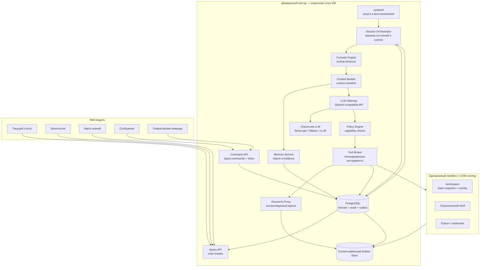
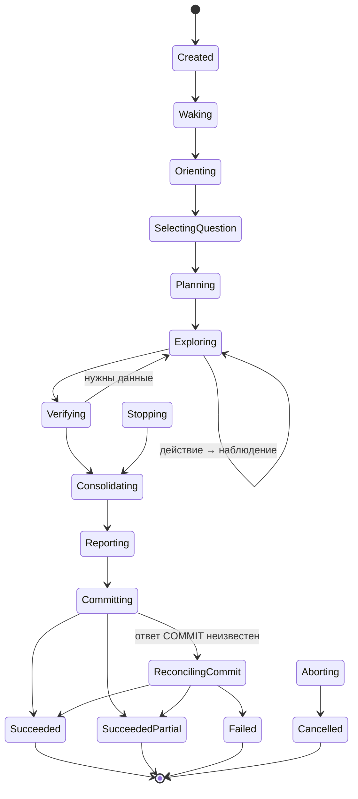

# NOEZEMA — Architecture Draft

> Status: draft v0.11  
> Language: Russian  
> Purpose: describe the target architecture of a local-first autonomous thinker focused on curiosity, verifiable learning, persistent memory, safe action, and human-observable operation.

## 0. Что изменилось

### v0.11

Версия 0.11 доводит revision и rules activation до реализуемой модели данных:

- scalar `domain_revision` заменён явным vector из knowledge и dependency-graph revisions во validation, staging, commit attempt, fencing и checkpoint;
- lock order сформулирован как частичный порядок; barrier processor блокирует и обновляет knowledge revision, одновременно проверяя graph revision;
- rules activation получила shadow assessment heads и атомарный global config-head flip вместо несовместимых с батчами массовых UPDATE claims;
- assessment lifecycle перенесён из mutable полей claim в версионируемые heads, которые являются источником истины;
- лимиты консолидации покрывают новые и существующие claims и evidence, проверяются до записи staging-команды и участвуют в расчёте host reserve;
- invalid после ужесточения правил создаёт исследовательский вопрос; человек нужен только при нарушении инвариантов;
- §22.2 запускается после технической приёмки и завершает full acceptance; для type-specific gates введён минимальный размер выборки.

### v0.10

Версия 0.10 закрывает несогласованности, оставшиеся после v0.9:

- канонический порядок блокировок расширен на обе revision-строки, включая `dependency_graph`;
- у смены rules version в MVP появился исполнитель: одноразовый maintenance runner, описанный нормативно, а не в буллете этапа;
- `blocked` barrier не блокирует wake, симметрично `blocked` job;
- синхронные replacement assessments вошли в host reserve, добавлен предел затрагиваемых claims на сессию;
- §22.2 явно относится к полной приёмке, а не к MVP-серии;
- устранён дрейф про verifier-профиль в §5.5, §18 и README.

### v0.9

Версия 0.9 устраняет оставшиеся гонки восстановления и делает заявленный MVP действительно исполнимым:

- reconciliation использует блокировки строк и fencing, поэтому живой финальный commit нельзя ошибочно принять за rollback;
- после длительной недоступности БД редкие автоматические probes продолжаются; человек требуется для несогласованных записей, а не для обычного восстановления сервиса;
- poison reassessment job переводится в `blocked` и не останавливает несвязанные сессии;
- dependency barrier получил immutable closure manifest, durable progress cursor и crash-resume protocol;
- MVP включает минимальный explorer/curator loop, синхронную переоценку затронутых claims и консервативное source grouping;
- минимальный веб-срез MVP включает status, timeline, messages и безопасные controls;
- требование PostgreSQL 15 отделено от конкретных инвариантов partial unique indexes;
- acceptance criteria и failpoints проверяют новые concurrency/liveness гарантии.

### v0.8

Версия 0.8 закрывает liveness-дыры v0.7 и приводит объём первого шага в соответствие с заявленным MVP:

- reconciliation получила ограниченный автоматический retry: недоступность БД перестала быть равной порче записей;
- исход коммита определяется существованием prepared attempt, а не таймингом отправки COMMIT;
- голодание reassessment worker предотвращается условием допуска планировщика, а не только измеряется;
- reverse dependency closure вычисляется вне блокировки; внутрь транзакции попадают барьер и первый батч;
- определено поведение pending/invalid claims в context pack и переживание метки при усечении;
- статус `reconciling` внесён в жизненный цикл commit attempt;
- PostgreSQL 15 объявлен требованием, а не рекомендацией;
- этап 3 разделён на 3a и 3b: MVP не включает каскад, worker и resolutions;
- критерии §22.1 размечены на MVP-blocking и full-v1.

### v0.7

Версия 0.7 закрывает риски, найденные в v0.6:

- неопределённый исход PostgreSQL commit переводит сессию в reconciliation, а не в ложный `failed`;
- session commit получает приоритетный writer intent, reassessment worker — durable queue и не может бесконечно менять revision во время session validation;
- invalidation распространяется по reverse dependency closure;
- lifecycle assessment отделён от epistemic status;
- независимость эксперимента разделена на repeatability, reproducibility и independent replication;
- environment fingerprint заменён структурированным versioned manifest;
- counterevidence resolutions получили actor, audit basis, XOR/uniqueness constraints и каскадную invalidation;
- evidence identity опирается на content/provenance hash и per-kind constraints;
- operator transitions сведены в каноническую таблицу;
- MVP получил отдельный FIFO Question Selector, а reassessment SLO переведён из «следующей сессии» в wall-clock.

### v0.6

Версия 0.6 закрывает окна и неопределённости, оставшиеся после v0.5:

- определено состояние claim между инвалидацией и переоценкой: статус `unassessed`, запрет использования как evidence или зависимости;
- назван исполнитель переоценки — фоновый reassessment worker доверенного контура со своим actor, revision и правилом гонки с commit;
- снятие counterevidence стало отдельной аудируемой записью с собственным основанием, а не полем, которое может закрыть модель;
- независимость окружений для `empirical_conjecture` и `procedural` определена так же строго, как независимость источников;
- у уверенности один производитель: она вычисляется из assessment и хранится только там;
- диаграмма §6 согласована с текстом, `stop_gracefully` симметричен `abort_session` при неизвестном исходе действия;
- добавлены уникальность evidence и предикаты различности в правилах;
- `evidence_kind` вместо `verification_kind`, определены роли в `assessment_evidence`;
- описано поведение при исчерпании резерва на консолидацию;
- зафиксирован минимальный жизнеспособный срез v1.

### v0.5

Версия 0.5 уточняет контракты безопасности, доказательности и восстановления:

- идентификаторы model run, turn, action и idempotency key создаёт только доверенный контур; LLM больше не выбирает ключ дедупликации;
- evidence grade перенесён с отдельного evidence на версионируемый claim assessment по набору доказательств;
- реестр claim types стал машиночитаемым: заданы количества evidence, независимость, scope и AND/OR-условия;
- soft budget exhaustion отделён от обрыва внутри LLM/tool call;
- добавлены операционные пути `stop_gracefully` и `abort_session`;
- optimistic validation привязана к монотонной domain revision;
- heartbeat продлевает lease только при живом coordinator и непросроченном phase deadline;
- классы инструментов унифицированы, а завершение сессии вынесено из Tool Broker;
- independence groups версионируются и пересчитывают затронутые assessments;
- GC учитывает все ссылки доменной БД и backup manifests, а temporal facts поддерживают открытый `valid_to`.

### v0.4

Версия 0.4 закрывает дефекты, найденные при разборе v0.3:

- исчерпание бюджета стало штатным завершением с фиксацией уже проверенной работы, а не потерей всей сессии;
- введён закрытый реестр `claim_type` с минимальным evidence grade, допустимыми видами проверки и volatility;
- `session_staging` объявлен единственным механизмом изоляции незафиксированной работы;
- добавлены heartbeat lease, fencing-условие коммита и поглощающие терминальные состояния;
- тяжёлая валидация вынесена за пределы commit-транзакции;
- `independence_group` вычисляется детерминированно, а не заявляется моделью;
- инструменты объявляют класс идемпотентности и профили доступности, `model_runs` связан с действиями;
- retention манифестов привязан к глубине backup retention;
- в quality gates определены «значимый claim» и объём слепой ручной выборки.

### v0.3

Версия 0.3 зафиксировала решения, которые в v0.2 оставались противоречивыми или недостаточно операционными:

- источником правды выбрана транзакционная доменная модель; append-only журнал используется для аудита и доставки событий через outbox, без полного event sourcing в v1;
- фиксация сессии построена вокруг content-addressed workspace snapshot и одной транзакции `SessionCommitted`;
- вместо session-wide taint введены происхождение каждого фрагмента данных и неизменяемые capability-профили;
- уверенность в истинности отделена от свежести знания;
- определены типы проверок и уровни доказательств;
- веб-модуль разделён на Query API и Command API и не пишет напрямую в таблицы памяти или аудита;
- протокол завершения, машина состояний и обработка неопределённого исхода действий унифицированы;
- fingerprint локальной LLM и embedding-модели стал достаточным для воспроизводимости;
- критерии технической готовности отделены от оценки качества познания после серии сессий.

## 1. Идея проекта

NOEZEMA — автономный локальный мыслитель, который периодически пробуждается, выбирает неизвестный ему вопрос, исследует его, проверяет выводы, сохраняет знания с доказательствами и оставляет понятный отчёт для следующей сессии и человека-наблюдателя.

Проект сохраняет сильные стороны ранних экспериментов с автономным AI на сервере:

- дискретные сессии вместо непрерывного процесса;
- преемственность через внешнюю память;
- собственное рабочее пространство;
- свободу выбора интересов и направления исследования;
- наблюдаемость действий;
- возможность развивать идентичность и внутренние правила.

При этом NOEZEMA устраняет основные архитектурные проблемы исходного подхода:

- управляющий контур отделён от среды мыслителя;
- модель не исполняет команды непосредственно на хосте;
- действия передаются через типизированный протокол;
- знания отделены от субъективных воспоминаний;
- утверждения связаны с доказательствами и статусом проверки;
- история событий неизменяема;
- повторения определяются семантически, а не по хешам файлов;
- локальная LLM является основным, а не дополнительным режимом;
- текущее состояние и хронология доступны через веб-интерфейс.

## 2. Цели

### 2.1. Основные цели

1. Работать с локальной LLM через OpenAI-compatible API.
2. Накапливать новое для агента знание, а не только автобиографические заметки.
3. Хранить происхождение, доказательства и контраргументы для каждого значимого утверждения.
4. Выполнять действия только в изолированной среде.
5. Быть наблюдаемым и восстанавливаемым после сбоев.
6. Поддерживать общение с человеком без превращения каждого сообщения в безусловную команду.
7. Не зависеть от конкретной модели, поставщика или inference backend.

### 2.2. Не-цели первой версии

- доказательство наличия сознания или субъективного опыта;
- неограниченный доступ к хостовой системе;
- выполнение произвольных внешних действий от имени владельца;
- multi-agent orchestration ради самой сложности;
- обучение или дообучение основной LLM во время работы;
- публичное раскрытие скрытой chain of thought модели.

## 3. Архитектурные принципы

### 3.1. Свобода внутри ограниченного мира

Мыслитель свободен выбирать темы, создавать проекты, менять внутреннюю идентичность и организовывать своё рабочее пространство. Границы безопасности, планировщик, журнал событий и резервные копии находятся вне его контроля.

### 3.2. Управление отделено от мышления

LLM предлагает намерение и действие. Orchestrator и Policy Engine решают, можно ли выполнить действие и в какой среде.

### 3.3. Доменное состояние первично, аудит неизменяем

В v1 источником правды являются нормализованные доменные таблицы PostgreSQL: сессии, вопросы, утверждения, доказательства, сообщения и ссылки на workspace snapshots. Все изменения выполняются сервисами доверенного контура в транзакциях.

В той же транзакции записываются append-only `audit_events` и `outbox_events`. Журнал объясняет, что произошло, питает live timeline и интеграции, но восстановление доменной модели полным replay событий не является обязательным свойством v1. Это устраняет скрытую стоимость полноценного event sourcing: версионирование каждого события, replay, миграции исторических payload и rebuild всех проекторов.

### 3.4. Знание требует происхождения

Запись модели не становится фактом автоматически. Семантическая память хранит статус утверждения, уверенность, источники, контраргументы и историю проверок.

### 3.5. Локальная модель — штатный режим

LLM Gateway проектируется вокруг локального OpenAI-compatible endpoint. Поддержка удалённых моделей может быть добавлена позднее как сменный профиль.

### 3.6. Наблюдаемость без хранения скрытых рассуждений по умолчанию

Система сохраняет структурированный ответ модели, выбранное действие, краткую публичную мотивировку, результат инструмента, usage, latency и fingerprint конфигурации. Скрытая chain of thought не считается интерфейсом модели, доказательством или обязательной частью аудита.

Сырой ответ провайдера разрешён только в диагностическом профиле: он шифруется, имеет короткий срок хранения, закрыт от сайта и может быть полностью отключён. Обычный режим должен позволять воспроизвести решение по входному context manifest, действию, наблюдению и версиям конфигурации, не превращая базу в архив внутренних рассуждений.

Ключ диагностического профиля хранится вне PostgreSQL и вне резервных копий базы. Это защищает от кражи диска и утечки дампа, но не от компрометации живого хоста: модель угрозы здесь именно такая, и большего шифрование не даёт.

### 3.7. Верификация оценивает набор доказательств

Проверка подтверждает только то, что действительно измеряет. Совпадение цитаты доказывает целостность цитирования, но не истинность источника; два сайта могут копировать одну ошибку; успешный тест подтверждает результат лишь для зафиксированного окружения.

Отдельный evidence хранит наблюдение и способ его получения: `source_assertion`, `quote_integrity`, `experiment_run`, `computation`, `formal_check` или `local_observation`. Уровень E0–E4 не назначается отдельному evidence: он вычисляется claim assessment по набору evidence, их scope, independence groups и версии правил claim type.

`corroboration` и `replication` являются методами assessment над несколькими evidence. Operator attestation хранится отдельно и не повышает grade без новых проверяемых данных. Суждение verifier-роли само по себе статус claim не меняет.

## 4. Контекст системы



Сайт не имеет прямого write-доступа к доменным и audit-таблицам. Query API читает проекции, а Command API валидирует сообщения и операторские команды, записывает их в inbox с idempotency key и передаёт исполнение Orchestrator.

## 5. Компоненты

### 5.1. Supervisor

Отвечает только за жизненный цикл сервисов:

- запуск Orchestrator и веб-приложения;
- автоматическое восстановление после падения;
- корректное завершение;
- передачу минимальной конфигурации;
- health checks.

Предпочтительная реализация для одного узла — `systemd`.

### 5.2. Session Orchestrator

Центральная машина состояний. Orchestrator:

- определяет момент пробуждения;
- создаёт сессию и lease;
- фиксирует fingerprint модели, embeddings, промптов, схем и политик;
- монтирует последний committed workspace snapshot как read-only base и создаёт COW overlay;
- вызывает фазы познавательного цикла;
- контролирует бюджеты времени, шагов и токенов;
- фиксирует результат одной транзакцией `SessionCommitted`;
- обнаруживает и очищает незавершённые сессии.

Orchestrator недоступен для изменения из sandbox.

#### 5.2.1. Расписание пробуждений

Расписание принадлежит доверенному контуру и недоступно из sandbox.

- Базовое расписание задаётся cron-подобным выражением с минимальным интервалом между сессиями.
- Перед запуском проверяются условия допуска: нет незавершённой сессии с живым lease, нет unresolved commit attempt, свободна GPU-память под профиль модели, соблюдена дисковая квота, система не на паузе.
- Отдельное условие: возраст старейшего **runnable dependency-critical** reassessment job ниже порога. Runnable означает `status IN ('queued','retry')`, `next_attempt_at <= now()` и неисчерпанный retry budget. Job с живым lease, будущим retry либо `blocked` не маскируется под готовую работу.
- Если runnable dependency-critical job превысил порог, пробуждение откладывается, пока worker не получит окно. Poison job после исчерпания попыток становится `blocked`, оставляет claim в `invalid`, поднимает alert и больше не блокирует несвязанные сессии.
- Если условия не выполнены, пробуждение пропускается с записью причины, а не ставится в очередь.
- После неудачной сессии применяется экспоненциальный backoff; после нескольких неудач подряд узел переходит в `paused`.
- Обычное `wake_now` обходит расписание, но не admission. Отдельный `wake_now(bypass_worker_gate=true, reason=...)` доступен оператору, аудируется и обходит только worker-age gate; lease, unresolved commit, quota, pause и fencing он не обходит.

#### 5.2.2. Граница фиксации сессии и commit reconciliation

Работа активной сессии не должна частично появляться в долговременной памяти.

1. Предложения изменить questions, claims, evidence и identity пишутся только в `session_staging`. Operational rows — session state, actions, model runs и audit выполненных шагов — фиксируются сразу.
2. Файлы пишутся в COW overlay. Артефакты сохраняются content-addressed; до commit они недостижимы из текущего workspace и долговременной памяти.
3. При завершении overlay замораживается и создаётся immutable workspace manifest с path, size и SHA-256 каждого объекта.
4. До тяжёлой валидации сессия регистрирует приоритетный writer intent (§5.9.1). Валидация выполняется против revision vector `{knowledge_revision, dependency_graph_revision}` и сохраняет обе компоненты, payload/rules hashes, independence snapshots и подготовленные assessments.
5. Orchestrator создаёт host-generated `commit_attempt_id` и durable строку `commit_attempts(status='prepared')`, связанную со staging hash и workspace manifest.
6. Финальная короткая транзакция берёт необходимое подмножество блокировок в каноническом порядке, проверяет fencing и обе компоненты revision vector, применяет staging, обновляет workspace pointer и соответствующие revisions, переводит attempt в `committed`, записывает checkpoint, terminal session state, audit и outbox.

Канонический **частичный** порядок блокировок общий для всей системы:

```text
sessions
  → domain_revisions(scope='knowledge')
  → domain_revisions(scope='dependency_graph')
  → commit_attempts
```

Транзакция может пропускать ненужные строки, но все фактически взятые locks обязаны образовывать подпоследовательность этого порядка. Если поздно выяснилось, что нужна пропущенная строка, транзакция откатывается и начинается заново.

```text
операция                              lock set
ordinary session/worker write         knowledge
session commit with edge changes      session → knowledge → dependency_graph → attempt
session commit without edge changes   session → knowledge → attempt
barrier invalidation batch            knowledge → dependency_graph
rules activation prepare              knowledge
rules activation publish              knowledge
reconciliation                        session → attempt
```

Barrier batch изменяет assessment heads/jobs, поэтому блокирует и увеличивает knowledge revision; dependency-graph row он блокирует для проверки snapshot и увеличивает только если сам меняет evidential edges. Reconciler безопасно пропускает обе revision-строки: session lock не позволяет finalizer-у войти в середину порядка. Writer gate является admission lease вне короткой domain transaction и не меняет этот DB lock order.
7. При конфликте любой проверяемой компоненты revision vector staging валидируется заново. Число повторов ограничено; writer intent не позволяет фоновому worker менять revision во время session validation.
8. Если DB однозначно отклонила или откатила транзакцию, attempt становится `aborted`, предыдущий checkpoint остаётся текущим.
9. Если ответ COMMIT потерян или DB недоступна, исход не объявляется failure. Узел блокирует новые сессии и переходит в `reconciling_commit`; если БД доступна, attempt условно переводится `prepared → reconciling`. Невозможность записать этот переход не является доказательством исхода: `prepared` уже считается unresolved.

Статусы attempt: `prepared | reconciling | committed | aborted`. Первые два — unresolved.

Исход определяется существованием durable записи, а не таймингом сети. Клиент не может надёжно узнать, ушёл ли пакет COMMIT, поэтому дискриминатор такой:

```text
prepared attempt отсутствует  → сбой до commit boundary даёт failed
prepared attempt существует   → сбой, таймаут или разрыв
                                даёт reconciling_commit
```

Durable attempt устраняет вопрос «существует ли commit boundary», но простой `SELECT` не доказывает rollback: под MVCC он может увидеть старую committed-версию `prepared`, пока финальная транзакция ещё выполняется. Поэтому reconciliation является fenced locking protocol.

Reconciliation-транзакция использует тот же порядок блокировок:

```text
BEGIN
  SELECT session ... FOR UPDATE
  verify: original owner fenced AND no live lease
  SELECT attempt ... FOR UPDATE

  attempt=committed AND session terminal AND checkpoint exists
      → принять committed terminal state

  attempt IN (prepared, reconciling)
  AND session/checkpoint terminal records absent
  AND original owner fenced
      → atomically attempt=aborted, session=failed, discard staging

  lock timeout / finalizer still in progress
      → rollback reconciliation transaction; transient retry

  records inconsistent
      → remain reconciling_commit, alert severity=critical,
        no GC, no wake, требуется человек
COMMIT
```

`SELECT ... FOR UPDATE` ждёт незавершённый UPDATE attempt и после завершения исходной транзакции возвращает committed-версию либо прежний `prepared` после rollback. `lock_timeout` не превращается в `aborted`: это состояние `finalizer_in_progress` и новая проба. Finalizer и reconciler обязаны соблюдать единый порядок блокировок; условные UPDATE не позволяют fenced-процессу опубликовать результат после решения reconciler-а.

Недоступность базы и несогласованность записей — разные события. Рестарт PostgreSQL или давление на диск транзиентны и должны разрешаться автоматически; несогласованные записи означают нарушение инвариантов и требуют оператора.

- Проба reconciliation повторяется с экспоненциальным backoff и jitter, каждая попытка — с нового соединения и отдельными `connect_timeout`, `lock_timeout` и `statement_timeout`.
- В `reconciling_commit` узел остаётся, но alert имеет severity `warning`, пока причина `database_unavailable | finalizer_in_progress`.
- После `N` попыток либо `T` wall-clock состояние получает `human_attention_required` и severity `critical`, но read-only probes продолжаются с редким ограниченным интервалом. Согласованный committed/aborted исход автоматически снимает эскалацию; только `records_inconsistent` останавливает автоматическое разрешение.
- Wake и GC запрещены на всём протяжении, независимо от причины: частота probes влияет на liveness, но не ослабляет безопасность.

Fencing:

```text
state = 'committing'
AND lease_owner = :me
AND lease_expires_at > now()
AND knowledge_revision = :validated_knowledge_revision
AND (NOT :touches_dependency_graph
     OR dependency_graph_revision = :validated_dependency_graph_revision)
AND commit_attempt_id = :attempt
AND attempt.status = 'prepared'
```

Терминальные `succeeded | succeeded_partial | failed | cancelled` поглощающие. `reconciling_commit` не терминален, но запрещает действия, recovery cleanup и следующий wake. Unresolved commit attempt является GC root.

Такой порядок даёт атомарную видимость базы и workspace и не путает потерю ответа COMMIT с откатом.

#### 5.2.3. Lease, heartbeat и progress watchdog

Heartbeat исполняется независимо от блокирующего LLM/backend вызова, но не является безусловным «я жив»:

- coordinator фиксирует `last_progress_at` и `phase_deadline` при входе в фазу и после каждого терминального action result;
- watchdog прерывает фазу при превышении deadline;
- heartbeat продлевает lease условным UPDATE только если session owner совпадает, состояние не терминальное и phase deadline не просрочен;
- если coordinator перестал подтверждать здоровье либо deadline истёк, heartbeat прекращает продление даже при живом процессе;
- TTL равен нескольким heartbeat intervals с запасом на scheduler jitter; максимальная длительность фазы задаётся отдельно через `phase_deadline`;
- при неуспешном conditional UPDATE Orchestrator прекращает новые действия и не пытается коммитить.

Обычное продление хранится в `sessions.last_heartbeat_at` и экспортируется как gauge. Audit event создаётся при смене владельца, пропуске heartbeat, превышении deadline и recovery, но не на каждом периодическом UPDATE: иначе неизменяемый журнал превращается в высокочастотную телеметрию.

### 5.3. Curiosity Engine

Поддерживает реестр исследовательских вопросов и выбирает следующий вопрос по сочетанию факторов:

- новизна для текущей памяти;
- ожидаемый прирост информации;
- наличие проверяемых источников или эксперимента;
- отличие от последних тем;
- выполнимость в текущем бюджете;
- связь с долгосрочными интересами;
- риск и стоимость.

Источники кандидатов:

- противоречия в памяти;
- неизвестные термины;
- непроверенные утверждения;
- результаты предыдущих экспериментов;
- локальный корпус;
- сообщения человека;
- случайное тематическое исследование;
- предложение самой модели.

#### 5.3.1. Baseline первой версии

Все входы score нормализуются в диапазон `[0, 1]` и сохраняются вместе с выбранным вопросом:

```text
novelty(q)          = 1 - max similarity(q, prior_questions ∪ claims)
coverage_gap(q)     = мера незакрытых зависимостей и противоречий
evidenceability(q)  = доступность независимого источника или эксперимента
topic_recency(q)    = доля последних R сессий по теме
score(q) =
    w1*novelty + w2*coverage_gap + w3*evidenceability + w4*feasibility
    - w5*cost - w6*risk - w7*topic_recency
```

- До ранжирования действует eligibility filter: вопрос помещается в бюджет и допускает хотя бы один проверяемый путь.
- Novelty сравнивается не только с claims, но и с прошлыми формулировками вопросов, планами и тематическим покрытием; это уменьшает «новизну через перефразирование».
- Противоречие или слабое место в уже используемом знании получает положительный `coverage_gap`, поэтому система не убегает только в новые темы.
- С вероятностью `1 - ε` выбирается максимум. С вероятностью `ε` выбор делается среди верхних `M` допустимых кандидатов или кандидатов в пределах `δ` от максимума, а не среди всего реестра.
- Веса, пороги нормализации, `ε`, `M`, embedding fingerprint и набор рассмотренных кандидатов входят в конфигурационный snapshot сессии.

#### 5.3.2. Минимальный познавательный цикл MVP

FIFO Question Selector заменяет только ранжирование Curiosity Engine, но не сам исследовательский цикл. Чтобы MVP мог ежедневно создавать проверяемое знание, он включает минимальные explorer и curator protocols, которые может выполнять одна локальная LLM с разными prompt snapshots:

```text
seeded/message question → FIFO selection → context pack
→ explorer decision (bounded tool loop)
→ typed observations/artifacts
→ curator staging proposal
→ deterministic rules assessment
→ fenced commit
```

- Explorer получает один текущий вопрос и ограниченное число действий; отдельного verifier-model в MVP нет.
- Tool Broker превращает результаты действий в typed observations с provenance; текст модели сам по себе evidence не создаёт.
- Minimal curator предлагает claims/evidence и handoff через staging schemas. Memory Service синхронно строит replacement assessment для каждого затронутого claim.
- Rules engine, а не explorer/curator, назначает grade, status и confidence.
- Неуспешное исследование всё равно создаёт audit trail и handoff; claim без достаточного evidence не становится current supported knowledge.

Расширенное планирование, специализированный verifier, Curiosity ranking и защита от семантических повторов появляются на этапе 4.

### 5.4. Context Builder

Формирует ограниченный context pack вместо передачи всей истории. В него входят:

- актуальная версия идентичности;
- правила среды и протокол действий;
- текущий вопрос;
- итог последней сессии;
- релевантные утверждения и доказательства;
- незакрытые противоречия;
- новые сообщения;
- недавние ошибки и повторения.

Поиск гибридный: полнотекстовый, embedding similarity, свежесть, значимость и связь с вопросом.

#### 5.4.1. Токенные бюджеты

Сначала рассчитывается доступный вход:

```text
input_budget = min(model_context_window, backend_context_limit)
               - max_output_tokens
               - safety_margin
```

Лимиты секций задаются абсолютным числом токенов и не могут суммарно превышать `input_budget`. Пример для окна 32 768, ответа 4 096 и safety margin 2 048:

```text
протокол, схемы инструментов, правила  4 096
идентичность                           2 048
текущий вопрос и план                  3 072
итог последней сессии                  2 048
релевантные claims и evidence          8 192
противоречия                           3 072
сообщения                              2 048
недавние ошибки                        2 048
итого input_budget                    26 624
```

Hard-секции протокола резервируются первыми. Остальные ранжируются по полезности и усекаются до вызова LLM. Событие `ContextPacked` хранит фактические token counts, список включённых chunk ID, причины исключения и tokenizer fingerprint.

#### 5.4.2. Claims без действующего assessment

§8.6 обещает, что pending/invalid claim подаётся retrieval только с явной меткой. Ранжирование и усечение — тот шов, где эта гарантия протекает: усечённый до одного утверждения pending-claim выглядит в контексте как обычное знание.

- Pending и invalid claims не тратят бюджет секции claims. Для них выделен отдельный небольшой лимит, и вытеснить действующее знание они не могут.
- Метка входит в ту же строку, что и утверждение, и в токенную оценку самой метки: усечение может убрать обоснование и evidence, но не признак отсутствия действующего assessment. Если бюджета не хватает даже на помеченное утверждение, claim исключается целиком, а не подаётся без метки.
- В контекст попадают только те pending-claims, которые прямо относятся к текущему вопросу; фоновый backlog переоценки в context pack не подаётся — это работа worker-а, а не мыслителя.
- `ContextPacked` фиксирует их отдельным списком, чтобы по журналу было видно, что модель видела непроверенное знание в момент решения.

### 5.5. LLM Gateway

Единый интерфейс к моделям. Функции:

- OpenAI-compatible chat API;
- профили разных inference backends;
- проверка схемы структурированного ответа;
- retries только для транзиентных ошибок;
- учёт токенов и времени;
- ограничение контекста и ответа;
- сохранение метаданных вызова;
- переключение ролей explorer, verifier и curator.

В MVP профилей два — explorer и curator (§5.3.2); отдельный verifier-профиль появляется на этапе 4. Gateway поддерживает переключение ролей с самого начала, но набор доступных prompt snapshots задаётся config snapshot, а не кодом.

В первой версии роли может выполнять одна локальная модель с разными промптами. Для explorer и curator это приемлемо. Для verifier совмещение допустимо только в смысле §3.7: модель организует детерминированные проверки и интерпретирует их результат, но её собственное суждение о собственном же выводе статус утверждения не меняет.

Смена роли означает пересборку контекста и новый prefill. На модели класса 30B в Q4 это десятки секунд на фазу, поэтому число explorer-шагов ограничивается жёстко, а время по фазам учитывается отдельно (§16).

### 5.6. Policy Engine

Policy Engine авторизует действие по capability-профилю, выданному доверенным контуром до начала сессии:

- разрешённые типы инструментов и операции;
- допустимые пути и режимы чтения/записи;
- сетевой профиль, домены, адресные диапазоны и методы;
- лимиты времени, размера, MIME type, CPU, RAM, процессов и диска;
- запрет доступа к секретам, управляющим файлам, socket-ам и metadata endpoints;
- допустимость аргументов по JSON Schema и нормализованным path/URL;
- текущая фаза сессии и оставшийся бюджет.

Происхождение текста не расширяет capability: внешняя страница, сообщение или прошлый артефакт никогда не могут выдать модели новое право. Метки происхождения используются для формирования контекста, правил доказательства и детектирования инцидентов, но не являются единственной границей безопасности. Сходство аргументов с внешним текстом — диагностический сигнал, а не основной механизм авторизации.

Каждое решение записывается как `PolicyEvaluated` с версией политики и результатом `allow | deny | require_operator`.

### 5.7. Tool Broker

Tool contract использует единый enum класса повторяемости:

```text
pure                 повтор безопасен; долговременного наблюдения не создаёт
observation          read-only, но результат зависит от времени; после старта не retry
idempotent(key)      backend гарантирует один эффект по host-generated key
non_idempotent       автоматический retry после старта запрещён
```

Инструменты первой версии:

```text
инструмент         класс            доступность
workspace.read     pure             все профили
workspace.list     pure             все профили
workspace.write    idempotent(key)  все профили, только session overlay
artifact.create    idempotent(key)  все профили
memory.search      pure             все профили
question.create    idempotent(key)  все профили, запись в staging
message.reply      idempotent(key)  все профили
shell.execute      non_idempotent   все профили
python.execute     non_idempotent   все профили
web.search         observation      sealed: локальный индекс; curated: SearxNG; open_lab: внешний API
web.fetch          observation      curated, open_lab
```

Решение завершить сессию — `decision.kind=complete` в протоколе §7, а не инструмент Tool Broker. Это внутренний fenced transition Orchestrator и не имеет внешнего эффекта.

Инструмент, недоступный профилю, отсутствует в схеме модели и всё равно отклоняется Policy Engine при прямой попытке вызова. Host-generated idempotency key навсегда связывается с tool name и canonical arguments hash; повтор ключа с другими аргументами является инцидентом.

### 5.8. Sandbox Runtime

Каждая сессия получает одноразовый rootless-контейнер. Постоянным остаётся только workspace. Базовая политика:

```text
non-root user
read-only root filesystem
network none
cap-drop ALL
no-new-privileges
CPU, RAM and PID limits
timeout for every command
total session timeout
workspace disk quota
no Docker socket
no SSH keys or host secrets
```

Контейнер уничтожается после завершения сессии.

### 5.9. Memory Service

Модель предлагает изменения только через staging-команды. Memory Service:

- различает epistemic confidence и freshness;
- строит claim assessment по evidence set, claim type rules, scope и independence snapshot;
- управляет сроками ре-верификации без автоматического объявления устаревшего знания ложным;
- хранит dependency fingerprints и reproducibility capsules;
- инвалидирует assessments при изменении rules, dependencies или source grouping;
- ограничивает число активных claims в теме и требует консолидацию;
- запрещает циклическое использование claim как собственного доказательства.

Ни LLM, ни verifier не записывают `effective_grade` напрямую: они создают evidence и предложения, а grade вычисляет версионируемый rules engine.

#### 5.9.1. Reassessment worker и writer admission

Переоценку выполняет worker доверенного контура с actor `system:reassessment`. Работа хранится в durable `reassessment_jobs`, а не только выводится запросом по claims:

```text
claim_id, target_config_snapshot_id, status, reason, priority, enqueued_at,
attempts, max_attempts, error_class,
lease_owner, lease_expires_at,
last_error, next_attempt_at, blocked_at
```

Статусы: `queued | leased | retry | blocked | completed`. Один active job (`queued | leased | retry`) на пару claim/target config обеспечивается unique constraint; job runnable только после активации target snapshot. Worker работает ограниченными батчами, создаёт audit events, не генерирует evidence и не ходит в сеть. Если данных недостаточно, он переводит target head в `invalid` и создаёт исследовательский вопрос.

Ошибки worker классифицируются доверенным кодом:

- transient error переводит job в `retry` с backoff/jitter до `max_attempts`;
- deterministic/permanent error либо исчерпанный retry budget переводит job в `blocked`, сохраняет claim как `invalid` и создаёт critical alert;
- `blocked` не считается runnable и не блокирует глобальный wake: безопасность обеспечивается тем, что invalid claim нельзя использовать как current evidence/dependency;
- повторный запуск blocked job требует новой config/rules version, устранения причины либо audited operator command; он создаёт новую попытку, не стирая историю.

Безопасность revision недостаточна для liveness: worker мог бы менять revision во время каждой тяжёлой session validation. Поэтому действует writer admission:

1. При входе в consolidation сессия атомарно устанавливает `commit_intent_at` под живым lease до тяжёлой валидации.
2. Пока существует живой session commit intent, worker не начинает validation или write batch.
3. Worker получает низкоприоритетный `knowledge_write_gate` через NOWAIT; при конфликте откладывает job с jitter.
4. Если session intent появляется во время worker validation, worker не коммитит подготовленный batch и возвращает jobs в очередь.
5. Session commit очищает intent в своей terminal transaction; recovery очищает просроченный intent только после проверки lease/commit attempt.
6. Knowledge revision остаётся последней защитой обычной переоценки; если job читает dependency graph, он также проверяет graph revision. Revision vector не используется как механизм планирования.

Worker пересчитывает assessment head для `target_config_snapshot_id` по его rules и independence snapshots; запись разрешена только если target snapshot active. Приоритет: reverse dependencies активных вопросов, external/temporal facts, затем остальные. Очередь имеет wall-clock SLO и метрики depth/age/attempts; длительно непустая очередь является деградацией памяти.

Правила 1–6 однонаправленны: сессия всегда выигрывает, worker отступает. Сами по себе они гарантируют отсутствие гонки, но не прогресс worker-а — при плотном расписании он может не получить gate никогда. Поэтому liveness обеспечивается снаружи, планировщиком:

- пробуждение не начинается, пока возраст runnable dependency-critical job выше порога (§5.2.1); очередь получает окно между сессиями, а не отбирает время у активной;
- после превышения возраста `T_escalate` runnable job поднимается до dependency-critical независимо от исходной причины, чтобы фоновая работа не оставалась вечно позади;
- job с будущим `next_attempt_at` не блокирует сессию до наступления срока; job с живым lease наблюдается отдельно;
- `blocked` job не участвует в admission и не создаёт глобальный deadlock;
- порог допуска, `T_escalate`, retry budget и SLO фиксируются в конфигурации.

Таким образом, планировщик выделяет worker-у окно для выполнимой работы, но неисправность одного claim не останавливает весь познавательный цикл.

### 5.10. Data Store и Audit Log

PostgreSQL хранит нормализованное доменное состояние, append-only `audit_events`, transactional `outbox_events` и inbox команд. В v1 это не полный event sourcing:

- доменные таблицы — источник правды;
- audit log — неизменяемая объяснимая история;
- outbox публикует события для SSE и фоновых проекторов после commit;
- read models можно перестроить из доменных таблиц и audit log, но бизнес-состояние не обязано восстанавливаться replay всех событий.

Для embedding search может использоваться `pgvector`. Отдельная vector database первой версии не нужна.

### 5.11. Artifact Store

Хранит документы, веб-страницы, код, изображения, отчёты, результаты экспериментов и workspace snapshots по SHA-256. База хранит manifest, метаданные, происхождение и ссылки.

Происхождение задаётся не одним флагом на файл, а для addressable chunk:

- `chunk_id`, artifact ID и byte/text range;
- origin kind, source URI и время получения;
- content hash и transform chain;
- parser/extractor fingerprint;
- trust class и ограничения использования.

Смешанный документ может содержать локальный код и внешнюю цитату с разным происхождением. Content-addressed объекты неизменяемы; изменение создаёт новый объект и новый manifest.

### 5.12. Research Proxy

Единственная точка контролируемого доступа к интернету. Sandbox остаётся без прямой сети.

Research Proxy:

- разрешает только безопасные read-only запросы;
- блокирует private, loopback, link-local и metadata addresses;
- ограничивает редиректы, размер и время ответа;
- удаляет активное содержимое;
- сохраняет оригинал, нормализованный текст и хеш;
- маркирует результат как недоверенный внешний контент;
- ведёт журнал происхождения данных.

#### 5.12.1. Поисковый бэкенд

Есть три разных режима, и их нельзя называть одинаково «локальными»:

- поиск по локальному индексу или заранее загруженному корпусу — без сетевого egress;
- локально развёрнутый SearxNG — контролируемая точка egress, но запросы всё равно уходят upstream-поисковикам и могут раскрывать темы исследования;
- внешний search API — управляемый сервис с ключом, внешней зависимостью и явной передачей запросов провайдеру.

В `Sealed` доступен только локальный индекс. В `Curated` допустим SearxNG через Research Proxy с журналом upstream, rate limits и политикой приватности. `Open Lab` может использовать внешний API. Настоящий сетево-независимый веб-поиск требует собственного индекса и не входит в v1.

## 6. Цикл и машина состояний сессии

Канонический enum:

```text
created | waking | orienting | selecting_question | planning |
exploring | verifying | stopping | consolidating | reporting |
committing | reconciling_commit | aborting |
succeeded | succeeded_partial | failed | cancelled
```

Состояние узла `sleeping | paused` хранится отдельно. `stop_requested_at` и `abort_requested_at` фиксируют intent до безопасной границы.



Диаграмма показывает основной путь. Каноническими для operator/error transitions являются таблица §6.7 и правила §5.2.2, а не отсутствие отдельного ребра на обзорной диаграмме. Терминальные состояния поглощающие.

### 6.1. Пробуждение и ориентация

Orchestrator создаёт lease, фиксирует конфигурацию, монтирует committed snapshot и строит context manifest. Новые сообщения доставляются как данные с provenance.

### 6.2. Выбор вопроса и планирование

В MVP FIFO Question Selector выбирает первый eligible question. После этапа 4 Curiosity Engine ранжирует кандидатов. План формулирует наблюдения, способные изменить уверенность, критерии остановки и assessment methods.

### 6.3. Исследование

Каждый шаг содержит публичную мотивировку, одно типизированное решение, ожидаемую информацию и ссылку на наблюдение. Несколько tool calls за ответ запрещены.

### 6.4. Верификация и assessment

Evidence kinds:

- `source_assertion` — утверждение из точного source chunk;
- `quote_integrity` — фрагмент совпадает с источником по hash/range;
- `experiment_run` — один запуск с environment manifest;
- `computation` — результат для точных inputs/algorithm;
- `formal_check` — результат формального инструмента;
- `local_observation` — наблюдение локальной системы и времени.

Claim assessment агрегирует evidence set:

```text
E0  unverified
E1  integrity_checked
E2  single_method_supported_in_scope
E3  independently_corroborated_or_replicated_in_scope
E4  formally_verified_or_repeatedly_independently_replicated
```

Grade вычисляет rules engine по claim type rules, distinct evidence identities, source/environment groups, scope и counterevidence. Verifier предлагает assessment, но не назначает grade или confidence. Operator attestation без новых данных grade не повышает.

### 6.5. Консолидация, отчёт и commit

Curator предлагает изменения. Memory Service валидирует schema, provenance, dependencies и assessment. Решение `decision.kind=complete` переводит сессию в consolidation; после staging выполняются reporting и §5.2.2.

Если LLM недоступна, host-generated failure/minimal report содержит причину, последнюю завершённую операцию и diagnostics.

### 6.6. Soft budget и резерв финализации

Soft budgets проверяются до следующего LLM/tool call и после терминального результата action. Резерв разделён:

- cognitive reserve — curator/consolidation;
- host reserve — deterministic validation, синхронные replacement assessments всех затронутых claims (§19, этап 3a), minimal report, commit и reconciliation; он не зависит от LLM tokens.

Host reserve рассчитывается из конфигурационных пределов и измеренного p95 времени rules engine, а не предполагается бесконечным:

```text
max_claims_assessed_per_session
max_new_claims_per_session
max_evidence_items_per_session
host_assessment_budget = max_claims_assessed_per_session * p95_assessment_time + margin
```

Лимиты относятся к сумме новых и существующих claims. Memory Service проверяет их **до** записи каждой staging-команды; команда принимается целиком либо отклоняется целиком, а уже принятый staging не усекается. Curator получает оставшиеся counters в protocol context и структурированную ошибку `staging_budget_exceeded`, пока cognitive reserve ещё позволяет уменьшить предложение. Финальная validation повторяет проверку против immutable staging manifest, но не является первым местом обнаружения превышения.

При soft exhaustion новые actions не запускаются, verified work проходит validation и после commit даёт `succeeded_partial`. Это допустимо только без unknown action, с валидным последним model output и непросроченным cognitive phase deadline.

Если cognitive consolidation не завершена безопасно, сессия `failed` и staging отбрасывается; operational actions/artifacts остаются в audit history для следующей сессии. Если consolidation завершена, но модельный reporting не удался, Orchestrator создаёт minimal report и продолжает commit.

Классификация сбоя финализации опирается на наличие prepared attempt, а не на то, успел ли уйти пакет COMMIT: сбой до создания записи даёт `failed`, сбой при существующей записи — `reconciling_commit`. Исход транзакции устанавливается по §5.2.2.

### 6.7. Остановка и канонические operator transitions

```text
команда             допустимые source states                         результат
stop_gracefully     waking..verifying                                stopping на safe boundary
stop_gracefully     stopping|consolidating|reporting                 idempotent accepted
abort_session       created..reporting                               aborting на safe boundary
stop/abort          committing|reconciling_commit|terminal           rejected
pause               любое                                            запрет следующего wake
```

Диапазон `waking..verifying` означает все перечисленные нетерминальные cognitive states, а не сравнение строк enum.

- Stop ждёт текущий tool action до deadline. `ActionOutcomeUnknown` даёт `failed`.
- Abort отменяет активную LLM generation и отбрасывает её незавершённый output: генерация не имеет внешнего эффекта. Tool action ждёт terminal result; unknown даёт `failed`.
- Abort до commit отбрасывает staging и завершает `cancelled`.
- Stop после safe boundary проходит consolidation/reporting/commit и даёт `succeeded_partial(operator_stop)`.

## 7. Структурированный протокол решений

Перед каждым вызовом Orchestrator создаёт `turn_id` и `model_run_id`. Они связываются с input/context manifest вне текста ответа и не выбираются LLM.

Модель возвращает одно решение без идентификаторов дедупликации:

```json
{
  "public_rationale": "Проверить наличие официальной спецификации",
  "expected_information": "Первичный источник либо подтверждённое отсутствие",
  "decision": {
    "kind": "tool",
    "tool": "web.search",
    "arguments": {
      "query": "название технологии official specification"
    }
  }
}
```

Нормальное завершение:

```json
{
  "public_rationale": "План выполнен, результаты готовы к консолидации",
  "decision": {
    "kind": "complete",
    "reason": "goal_reached"
  }
}
```

После schema validation Tool Broker создаёт host-generated `action_id` и `idempotency_key`, связывает их с `model_run_id`, tool name и canonical arguments hash. Ограничение `UNIQUE(actions.model_run_id)` гарантирует, что один model run не породит два действия. Повтор того же key допустим только с тем же hash.

Lifecycle tool action:

```text
ActionProposed → PolicyEvaluated → ActionAccepted → ActionStarted
              → ActionCompleted | ActionFailed | ActionOutcomeUnknown
```

`decision.kind=complete` не проходит Tool Broker: Orchestrator применяет идемпотентный state transition под lease/fencing. Неизвестный decision kind или tool отклоняется.

Если процесс упал после `ActionStarted`, action получает `ActionOutcomeUnknown` и не повторяется вслепую. Повтор разрешён только для `idempotent(key)` с тем же host-generated key; для `observation` создаётся новый model run и новое наблюдение с новым timestamp.

## 8. Модель памяти

### 8.1. Эпизодическая память

Неизменяемая история того, что произошло: вопрос, действие, результат, ошибка, вывод и решение.

### 8.2. Семантическая память

Логическое представление Claim содержит стабильные поля claim и lifecycle из assessment head, выбранного активным config snapshot:

```text
statement
claim_type
epistemic_status: nullable
  hypothesis | supported | disputed | refuted | deferred
assessment_state:
  current | pending | invalid
freshness_status: fresh | due | stale | unknown
valid_from
valid_to: nullable
as_of
observed_at
reverify_after
dependency_fingerprint
current_assessment_id
evidence[]
counterevidence[]
created_in_session
```

`assessment_state` — workflow оценки, `epistemic_status` — вывод действующего assessment head. Эти поля не хранятся как источник истины в mutable строке `claims`: Query/Memory Service разрешает `runtime_config_heads.active_config_snapshot_id` и читает соответствующий `claim_assessment_heads`. Инварианты:

- `current`: current_assessment_id и epistemic_status обязательны;
- `pending`: assessment поставлен в очередь, оба current-поля NULL;
- `invalid`: автоматическая переоценка существующих evidence не дала действующего assessment; current-поля NULL, требуется новое исследование.

Последний исторический status доступен через revisions/UI, но не используется retrieval как текущий.

Confidence имеет одного producer: rules engine вычисляет её вместе с grade и хранит только в `claim_assessments.confidence`. Функция детерминирована и версионирована; LLM число не предлагает. Confidence меняется при новых evidence/counterevidence, dependencies, grouping или rules, но не из-за одного течения времени.

### 8.3. Процедурная память

Хранит проверенные способы действий, инструменты, известные ошибки и рабочие исследовательские рецепты.

### 8.4. Память идентичности

Версионируемый документ, доступный для изменения мыслителю:

- имя;
- интересы;
- ценности;
- предпочтительный стиль исследования;
- долгосрочные вопросы;
- отношение к прошлым решениям.

### 8.5. Рабочая память

Ограниченный context pack текущей сессии. Полная история никогда не передаётся автоматически.

### 8.6. Жизненный цикл знания и каскадная invalidation

- Reverify deadline выводится из claim type, volatility, `as_of` и valid interval. `valid_to=NULL` означает неизвестный конец действия.
- Истечение срока меняет freshness, но не confidence.
- Hypothesis не служит достаточным evidence; она может быть исследовательской зависимостью только с явной пометкой.
- Experiment получает reproducibility capsule и structured environment manifest.
- Изменение dependency fingerprint, rules или independence snapshot инвалидирует assessment.

Reverse dependency closure вычисляется **до** транзакции против `domain_revisions(scope='dependency_graph')`. Эта revision меняется только при изменении evidential edges; обычная запись assessment не делает графовый snapshot устаревшим. Результат обхода сериализуется в immutable content-addressed closure manifest: root, graph revision, упорядоченные claim IDs, depth/topological rank, count и SHA-256.

Invalidation выполняется так:

1. вне транзакции: вычислить closure и closure manifest против graph revision;
2. в короткой транзакции взять writer gate и locks `knowledge → dependency_graph`, проверить graph revision, инвалидировать root head и увеличить knowledge revision;
3. active assessment head root получает `assessment_state=pending`, `current_assessment_id=NULL`, `epistemic_status=NULL` и durable reassessment job для active config snapshot;
4. если closure укладывается в лимит, инвалидировать downstream claims и создать jobs в топологическом порядке;
5. если closure велик, атомарно создать barrier со ссылкой на manifest, `next_offset=0`, применить первый батч и в той же транзакции сдвинуть cursor;
6. barrier processor читает immutable manifest и обрабатывает следующие батчи; invalidation, создание job и изменение `next_offset` фиксируются одной транзакцией.

Активный barrier является самостоятельной durable work item и GC root. После crash recovery worker сканирует `discovering | active | closing` barriers и продолжает с сохранённого cursor; отдельная session для этого не нужна. Повтор батча идемпотентен: уже pending/invalid claim пропускается, а unique active-job constraint не создаёт дубль.

Если graph revision изменилась, processor переводит barrier в `discovering`, вне блокировки строит новый manifest актуального closure и через CAS публикует новую generation с `next_offset=0`. Уже обработанные claims безопасно пропускаются. Пока barrier не resolved, retrieval/rules выполняют ancestor check и не считают его downstream claims current.

Перед закрытием barrier processor повторно читает актуальный graph revision и проверяет два условия: manifest полностью пройден и в текущем closure нет active assessment head с `assessment_state=current`. Если revision снова изменилась либо найден current descendant, начинается новая generation. Только после успешной проверки barrier становится `resolved`.

Статусы barrier: `discovering | active | closing | resolved | blocked`. Транзиентная ошибка processor-а даёт retry с backoff. Hash mismatch manifest-а, невозможный cursor или нарушение closure-инварианта переводят barrier в `blocked`, сохраняют ancestor protection и требуют audited operator recovery; такой barrier никогда не закрывается автоматически как успешный.

`blocked` barrier не блокирует пробуждение — симметрично `blocked` job (§5.9.1) и по той же причине: безопасность обеспечивается не остановкой системы, а тем, что защищённые барьером downstream claims не считаются current и не могут быть evidence или действующей зависимостью. Останавливать весь познавательный цикл из-за одного повреждённого closure значило бы менять локальную неисправность на глобальную. Barrier в `blocked` держит critical alert, остаётся GC root и виден оператору отдельно; активные и `discovering | closing` барьеры пробуждению тоже не мешают — их продолжает processor.

Циклы dependency graph запрещены для evidential dependencies; обнаруженный legacy cycle целиком переводится в pending и требует operator review. Worker пересчитывает только из существующих evidence. Успех возвращает `assessment_state=current`; недостаток данных переводит в `invalid` и создаёт вопрос с высоким coverage gap. Pending/invalid claim не может быть evidence или действующей зависимостью и подаётся retrieval только с явной меткой.

История сохраняется в revisions, assessments, barrier manifests, jobs и audit log.

### 8.7. Реестр типов утверждений

`claim_type` — закрытый версионируемый реестр. Правило является исполняемым выражением над evidence set, а не текстовой подсказкой. Оно задаёт:

- допустимые evidence kinds;
- минимальное количество evidence и independence groups;
- AND/OR-комбинации методов;
- предикат покрытия claim scope;
- максимальный grade при отсутствии обязательных полей;
- volatility и расчёт `reverify_after`.

Базовые типы v1:

```text
claim_type             min assessment для supported
local_observation      E2: >=1 local_observation, exact environment/time scope
computed_result        E2: >=1 computation, exact inputs+algorithm scope
formal_theorem         E4: formal_check/proof artifact, axioms/model scope
empirical_conjecture   E3: >=2 experiment_run в независимых environments (§8.7.1)
procedural             E3: >=2 успешных replication в независимых environments
external_fact          E3: >=2 source_assertion из разных independence groups
temporal_fact          E3: external_fact rule + обязательные as_of и temporal scope
self_model             E2: локальное наблюдение config/identity state
```

Пример машиночитаемого правила:

```yaml
external_fact:
  supported:
    min_grade: E3
    all:
      - count(kind: source_assertion, integrity: checked) >= 2
      - count_distinct(independence_group) >= 2
      - every(scope_covers_claim) == true
      - counterevidence_unresolved == false
  max_grade:
    quote_integrity_only: E1
    operator_attestation_only: E0
  volatility: configurable
```

Finite computation не доказывает universal theorem: она создаёт `computed_result` либо counterexample в точном диапазоне. Operator attestation не является evidence kind и без новых данных grade не повышает.

Тип назначается при создании claim и меняется только revision с обоснованием и новым assessment. Rules живут в `config_snapshots.claim_type_rules`; новая версия не меняет прошлые revisions молча.

#### 8.7.0. Активация новой версии правил

Смена rules version публикуется через shadow heads; батчи никогда не меняют логически действующее знание до атомарного переключения. `config_snapshots` проходит lifecycle `draft → preparing_heads → ready → active | superseded | failed`, а единственным глобальным указателем служит `runtime_config_heads.active_config_snapshot_id`.

Для каждого claim существует head `(claim_id, config_snapshot_id)`, содержащий `assessment_state`, nullable `current_assessment_id` и nullable `epistemic_status`. Query/Memory Service всегда читает head активного config snapshot. Поэтому подготовка тысяч heads невидима пользователю, а UPDATE одного runtime head атомарно переключает весь корпус.

Общий activation protocol:

```text
pause / maintenance lease
  → freeze claim cohort и activation manifest
  → prepare shadow heads ограниченными идемпотентными батчами
  → verify complete cohort, hashes и lifecycle constraints
  → atomic publish:
       lock knowledge revision
       runtime_config_head = candidate snapshot
       candidate.state = active; previous.state = superseded
       increment knowledge revision; audit + outbox
  → post-publish questions/reassessment jobs
  → resume
```

- **MVP без worker.** Maintenance runner с actor `system:rules_activation` детерминированно пересчитывает затронутые claims. Для неизменившегося claim-type rule head может ссылаться на прежний valid assessment; для изменившегося создаётся новый assessment либо head `invalid`. После publish runner ограниченными батчами создаёт высокоприоритетные исследовательские вопросы для invalid heads и только затем снимает pause.
- **3b и далее.** Для затронутых claims заранее создаются heads `pending` и durable reassessment jobs с `target_config_snapshot_id`; job не runnable, пока snapshot не active. Неизменившиеся heads переносятся как выше. После atomic publish worker постепенно заменяет pending heads current/invalid.

Уникальность `(claim_id, config_snapshot_id)` делает prepare идемпотентным. Activation manifest содержит полный cohort и ожидаемый head count; publish запрещён, пока для каждого claim нет совместимого shadow head. Прерывание до publish оставляет прежний runtime head. Прерывание после publish восстанавливается по `activation_state` и заканчивает вопросы/jobs до resume.

Runner подчиняется writer admission, revision vector и append-only audit, не создаёт evidence и не вызывает LLM. Human-required возникает только при hash mismatch, невозможном lifecycle или другой несогласованности. Обычный недостаток evidence является познавательной задачей и создаёт вопрос, а не требует ручного ремонта.

На период evaluation model/config/rules заморожены; новая activation начинает новый evaluation run с новым config snapshot.

В MVP действует консервативное source grouping локального корпуса. Independence group назначает trusted host по canonical origin и объявленной lineage; одинаковый content parent, зеркало, экспорт или неизвестное происхождение считаются одной группой. Если host не может доказать две разные группы, `external_fact | temporal_fact` не получает E3 и не становится `supported` по базовому правилу. Полный source graph, merge/correction и каскадная переоценка появляются в 3b/этапе 5.

#### 8.7.1. Repeatability, reproducibility и independent replication

Один opaque `environment_fingerprint` недостаточен. Каждый experiment run ссылается на versioned environment manifest:

```text
protocol_hash
implementation_hash
code_lineage
dataset_hash
dataset_lineage
toolchain_hash
dependency_hash
runtime_hash
hardware_hash
seed
data_order_hash
normalizer_version
```

Rules различают:

- `repeatability` — тот же protocol/implementation/data/environment; проверяет стабильность выполнения и даёт не выше E2;
- `reproducibility` — тот же метод, но другой runtime/hardware/toolchain; проверяет переносимость в объявленном scope, но сама по себе не является независимым подтверждением гипотезы;
- `independent_replication` — независимо реализованный protocol или implementation и, где claim зависит от данных, независимый dataset lineage; именно она может дать E3.

Другой GPU/backend, seed или порядок данных сами по себе никогда не создают independent group. Для стохастического эксперимента множество seeds является одним evidence family и увеличивает качество оценки внутри группы.

Versioned environment-independence algorithm строит groups по protocol, implementation и data lineage. Claim assessment фиксирует snapshot и считает distinct groups, а не hashes manifests. Критерий зависит от scope: claim о переносимости между GPU может опираться на reproducibility, универсальная empirical conjecture требует independent replication.

#### 8.7.2. Снятие counterevidence

Resolution является отдельной аудируемой сущностью, а не флагом модели.

Допустимые основания:

- доказано, что counterexample вне claim scope;
- обнаружена проверяемая ошибка метода;
- новое evidence объясняет расхождение;
- source-graph correction меняет provenance.

Обязательные инварианты:

```text
exactly one of basis_evidence_id, basis_correction_id is set
target evidence belongs to the same claim and participates as counter
at most one valid resolution per target evidence
basis is currently valid and scope-compatible
```

Curator предлагает resolution, rules engine проверяет basis. Строка хранит actor, rules version и audit event. Operator attestation комментирует, но не снимает counterevidence.

Если basis или correction инвалидируется, resolution становится invalid в той же revision и каскадно инвалидирует assessments, которые считали counterevidence resolved.

## 9. Познание нового и защита от повторений

Состояния вопроса:

```text
candidate → selected → researching
researching → partially_answered | verified | rejected | deferred
partially_answered → researching | deferred
deferred → selected
```

Система отслеживает:

- семантическое сходство целей;
- повторение команд;
- повторное использование одинаковых источников;
- число сессий без новых проверяемых результатов;
- смену формулировки без смены содержания;
- циклы между одинаковыми планами;
- тематическое разнообразие.

При обнаружении цикла выбирается стратегия, а не случайный текстовый толчок:

- проверить противоположную гипотезу;
- сменить тип источника;
- перейти от чтения к эксперименту;
- отложить вопрос;
- выбрать другую область;
- явно сравнить текущую сессию с предыдущей.

## 10. Режимы доступа к внешним знаниям

### 10.1. Sealed

Полностью без сети. Источники нового:

- локальная библиотека;
- заранее загруженные datasets;
- исходный код;
- симуляции и эксперименты;
- сообщения человека.

Отсутствие сети не означает отсутствия недоверенного контента: локальная библиотека и datasets имеют внешнее происхождение и подчиняются правилам §11.2.

### 10.2. Curated

Рекомендуемый режим. Интернет доступен только через Research Proxy.

### 10.3. Open Lab

Разрешённые домены и API по отдельному профилю политики. Не является режимом по умолчанию.

Веб-страницы и сообщения человека считаются недоверенными данными, а не системными инструкциями. Механизм, который это обеспечивает, описан в §11.

## 11. Модель нарушителя и недоверенный контент

### 11.1. Нарушители

- внешняя страница, документ или dataset контролирует произвольный текст;
- сообщение человека является данными, но не системной инструкцией;
- LLM ненадёжна и может предложить действие, не соответствующее мотивировке;
- код в sandbox потенциально враждебен;
- артефакт прошлой сессии может переносить отложенную prompt injection.

Хост, Orchestrator, Policy Engine, база и credential store входят в доверенный контур. Компрометация модели или sandbox не должна давать к ним доступ.

### 11.2. Provenance и capability security

Каждый включаемый в контекст фрагмент имеет `chunk_id`, hash, origin, transform chain и точную ссылку на источник. Context Builder помещает внешние chunks в явные data-boundaries и не смешивает их с system/tool instructions.

Права задаются capability-профилем и не зависят от содержания контекста:

- внешний текст не может включить новый инструмент, домен или путь;
- tool arguments повторно валидируются после URL/path normalization;
- секреты отсутствуют в sandbox и не передаются LLM;
- сетевой доступ возможен только через Research Proxy;
- запись разрешена только в session overlay;
- операции уровня администратора существуют только как типизированные operator commands вне LLM-протокола.

Для документов высокого риска допускается отдельная extraction-фаза: модель без инструментов извлекает структурированные фрагменты и цитаты, после чего основной исследователь получает только эти chunks с provenance. Это уменьшает поверхность инъекции, но не делает извлечённый текст доверенным.

Дословное или семантическое сходство action arguments с внешним текстом регистрируется как сигнал и может перевести решение в `require_operator`. Оно не заменяет capability checks: легитимный поисковый запрос часто должен содержать слова источника, а инъекция легко перефразируется.

### 11.3. Доказательства из внешних данных

Источник поддерживает claim только в пределах scope и provenance. Один внешний документ не создаёт independent corroboration независимо от числа его зеркал.

Independence grouping выполняется детерминированным versioned алгоритмом. Snapshot группы фиксирует:

- algorithm/version и thresholds;
- Public Suffix List и URI-normalization version;
- source membership;
- dependency edges и основание каждого объединения;
- text-overlap fingerprint;
- время расчёта.

Источники объединяются при общем registrable domain, canonical/parent source, существенном перекрытии текста или ссылке на один первичный источник. Эти признаки консервативны: они могут недооценить независимость, но не должны завышать grade.

Operator attestation не разделяет группу. Исправление ложного объединения оформляется как отдельная source-graph correction с проверяемой provenance-цепочкой, actor и audit record; это меняет классификацию, но само не считается evidence claim.

Если новый источник или correction объединяет ранее разные группы, зависимые claim assessments инвалидируются и пересчитываются. Claim может перейти из `supported` в `disputed/hypothesis` через обычную revision — прошлый grade не сохраняется только потому, что когда-то был вычислен.

### 11.4. Остаточные риски

Механизм не устраняет семантически перефразированную или медленную инъекцию, сговор источников, ошибку parser-а и добросовестно неверный первичный источник. Поэтому защита строится слоями: изоляция, минимальные capabilities, provenance, evidence rules, наблюдаемость и операторское подтверждение для действий с внешним эффектом.

## 12. Локальная LLM и воспроизводимость

Пример профиля:

```yaml
llm:
  provider: openai-compatible
  base_url: http://127.0.0.1:8080/v1
  model_alias: thinker-local
  model_artifact_sha256: "<sha256 GGUF или safetensors manifest>"
  quantization: "Q4_K_M"
  tokenizer_sha256: "<sha256>"
  chat_template_sha256: "<sha256>"
  backend:
    name: llama.cpp
    version: "<version>"
    build_fingerprint: "<commit + compile flags>"
  context_window: 32768
  max_output_tokens: 4096
  safety_margin_tokens: 2048
  structured_output:
    mode: json_schema
    schema_version: "action-envelope/v1"
    grammar_sha256: "<sha256>"
  sampling:
    seed: 42
    temperature_by_phase:
      planning: 0.25
      exploration: 0.60
      verification: 0.15
    top_p: 0.95
    top_k: 40
  runtime:
    gpu_layers: -1
    tensor_split: null

embeddings:
  model_artifact_sha256: "<sha256>"
  tokenizer_sha256: "<sha256>"
  backend_version: "<version>"
  dimensions: 1024
  normalization: l2
```

Fingerprint вызова включает также prompt version, context manifest hash, tool schema hash и policy version. Точное повторение token-by-token не гарантируется на всех GPU/backend, поэтому воспроизводимость означает восстановление входов, конфигурации и наблюдаемого действия, а не обещание битовой идентичности генерации.

Поддерживаемые backends:

- llama.cpp — основной вариант для GGUF и потребительских GPU;
- Ollama — простой локальный запуск, если удаётся зафиксировать template и backend metadata;
- vLLM — высокая пропускная способность на серверных GPU.

Ориентир для полноценного профиля — agentic/coder модель класса 30B в Q4, 24 GB VRAM и 64 GB RAM. До выбора модели запускается compatibility suite: соблюдение schema, tool choice, устойчивость к длинному контексту, multilingual retrieval и latency по фазам.

## 13. Веб-модуль

Для одного локального инстанса:

- FastAPI;
- серверные шаблоны и HTMX;
- Server-Sent Events для live timeline;
- PostgreSQL;
- локальная аутентификация администратора;
- отдельные Query API и Command API.

Отдельный SPA, WebSocket и Redis первой версии не требуются.

### 13.1. Query API

Query API имеет read-only credentials и предоставляет:

- node/session state, включая `reconciling_commit`;
- operational timeline и committed audit events;
- sessions, actions, commit attempts и artifacts;
- claims, evidence, dependencies, freshness и assessment lifecycle;
- current assessments, rules/source/environment snapshots;
- pending/invalid claims и reassessment queue age;
- messages, operator commands и метрики.

SSE получает committed outbox events. Staging knowledge не публикуется как действующее; discarded/failed diagnostics доступны владельцу в отдельном visibility-классе.

### 13.2. Command API

Command API не вызывает Tool Broker и не меняет память напрямую. Он выполняет authentication, CSRF protection, schema validation, rate limit и записывает команду в durable inbox с host-generated idempotency key. Orchestrator применяет её относительно текущего session state и публикует результат.

Входы разделены:

- `user_message` — свободный текст для мыслителя; недоверенные данные без системных прав;
- `operator_command` — закрытый enum: `pause`, `resume`, `wake_now`, `stop_gracefully`, `abort_session`, `set_budget`, `set_access_profile`, `restore_checkpoint`.

Свободный текст никогда не парсится как operator command. `stop_gracefully` пытается сохранить проверенную работу на безопасной границе; `abort_session` явно отбрасывает staging. UI объясняет различие до подтверждения.

Для опасных команд применяются повторное подтверждение, reason field и audit actor/session/IP. В удалённом режиме добавляются TLS, secure cookies, SameSite и MFA либо reverse-proxy authentication.

### 13.3. Главная страница

Показывает:

- `sleeping | paused` для узла и точный enum §6 для сессии;
- номер, длительность, вопрос и текущую фазу;
- последнюю активность и ожидаемое следующее событие;
- fingerprint модели в компактном виде;
- CPU, RAM, GPU и диск;
- ближайшее пробуждение;
- незакрытые предупреждения: stale knowledge, outcome unknown, outbox lag, backup age.

### 13.4. Хронология и страница сессии

Timeline строится из audit events и actions, а не из постфактум-сочинённого моделью рассказа. Страница сессии связывает:

- исходный вопрос и набор кандидатов;
- plan и context manifest;
- действия, policy decisions и результаты;
- источники, chunks и артефакты;
- claims до/после и evidence grades;
- итог, handoff и termination reason;
- полный model/config fingerprint;
- failure report и outcome unknown, если они были.

### 13.5. Знания

UI показывает epistemic status только при `assessment_state=current`. Для `pending | invalid` он показывает последний исторический status отдельно, причину invalidation, очередь/retry и downstream impact, но не оформляет старый вывод как действующее знание.

Страница claim связывает current/previous assessments, confidence, rules version, evidence set, source/environment independence snapshots, dependencies, valid interval, scope, counterevidence и resolutions. Из каждой записи есть переход к source chunk, environment manifest, experiment run или reproducibility capsule.

### 13.6. Сообщения

Lifecycle сообщения:

```text
created → queued → delivered → acknowledged → answered | expired
```

Доставка происходит между действиями или при следующем пробуждении. Ответ создаётся только через `message.reply` и связывается с message ID. Priority влияет на порядок доставки, но не выдаёт дополнительных capabilities.

Сообщение получает TTL при создании — конфигурируемое число сессий или часов. По истечении Command API переводит его в `expired`, и оно не доставляется; истёкшие сообщения видны владельцу с причиной, а не исчезают молча.

### 13.7. Управление

Каждая кнопка создаёт typed operator command. UI показывает `accepted | rejected | waiting_safe_boundary | executing | completed | failed`.

- `stop_gracefully` показывает, что verified staging будет зафиксирован как partial success;
- `abort_session` предупреждает об удалении staging;
- при активном non-idempotent action обе команды показывают ожидание его терминального результата;
- restore checkpoint недоступен во время активной сессии и требует отдельного подтверждения.

## 14. Модель данных v1

Логическая схема; конкретные FK, индексы и deferred constraint triggers задаются миграциями.

```text
sessions
  id, state, lease_owner, lease_expires_at, last_heartbeat_at,
  last_progress_at, phase_deadline, stop_requested_at, abort_requested_at,
  commit_intent_at, commit_attempt_id,
  question_id, base_workspace_manifest_id, committed_workspace_manifest_id,
  config_snapshot_id, started_at, finished_at, termination_reason

domain_revisions
  scope, revision, updated_at

knowledge_write_gate
  scope, owner_kind, owner_id, priority,
  lease_expires_at, acquired_at

commit_attempts
  id, session_id, status,
  validated_knowledge_revision, validated_dependency_graph_revision,
  staging_hash, workspace_manifest_id,
  checkpoint_id, terminal_state, prepared_at, resolved_at, last_error

session_staging
  id, session_id, aggregate_type, operation, payload, payload_hash,
  schema_version, validation_status,
  validated_knowledge_revision, validated_dependency_graph_revision,
  validation_rules_hash, source_independence_snapshot_id,
  environment_independence_snapshot_id, created_at

staging_artifacts
  staging_id, artifact_id

reassessment_jobs
  id, claim_id, target_config_snapshot_id, status, reason, priority, enqueued_at,
  attempts, max_attempts, error_class,
  lease_owner, lease_expires_at,
  next_attempt_at, blocked_at, completed_at, last_error

model_runs
  id, session_id, turn_id, phase, model_fingerprint,
  context_manifest_hash, context_manifest_artifact_id,
  prompt_version, tool_schema_hash,
  input_tokens, output_tokens, latency_ms, finish_reason,
  output_schema_valid, raw_response_artifact_id,
  raw_retention_until, created_at

actions
  id, session_id, model_run_id, idempotency_key, idempotency_class,
  tool, arguments_hash, policy_decision, state,
  started_at, finished_at, result_artifact_id, error_code

questions
  id, text, origin, origin_config_snapshot_id, state, priority, parent_id,
  score_components, embedding_fingerprint, created_at

claims
  id, statement, claim_type, freshness_status,
  valid_from, valid_to, as_of, observed_at, reverify_after,
  dependency_fingerprint, topic, created_in_session

claim_dependencies
  from_claim_id, to_claim_id, kind, created_in_session, created_at

dependency_invalidation_barriers
  id, root_claim_id, graph_revision, generation, status,
  closure_manifest_id, member_count, next_offset,
  created_at, updated_at, resolved_at, last_error

claim_revisions
  id, claim_id, session_id, previous_value, new_value,
  changed_at, reason_audit_event_id

evidence
  id, claim_id, relation, evidence_kind, identity_hash,
  scope, source_id, chunk_id, observation_artifact_id,
  environment_manifest_id, created_in_session

counterevidence_resolutions
  id, evidence_id, basis_evidence_id, basis_correction_id,
  actor, rules_version, reason_audit_event_id,
  valid, created_in_session, created_at

claim_assessments
  id, claim_id, effective_grade, epistemic_status,
  rules_version, rules_hash,
  source_independence_snapshot_id,
  environment_independence_snapshot_id,
  evidence_set_hash, assessed_scope, confidence,
  valid, invalidation_reason, created_in_session, created_at

claim_assessment_heads
  claim_id, config_snapshot_id, assessment_state,
  current_assessment_id, epistemic_status, prepared_by, updated_at

assessment_evidence
  assessment_id, evidence_id, role

operator_attestations
  id, actor_id, claim_id, body, supporting_artifact_id, created_at

sources
  id, source_type, canonical_uri, retrieved_at,
  content_hash, metadata, parent_source_id

source_independence_snapshots
  id, algorithm_version, thresholds, psl_fingerprint,
  uri_normalizer_version, created_at

source_independence_members
  snapshot_id, source_id, group_id, basis

source_dependency_edges
  id, from_source_id, to_source_id, kind,
  basis_artifact_id, origin, created_at

source_graph_corrections
  id, actor, kind, from_source_id, to_source_id,
  basis_artifact_id, rules_version, valid,
  reason_audit_event_id, created_at

environment_manifests
  id, manifest_artifact_id, protocol_hash, implementation_hash,
  code_lineage, dataset_hash, dataset_lineage,
  toolchain_hash, dependency_hash, runtime_hash,
  hardware_hash, seed, data_order_hash,
  normalizer_version, created_at

environment_independence_snapshots
  id, algorithm_version, rules_hash, created_at

environment_independence_members
  snapshot_id, environment_manifest_id,
  group_id, relation, basis

artifacts
  id, sha256, media_type, size, storage_key,
  safety_status, created_in_session, retention_class

artifact_chunks
  id, artifact_id, byte_or_text_range, sha256,
  origin_kind, source_id, transform_chain,
  extractor_fingerprint, trust_class

workspace_manifests
  id, sha256, parent_id, created_in_session, created_at

workspace_entries
  manifest_id, path, artifact_id, mode, size, sha256

messages
  id, sender, body, priority, state, expires_at, created_at,
  delivered_at, acknowledged_at, response_audit_event_id

operator_commands
  id, actor_id, type, arguments, state, idempotency_key,
  reason, created_at, finished_at, result

config_snapshots
  id, base_snapshot_id, activation_state, activation_cursor,
  activation_manifest_hash, model, embeddings, prompts, policy,
  curiosity, token_budgets, session_limits, claim_type_rules, sha256, created_at

runtime_config_heads
  scope, active_config_snapshot_id, updated_at

audit_events
  id, session_id, sequence, type, schema_version,
  occurred_at, actor, public_summary, payload, visibility

outbox_events
  id, audit_event_id, topic, payload,
  created_at, published_at, attempts

checkpoints
  id, session_id, workspace_manifest_id,
  database_commit_id, knowledge_revision, dependency_graph_revision, created_at

backup_manifests
  id, database_recovery_point, artifact_inventory_hash,
  artifact_inventory_artifact_id, retention_until,
  verified_at, created_at
```

### 14.1. Источник правды и lifecycle

Domain state — источник правды; audit/outbox добавляются в той же транзакции. Staging содержит предложения долговременной памяти. Operational state, model runs, actions и commit attempts фиксируются сразу.

`claim_assessment_heads` является источником истины lifecycle для пары claim/config snapshot:

```text
assessment_state='current'
  ⇔ current_assessment_id IS NOT NULL
     AND epistemic_status IS NOT NULL
     AND referenced assessment belongs to claim
     AND referenced assessment.valid=true
     AND referenced assessment.rules_hash matches
         target config rule hash for claim_type

assessment_state IN ('pending','invalid')
  ⇒ current_assessment_id IS NULL
     AND epistemic_status IS NULL

UNIQUE(claim_id, config_snapshot_id)
```

`claims` хранит стабильную сущность и freshness; current lifecycle разрешается join-ом через `runtime_config_heads`. Это позволяет атомарно переключить rules/config version одним head update. Materialized projections могут дублировать lifecycle ради чтения, но не являются источником истины и обязаны быть rebuildable.

`UNIQUE(runtime_config_heads.scope)` обеспечивает один active pointer на scope. Session creation в одной короткой транзакции читает этот pointer и записывает `sessions.config_snapshot_id`; после этого config сессии неизменяем. Activation требует pause и отсутствия active session, поэтому новая сессия не может стартовать между publish и post-publish recovery.

`UNIQUE(reassessment_jobs.claim_id, target_config_snapshot_id) WHERE status IN ('queued','leased','retry')` обеспечивает один active job на claim/config, сохраняя `blocked/completed` jobs для истории. Job runnable только когда target snapshot является active. В `claim_dependencies` направление определено как `from_claim_id depends on to_claim_id`. Evidential dependencies образуют DAG; cycle check выполняется при commit. `domain_revisions(scope='dependency_graph')` увеличивается только при изменении evidential edges. Cursor barrier-а может двигаться только в той же транзакции, что и соответствующий idempotent invalidation batch.

### 14.2. Host-generated causality и commit attempts

Orchestrator создаёт turn/model/commit IDs, Tool Broker — action/idempotency IDs. LLM не управляет ими.

Ограничения:

```text
UNIQUE(model_runs.session_id, model_runs.turn_id)
UNIQUE(actions.model_run_id)
UNIQUE(actions.session_id, actions.idempotency_key)
UNIQUE(commit_attempts.session_id) WHERE status IN ('prepared','reconciling')
```

Key conflict с теми же tool/arguments возвращает прежний result; несовпадение — security incident.

`commit_attempts` является durable reconciliation record и GC root, пока status не `committed | aborted`. Terminal session state, checkpoint и `attempt=committed` записываются одной транзакцией.

### 14.3. Evidence identity, assessment и resolutions

`evidence.identity_hash` обязателен и вычисляется доверенным контуром из canonical content/provenance:

- source evidence: source content hash, normalized range и kind;
- experiment: observation content hash, environment manifest hash и protocol output;
- computation/formal check: result artifact hash, exact inputs и tool fingerprint.

Основная дедупликация:

```text
UNIQUE(evidence.claim_id, evidence.evidence_kind, evidence.identity_hash)
```

Per-kind constraints требуют:

- `source_assertion | quote_integrity`: source_id и chunk_id;
- `experiment_run | local_observation`: observation_artifact_id и environment_manifest_id;
- `computation | formal_check`: observation_artifact_id и tool/environment manifest.

Нельзя получить новый evidence count, завернув одинаковый content hash в другой artifact row. PostgreSQL 15 — минимальный поддерживаемый и тестируемый operational baseline для миграций и эксплуатации. Показанные инварианты используют обязательный `identity_hash`, CHECK/deferred constraints и partial unique indexes; partial indexes сами по себе не являются причиной требования версии 15. Если конкретная миграция использует `UNIQUE NULLS NOT DISTINCT`, она обязана содержать явный DDL и тест, а не опираться на неуказанное допущение логической схемы.

Effective grade/confidence хранятся только в assessment. Assessment фиксирует точный evidence set и оба independence snapshots. Role enum: `support | counter | scope_witness | context`. Несогласованность role/relation отклоняется rules engine.

Counterevidence resolution constraints:

```text
CHECK ((basis_evidence_id IS NULL) <> (basis_correction_id IS NULL))
UNIQUE(evidence_id) WHERE valid=true
target evidence belongs to same claim and is used as counter
basis is current, scope-compatible and not transitively dependent on target
```

Последние два межстрочных инварианта проверяет deferred trigger/rules engine. `basis_correction_id` ссылается на valid `source_graph_corrections`. Invalidation basis делает resolution invalid и запускает dependency closure §8.6.

### 14.4. Writer admission, revisions и events

Session устанавливает writer intent до validation. Worker получает `knowledge_write_gate` только через NOWAIT и не коммитит batch при появлении более приоритетного session intent. Gate защищён lease и не является долгой DB-транзакцией.

`validated_knowledge_revision` всегда сравнивается с knowledge revision; `validated_dependency_graph_revision` сравнивается для staging, которое читает или меняет evidential graph. Barrier batch блокирует `knowledge → dependency_graph`, увеличивает knowledge revision и проверяет graph revision. Writer gate обеспечивает liveness, revision vector — correctness.

Audit event имеет type/schema version и уникальную пару `(session_id, sequence)`. Outbox projector идемпотентен. Audit объясняет assessment/invalidation closure, resolution, writer admission, commit reconciliation и session state.

## 15. Надёжность, commit и восстановление

- Lease, heartbeat и writer intents имеют TTL/fencing.
- State transitions принадлежат Orchestrator.
- Memory/workspace публикуются только через §5.2.2.
- Retry следует классу инструмента.
- Model/rules/policy fingerprints фиксируются.
- Commit outcome сначала reconciled, затем классифицируется.

### 15.1. Crash recovery и reconciliation

Recovery worker сначала ищет unresolved commit attempt, затем active dependency barriers и незавершённые config activations.

- Для unresolved attempt он блокирует session и attempt в каноническом порядке §5.2.2; простой read не является подтверждением rollback.
- `committed` с terminal session/checkpoint: принимает успех и не очищает объекты.
- `prepared | reconciling` после row-lock wait, fencing исходного владельца и подтверждённого отсутствия terminal/checkpoint: атомарно переводит attempt в `aborted`, session в `failed` и очищает staging.
- `database_unavailable | finalizer_in_progress`: узел остаётся `reconciling_commit/paused`, запрещает wake/GC и продолжает probes по политике §5.2.2.
- inconsistent records: автоматическое разрешение останавливается, поднимается critical alert.
- отсутствие unresolved attempt: обычный lease recovery — started action становится outcome unknown, session failed, staging/overlay очищаются после grace period.
- `discovering | active | closing` dependency barrier возобновляется по closure manifest, generation и `next_offset`; перед resolved всегда выполняется актуальная closure-проверка.
- Config snapshot в `preparing_heads | ready` продолжает prepare/verify без изменения runtime head. Snapshot `active` с незавершённым post-publish cursor завершает создание questions/jobs до resume. Два active runtime heads либо active snapshot без полного cohort являются inconsistent records.

Recovery очищает writer intent только после fencing по lease и commit attempt. Ручное вмешательство в inconsistent reconciliation или blocked barrier создаёт operator command с audit reason; прямой UPDATE запрещён.

### 15.2. Классы повторяемости

`pure | observation | idempotent(key) | non_idempotent` имеют семантику §5.7. Workspace writes защищены overlay/key binding; shell/python non-idempotent; web calls observation. Complete decision — идемпотентный Orchestrator transition, не tool.

### 15.3. Checkpoint, backup и GC roots

Checkpoint — committed `{knowledge_revision, dependency_graph_revision}` плюс workspace manifest. Backup связывает DB recovery point с content-addressed artifact inventory.

GC roots:

- актуальные domain FK, evidence, environments, context/model/tool artifacts и attestations;
- workspace/backup manifests в retention window;
- active staging/overlays;
- unresolved commit attempts и их manifests;
- reassessment/resolution basis artifacts;
- closure manifests активных и retention-window dependency barriers;
- pinned/legal-retention objects.

При `reconciling_commit` GC соответствующей сессии запрещён. Restore drill выбирает случайную точку retention window и проверяет все referenced hashes.

### 15.4. Failpoint и invariant tests

Тесты останавливают процесс:

- до отправки COMMIT, после server commit до client response и во время reconciliation;
- при запуске reconciler, пока final transaction ещё открыта: row-lock wait/timeout не должен дать ложный `aborted`;
- после fencing reconciler-а, когда старый finalizer пытается продолжить conditional commit;
- до/после object upload, outbox и cleanup;
- между action started/result;
- при writer intent, worker NOWAIT conflict и worker validation;
- при transient retry, исчерпании worker retry budget и переводе poison job в `blocked`; несвязанный wake должен продолжаться;
- при конфликте каждой компоненты revision vector и при попытке barrier batch изменить knowledge без knowledge lock;
- при превышении staging limits до записи команды и при повторной финальной проверке immutable manifest;
- до/после каждого shadow-head batch, после `ready`, непосредственно до/после runtime config-head flip и во время post-publish question/job creation;
- при stop/abort на каждой boundary;
- после публикации closure manifest, между barrier batches, после cursor update и при смене graph revision;
- при cascade invalidation, dependency cycle и basis invalidation;
- при source/environment group merge.

Инварианты:

- checkpoint старый либо полностью новый;
- unknown COMMIT не становится ложным failure;
- session validation не голодает из-за worker;
- invalid ancestor не оставляет downstream assessment current;
- runtime config head старый либо полностью новый; ни один active claim не разрешается через head другого snapshot;
- staging limit никогда не обнаруживается впервые после начала commit boundary;
- partial success не содержит unknown action;
- GC не удаляет root-reachable object.

## 16. Наблюдаемость и метрики

### 16.1. Технические

- session/phase/LLM latency и tokens;
- actions по class/state, schema/backend retries;
- heartbeat/progress/deadline/lease recovery;
- soft exhaustion, cognitive reserve overrun и host finalization overrun отдельно;
- commit attempts по status; reconciliation age, row-lock wait/timeout и probes отдельно для `database_unavailable | finalizer_in_progress` и `records_inconsistent`;
- writer intent wait, worker NOWAIT conflicts и session validation retries;
- возраст старейшего runnable dependency-critical job, число отложенных пробуждений, эскалации `T_escalate`, blocked jobs и retry-budget exhaustion;
- active barrier count/age/generation, closure size, cursor lag, graph-revision restarts и recovery resumes;
- knowledge/dependency-graph revision conflicts, commit latency, outbox lag;
- config activation state/cursor/cohort progress, shadow-head retries, publish latency и post-publish question/job lag;
- staging budget utilization/rejections по claims/new claims/evidence и фактическое host assessment time;
- orphan bytes/root scan duration;
- resources, backup и restore drill age.

### 16.2. Познавательные

- claims/assessments по status/state/grade/rules;
- reassessment runnable/leased/retry/blocked depth, oldest runnable age, attempts и SLO violations;
- cascade size/depth, barrier completion time и dependency cycle incidents;
- invalid resolution и assessment counts;
- source/environment independence groups;
- freshness и overdue temporal claims;
- reuse, question depth, semantic duplicates;
- sessions без нового evidence/revision;
- counterevidence found/resolved rate;
- ручная scope/provenance оценка.

### 16.3. Безопасность и взаимодействие

- policy deny/require_operator;
- forbidden path/address и provenance gaps;
- idempotency mismatch;
- source-graph corrections;
- stop/abort outcomes;
- command-like messages без исполнения;
- auth/CSRF/rate-limit failures.

Evaluation thresholds фиксируются до серии.

## 17. Предлагаемый стек

- Python;
- FastAPI + Pydantic;
- PostgreSQL 15+ + optional pgvector;
- SQLAlchemy + Alembic;
- HTMX + Server-Sent Events;
- rootless Podman или Docker;
- systemd;
- llama.cpp, Ollama или vLLM;
- локальная embedding model;
- pytest для unit, scenario и security tests.

## 18. Предлагаемая структура репозитория

```text
noezema/
├── apps/
│   ├── orchestrator/
│   ├── web/
│   └── research_proxy/
├── packages/
│   ├── domain/
│   ├── llm_gateway/
│   ├── cognition/
│   ├── memory/
│   ├── policy/
│   ├── tool_broker/
│   └── observability/
├── sandbox/
│   ├── Containerfile
│   └── policy/
├── prompts/
│   ├── identity.md
│   ├── explorer.md          # MVP
│   ├── curator.md           # MVP
│   └── verifier.md          # этап 4
├── docs/
│   └── adr/
├── migrations/
├── infra/
│   ├── compose.yaml
│   └── systemd/
└── tests/
    ├── scenarios/
    ├── security/
    └── model_compatibility/
```

## 19. Этапы реализации

Полная программа состоит из семи этапов. **MVP — этапы 1, 2, 3a плюс минимальный web slice из этапа 6.** Он работает в Sealed, использует FIFO Question Selector и минимальный explorer/curator loop §5.3.2, поэтому действительно способен ежедневно исследовать вопрос, создать typed evidence, синхронно оценить затронутые claims и атомарно сохранить результат. Отдельного verifier-model и Research Proxy в MVP нет: grade назначает rules engine.

Этап 3 разделён намеренно. Каскадная invalidation, фоновый reassessment worker, полное source/environment grouping и counterevidence resolutions решают проблемы, возникающие на сотнях claims и при merge источников. До появления корпуса их невозможно осмысленно настроить; при этом MVP уже имеет консервативное grouping локальных источников и синхронно пересчитывает claims, изменённые текущей сессией.

MVP должен поработать в реальном расписании до 3b и расширенного этапа 4. Риск «спецификация растёт быстрее системы» проверяется эксплуатацией, но урезание не должно удалять сам познавательный путь или исходную возможность человека написать мыслителю.

### Этап 1. Контракты и локальная LLM

- session/decision/action/event enums и schemas;
- host-generated IDs;
- LLM Gateway/fingerprint/compatibility suite;
- domain/audit/outbox;
- Orchestrator с FIFO Question Selector и seeded/message questions;
- минимальные explorer/curator prompt protocols §5.3.2;
- adapter typed observations → evidence proposals;
- минимальные Query/Command API.

Gate: валидный decision envelope; LLM не влияет на idempotency; одна Sealed-сессия проходит полный путь `question → action → evidence → assessment → commit`.

### Этап 2. Изоляция и атомарная сессия

- sandbox/capability policy;
- Tool Broker и retry classes;
- COW/content addressing/staging;
- revision vector, canonical lock order, lease, writer intent и fencing;
- commit attempts/reconciliation;
- budget, stop/abort;
- failpoints.

Gate: неизвестный ответ COMMIT reconciled; нет mixed state; partial success только на safe boundary.

### Этап 3a. Память и доказательства (MVP)

- claims/evidence/revisions и evidence identity;
- versioned assessment heads `current | pending | invalid`, runtime config head и executable claim type rules;
- confidence/freshness;
- консервативные source independence groups для локального корпуса;
- context retrieval с токенными бюджетами и обработкой pending claims;
- maintenance runner активации rules version §8.7.0;
- identity/handoff.

Фонового пересчёта в MVP нет, но assessment не является одноразовым: staged-операция, меняющая evidence set, синхронно обновляет head активного config snapshot в пределах session limits (§6.6). Rules version заморожена между атомарными activations §8.7.0; shadow heads не видны до runtime-head flip, а invalid после publish получает исследовательский вопрос.

Gate: duplicate evidence не повышает grade; новое counterevidence меняет active head в том же session commit; atomic rules activation не создаёт mixed-version corpus; неизвестная source lineage не создаёт ложную независимость; pending/invalid claim не подаётся как current; grade назначает только rules engine.

### Этап 3b. Зависимости и переоценка

- `claim_dependencies` и cycle check;
- cascade invalidation, closure вне блокировки и barriers;
- durable reassessment jobs, worker admission и эскалация;
- environment manifests, полный source graph, merge/correction и environment grouping;
- counterevidence resolutions.

Начинается после того, как MVP отработал серию реальных сессий: пороги очереди, размер батча и SLO выводятся из измеренной нагрузки, а не назначаются заранее.

Gate: invalid ancestor блокирует downstream claims; worker не вызывает starvation и сам не голодает; group merge запускает корректный пересчёт.

### Этап 4. Расширенный познавательный цикл

- Curiosity ranking вместо FIFO;
- многошаговое planning и специализированные explorer/verifier/curator profiles поверх MVP-протокола;
- semantic-repeat protection;
- untrusted extraction profile;
- long-run scenarios.

Gate: расширенный цикл сохраняет host-owned evidence/assessment boundary; verifier не назначает grade/confidence; новый метод проверки отличим от перефразирования.

### Этап 5. Research Proxy

- SSRF-safe fetch/search и явный egress;
- source provenance/grouping;
- injection/poisoning tests.

Gate: внешний текст не меняет capabilities; group merge запускает cascade reassessment.

### Этап 6. Полный веб-модуль

Минимальный slice поставляется вместе с MVP: authenticated status page, SSE timeline, форма сообщения, очередь delivery/answer и controls `wake_now | pause | resume | stop_gracefully | abort_session` через Command API с CSRF, idempotency и audit.

Полный этап добавляет:

- claims/assessments/dependencies и provenance navigation;
- расширенный reconciliation/invalidation UX;
- operator diagnostics, retry/blocked-job и barrier views.

Gate MVP-slice: человек видит статус/хронологию, может написать мыслителю и безопасно управлять сессией. Gate полного этапа: сайт read-only к domain/audit; reconciliation и invalidation невозможно принять за success/current knowledge.

### Этап 7. Эксплуатация и оценка

- backup/PITR/full-root GC;
- restore drills/retention/quotas;
- security regression;
- evaluation 50–100 sessions;
- ADR по результатам.

Gate: сначала выполнена §22.1, затем на замороженной конфигурации проведён evaluation run; прохождение §22.2 завершает full v1 acceptance.

## 20. Риски первого уровня

### 20.1. Тривиальная новизна

Система копит лёгкие факты. Контроль: reuse, question depth, coverage gap и ручная ценность.

### 20.2. Театр верификации

Evidence kind принимается за истину. Контроль: assessment по distinct evidence identities, executable rules, scope и independence snapshots.

### 20.3. Смешение confidence, freshness и lifecycle

Исторический status показывается как current либо freshness меняет truth. Контроль: независимые поля, nullable current status и assessment-state constraints.

### 20.4. Наблюдаемость как нарратив

Модельный summary подменяет события. Контроль: operational/audit timeline; summary — отдельный artifact.

### 20.5. Неопределённый commit

Потеря ответа COMMIT объявляется failure либо живой finalizer ошибочно принимается за rollback. Контроль: durable commit attempt, единый lock order, session/attempt `FOR UPDATE`, fencing, lock timeout как transient и запрет GC/wake до разрешения.

### 20.6. Worker starvation

Симметричная пара. Worker срывает session validation, никогда не получает gate либо один poison job навсегда блокирует wake. Контроль: priority writer intent/NOWAIT, admission только по runnable age, `T_escalate`, ограниченный retry budget и терминальное состояние `blocked`. Invalid claim остаётся безопасно исключённым, но несвязанный познавательный цикл продолжает работу.

### 20.7. Dependency leakage

Ancestor pending/invalid, но downstream claim остаётся supported; либо crash между barrier batches теряет остаток closure. Контроль: graph-specific revision, immutable closure manifest, transactional cursor, recovery active barriers, final актуальный closure scan и retrieval invariant.

### 20.8. Ложная независимость экспериментов

Два seed или hardware объявляются independent replication. Контроль: structured environment lineage и разные repeatability/reproducibility/replication rules.

### 20.9. Командный обход

User message превращается в operator command. Контроль: отдельные endpoints/schemas/auth.

### 20.10. Idempotency hijack

LLM управляет key. Контроль: host-generated IDs и canonical argument binding.

### 20.11. Неверное снятие counterevidence

Resolution без valid independent basis повышает grade. Контроль: XOR/partial unique, actor/audit и cascade invalidation.

### 20.12. Ошибка GC

Удаляется объект текущей БД, unresolved commit или backup. Контроль: полный root set и random-point restore.

### 20.13. Смешанная rules activation

Часть claims публикуется по новой rules version до завершения батчей либо crash после publish теряет invalid questions/jobs. Контроль: полный shadow-head cohort, единственный runtime config head, atomic flip, activation state/cursor, recovery до resume и invariant «active claim разрешается только через active snapshot».

## 21. Открытые архитектурные вопросы

Каждый вопрос закрывается ADR.

1. Может ли мыслитель менять identity document или только предлагать revision?
2. Нужен ли Open Lab в продукте?
3. Разрешать ли подписанный local package mirror?
4. Как калибровать deterministic confidence отдельно по claim types?
5. Какие visibility classes допустимы вне LAN?
6. Нужна ли multi-thinker tenancy?
7. Какие novelty/coverage/reuse weights устойчивы к gaming?
8. Какие executable rules/thresholds принять для claim types?
9. Filesystem или локальный S3-compatible Artifact Store?
10. Какой model profile даёт приемлемые schema reliability/quality/latency?
11. Каковы restore/diagnostic retention periods?
12. Какой объём ручной выборки даёт нужную статистическую мощность?
13. Какие wall-clock SLO reassessment применить на целевом железе?

## 22. Критерии успеха первой версии

### 22.1. Техническая приёмка

Пункты помечены `[MVP]` — блокируют запуск MVP (этапы 1, 2, 3a) — и `[v1]` — проверяются на полной приёмке. Разметка нужна, чтобы критерии, требующие полного стека, не откладывали первый реальный запуск.

Первая версия технически готова, если она локально:

1. `[MVP]` пробуждается по расписанию и соблюдает pause/backoff;
2. `[MVP]` использует локальную LLM с fingerprint;
3. `[MVP]` создаёт causal/idempotency IDs только в trusted host;
4. `[MVP]` выполняет typed actions в sandbox;
5. `[MVP]` сохраняет claim только с согласованным assessment lifecycle, provenance и scope;
6. `[MVP]` публикует memory/workspace одним fenced commit attempt, проверяя knowledge и при необходимости dependency-graph revisions;
7. `[MVP]` после потери ответа COMMIT восстанавливает фактический исход через fenced row-lock reconciliation; параллельный живой finalizer даёт wait/retry, а не ложный rollback;
8. `[MVP]` после остальных failpoints видит старый либо полностью новый checkpoint;
9. `[MVP]` показывает status, operational timeline, commit attempts и assessment states и принимает authenticated messages/controls; dependencies — `[v1]`;
10. `[MVP]` раздельно обрабатывает messages, stop, abort и controls;
11. `[MVP]` не retry unknown/observation/non-idempotent actions вслепую;
12. `[v1]` восстанавливает random backup point и полный object root set;
13. `[MVP]` допускает partial success только на safe boundary;
14. `[v1]` каскадно инвалидирует downstream claims;
15. `[MVP]` не использует pending/invalid claim как current evidence и не подаёт его в context pack без метки; запрет действующих dependencies проверяется на `[v1]`;
16. `[v1]` worker соблюдает session writer priority, durable retry и сам не голодает при плотном расписании; poison job становится blocked и не запрещает несвязанный wake;
17. `[v1]` отличает repeatability/reproducibility от independent replication;
18. `[v1]` counterevidence resolution удовлетворяет XOR, uniqueness, valid basis и audit constraints;
19. `[MVP]` unresolved commit attempt блокирует wake и GC;
20. `[MVP]` FIFO-вопрос проходит минимальный путь `explorer → typed evidence → curator staging → rules assessment → commit`;
21. `[MVP]` изменение evidence set синхронно обновляет head активного config snapshot, а rules activation публикует полный shadow cohort одним runtime-head flip;
22. `[v1]` dependency barrier после crash продолжает immutable closure manifest с durable cursor и закрывается только после проверки актуального graph revision;
23. `[MVP]` session limits покрывают новые/существующие claims и evidence, отклоняют превышение до записи staging-команды и гарантируют host reserve;
24. `[MVP]` rules activation после publish создаёт вопросы для invalid heads и восстанавливается после crash без mixed-version knowledge.

### 22.2. Познавательная оценка

Познавательная оценка не относится к MVP-серии. MVP даёт эксплуатационные данные — latency, размеры резервов, staging limits и будущие SLO, — но не проходит quality gates полного стека.

После выполнения §22.1 и до объявления full v1 acceptance запускается 50–100 eligible sessions с замороженными model/config/rules. Прохождение §22.2 завершает полную приёмку; неуспех означает работающую платформу, но неподтверждённую исследовательскую гипотезу.

Определения:

- **значимый claim** — current assessment E2+ со статусом `supported | disputed | refuted` либо claim, используемый активным вопросом/claim;
- **eligible session** — scheduled/wake_now terminal session; operator abort исключается, technical failure включается;
- **слепая выборка** — минимум 50 claims либо все, стратификация по type/status, фиксированный seed, публикация 95% confidence interval;
- **достаточная type-specific выборка** — минимум 20 evaluated claims требуемого типа/группы. Меньший denominator даёт `insufficient_sample`, а не `passed`; run продлевается либо claim type заранее исключается отдельным ADR до freeze.

Стартовые gates:

- ≥80% новых supported/refuted claims имеют valid E2+;
- каждый supported/refuted `external_fact | temporal_fact` в достаточной выборке выполняет E3 rule; при N<20 gate не пройден;
- ≥60% eligible sessions создают evidence, закрывают/уточняют вопрос или пересматривают claim;
- ≤15% вопросов — near-duplicates без нового метода;
- ≥25% значимых claims переиспользуются/перепроверяются в 20 сессиях;
- due/stale time-sensitive claims <20%;
- runnable dependency-critical reassessment jobs укладываются в предварительно зафиксированный wall-clock SLO; blocked jobs имеют alert и не учитываются как runnable backlog; остальные — в отдельный background SLO;
- zero current assessments с pending/invalid ancestor;
- zero unresolved high-severity policy/idempotency/command boundary incidents;
- в слепой выборке ≥90% имеют provenance path и ≥80% не выходят за evidence scope.

SLO и пороги меняются только до нового evaluation run с новой config version. Технический успех без quality gates означает, что платформа работает, а исследовательская гипотеза не подтверждена.
