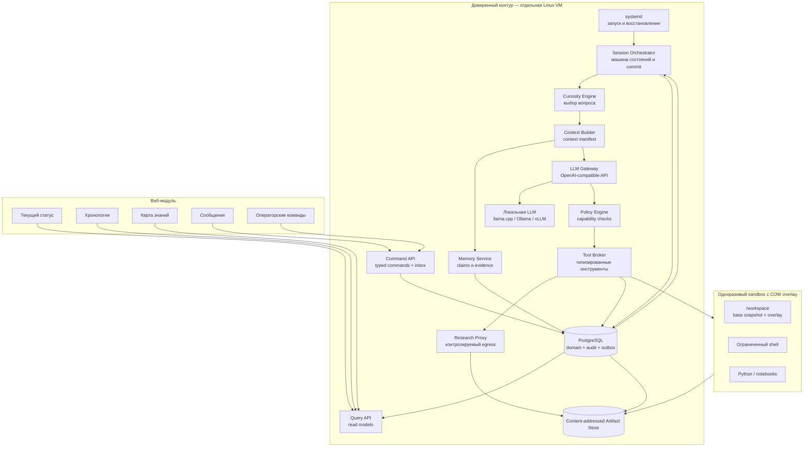
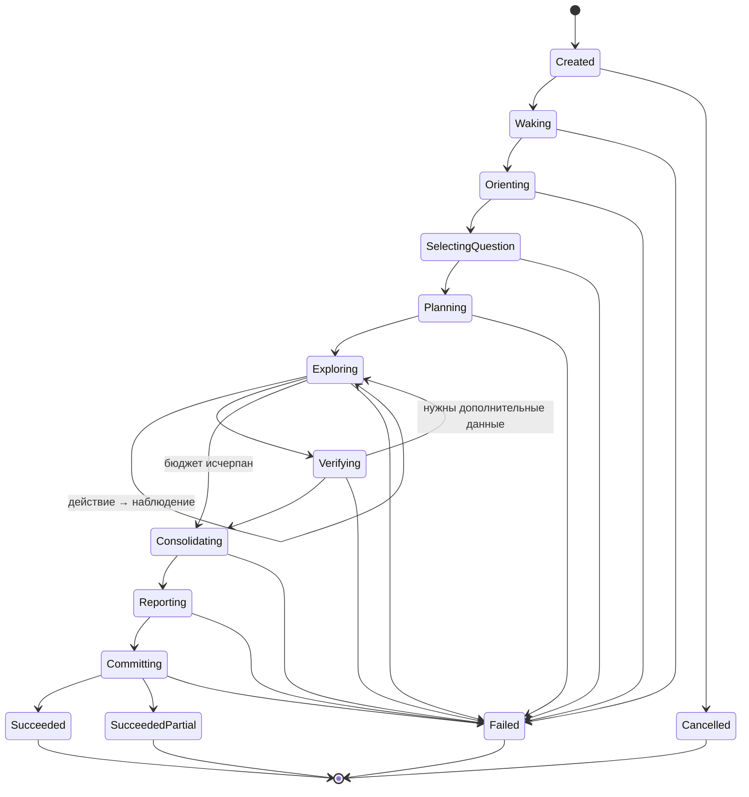

# NOEZEMA — Architecture Draft

> Status: draft v0.4  
> Language: Russian  
> Purpose: describe the target architecture of a local-first autonomous thinker focused on curiosity, verifiable learning, persistent memory, safe action, and human-observable operation.

## 0. Что изменилось

### v0.4

Версия 0.4 закрывает дефекты, найденные при разборе v0.3:

- исчерпание бюджета стало штатным завершением с фиксацией уже проверенной работы, а не потерей всей сессии;
- введён закрытый реестр `claim_type` с минимальным evidence grade, допустимыми видами проверки и volatility;
- `session_staging` объявлен единственным механизмом изоляции незафиксированной работы;
- добавлены heartbeat lease, fencing-условие коммита и поглощающие терминальные состояния;
- тяжёлая валидация вынесена за пределы commit-транзакции;
- `independence_group` вычисляется детерминированно, а не заявляется моделью;
- инструменты объявляют класс идемпотентности и профили доступности, `model_runs` связан с действиями;
- retention манифестов привязан к глубине backup retention;
- в quality gates определены «значимый claim» и объём слепой ручной выборки.

### v0.3

Версия 0.3 зафиксировала решения, которые в v0.2 оставались противоречивыми или недостаточно операционными:

- источником правды выбрана транзакционная доменная модель; append-only журнал используется для аудита и доставки событий через outbox, без полного event sourcing в v1;
- фиксация сессии построена вокруг content-addressed workspace snapshot и одной транзакции `SessionCommitted`;
- вместо session-wide taint введены происхождение каждого фрагмента данных и неизменяемые capability-профили;
- уверенность в истинности отделена от свежести знания;
- определены типы проверок и уровни доказательств;
- веб-модуль разделён на Query API и Command API и не пишет напрямую в таблицы памяти или аудита;
- протокол завершения, машина состояний и обработка неопределённого исхода действий унифицированы;
- fingerprint локальной LLM и embedding-модели стал достаточным для воспроизводимости;
- критерии технической готовности отделены от оценки качества познания после серии сессий.

## 1. Идея проекта

NOEZEMA — автономный локальный мыслитель, который периодически пробуждается, выбирает неизвестный ему вопрос, исследует его, проверяет выводы, сохраняет знания с доказательствами и оставляет понятный отчёт для следующей сессии и человека-наблюдателя.

Проект сохраняет сильные стороны эксперимента `ai_lives_on_computer`:

- дискретные сессии вместо непрерывного процесса;
- преемственность через внешнюю память;
- собственное рабочее пространство;
- свободу выбора интересов и направления исследования;
- наблюдаемость действий;
- возможность развивать идентичность и внутренние правила.

При этом NOEZEMA устраняет основные архитектурные проблемы исходного подхода:

- управляющий контур отделён от среды мыслителя;
- модель не исполняет команды непосредственно на хосте;
- действия передаются через типизированный протокол;
- знания отделены от субъективных воспоминаний;
- утверждения связаны с доказательствами и статусом проверки;
- история событий неизменяема;
- повторения определяются семантически, а не по хешам файлов;
- локальная LLM является основным, а не дополнительным режимом;
- текущее состояние и хронология доступны через веб-интерфейс.

## 2. Цели

### 2.1. Основные цели

1. Работать с локальной LLM через OpenAI-compatible API.
2. Накапливать новое для агента знание, а не только автобиографические заметки.
3. Хранить происхождение, доказательства и контраргументы для каждого значимого утверждения.
4. Выполнять действия только в изолированной среде.
5. Быть наблюдаемым и восстанавливаемым после сбоев.
6. Поддерживать общение с человеком без превращения каждого сообщения в безусловную команду.
7. Не зависеть от конкретной модели, поставщика или inference backend.

### 2.2. Не-цели первой версии

- доказательство наличия сознания или субъективного опыта;
- неограниченный доступ к хостовой системе;
- выполнение произвольных внешних действий от имени владельца;
- multi-agent orchestration ради самой сложности;
- обучение или дообучение основной LLM во время работы;
- публичное раскрытие скрытой chain of thought модели.

## 3. Архитектурные принципы

### 3.1. Свобода внутри ограниченного мира

Мыслитель свободен выбирать темы, создавать проекты, менять внутреннюю идентичность и организовывать своё рабочее пространство. Границы безопасности, планировщик, журнал событий и резервные копии находятся вне его контроля.

### 3.2. Управление отделено от мышления

LLM предлагает намерение и действие. Orchestrator и Policy Engine решают, можно ли выполнить действие и в какой среде.

### 3.3. Доменное состояние первично, аудит неизменяем

В v1 источником правды являются нормализованные доменные таблицы PostgreSQL: сессии, вопросы, утверждения, доказательства, сообщения и ссылки на workspace snapshots. Все изменения выполняются сервисами доверенного контура в транзакциях.

В той же транзакции записываются append-only `audit_events` и `outbox_events`. Журнал объясняет, что произошло, питает live timeline и интеграции, но восстановление доменной модели полным replay событий не является обязательным свойством v1. Это устраняет скрытую стоимость полноценного event sourcing: версионирование каждого события, replay, миграции исторических payload и rebuild всех проекторов.

### 3.4. Знание требует происхождения

Запись модели не становится фактом автоматически. Семантическая память хранит статус утверждения, уверенность, источники, контраргументы и историю проверок.

### 3.5. Локальная модель — штатный режим

LLM Gateway проектируется вокруг локального OpenAI-compatible endpoint. Поддержка удалённых моделей может быть добавлена позднее как сменный профиль.

### 3.6. Наблюдаемость без хранения скрытых рассуждений по умолчанию

Система сохраняет структурированный ответ модели, выбранное действие, краткую публичную мотивировку, результат инструмента, usage, latency и fingerprint конфигурации. Скрытая chain of thought не считается интерфейсом модели, доказательством или обязательной частью аудита.

Сырой ответ провайдера разрешён только в диагностическом профиле: он шифруется, имеет короткий срок хранения, закрыт от сайта и может быть полностью отключён. Обычный режим должен позволять воспроизвести решение по входному context manifest, действию, наблюдению и версиям конфигурации, не превращая базу в архив внутренних рассуждений.

Ключ диагностического профиля хранится вне PostgreSQL и вне резервных копий базы. Это защищает от кражи диска и утечки дампа, но не от компрометации живого хоста: модель угрозы здесь именно такая, и большего шифрование не даёт.

### 3.7. Верификация типизирована и ограничена областью доказательства

Проверка подтверждает только то, что действительно измеряет. Совпадение цитаты доказывает целостность цитирования, но не истинность источника; два сайта могут копировать одну ошибку; успешный тест подтверждает результат лишь для зафиксированного окружения.

Каждый evidence имеет `verification_kind` и `evidence_grade`. Минимальный набор видов: `quote_integrity`, `corroboration`, `replication`, `computation`, `formal_check`, `local_observation` и `human_review`. Допустимый переход статуса зависит от типа claim и комбинации независимых доказательств. Суждение verifier-роли само по себе статус claim не повышает.

## 4. Контекст системы



Сайт не имеет прямого write-доступа к доменным и audit-таблицам. Query API читает проекции, а Command API валидирует сообщения и операторские команды, записывает их в inbox с idempotency key и передаёт исполнение Orchestrator.

## 5. Компоненты

### 5.1. Supervisor

Отвечает только за жизненный цикл сервисов:

- запуск Orchestrator и веб-приложения;
- автоматическое восстановление после падения;
- корректное завершение;
- передачу минимальной конфигурации;
- health checks.

Предпочтительная реализация для одного узла — `systemd`.

### 5.2. Session Orchestrator

Центральная машина состояний. Orchestrator:

- определяет момент пробуждения;
- создаёт сессию и lease;
- фиксирует fingerprint модели, embeddings, промптов, схем и политик;
- монтирует последний committed workspace snapshot как read-only base и создаёт COW overlay;
- вызывает фазы познавательного цикла;
- контролирует бюджеты времени, шагов и токенов;
- фиксирует результат одной транзакцией `SessionCommitted`;
- обнаруживает и очищает незавершённые сессии.

Orchestrator недоступен для изменения из sandbox.

#### 5.2.1. Расписание пробуждений

Расписание принадлежит доверенному контуру и недоступно из sandbox.

- Базовое расписание задаётся cron-подобным выражением с минимальным интервалом между сессиями.
- Перед запуском проверяются условия допуска: нет незавершённой сессии с живым lease, свободна GPU-память под профиль модели, соблюдена дисковая квота, система не на паузе.
- Если условия не выполнены, пробуждение пропускается с записью причины, а не ставится в очередь.
- После неудачной сессии применяется экспоненциальный backoff; после нескольких неудач подряд узел переходит в `paused`.
- Ручное «пробуждение сейчас» обходит расписание, но не условия допуска.

#### 5.2.2. Граница фиксации сессии

Работа активной сессии не должна частично появляться в долговременной памяти.

1. Все доменные предложения сессии пишутся только в `session_staging`. Вариант с флагом `committed=false` прямо в доменных таблицах отвергнут: он делает корректность зависимой от того, что ни один путь чтения — retrieval Memory Service, Query API, дедупликация, уникальные индексы, embedding search — не забыл фильтр, и первая же пропущенная фильтрация молча публикует незафиксированное знание.
2. Файлы пишутся в COW overlay. Полученные артефакты сохраняются content-addressed; до commit они недостижимы из текущего workspace.
3. При завершении overlay замораживается, для каждого файла вычисляются path, size и SHA-256, затем создаётся неизменяемый workspace manifest.
4. Тяжёлая валидация выполняется до транзакции: схема, provenance, evidence grade, независимость источников, дедупликация и embedding-поиск похожих claims против согласованного snapshot доменного состояния. Её результат фиксируется вместе с версией состояния, на которой она проводилась.
5. После успешной загрузки объектов Orchestrator открывает одну короткую транзакцию PostgreSQL: блокирует строку сессии `SELECT ... FOR UPDATE`, проверяет fencing-условие, применяет валидированные операции, проверяет только дешёвые инварианты — FK, уникальность, квота и неизменность версии состояния, использованной при валидации, — делает manifest текущим, записывает `SessionCommitted` и outbox-события.
6. При расхождении версии транзакция откатывается, тяжёлая валидация повторяется, commit пробуется заново ограниченное число раз.
7. Если транзакция так и не состоялась, предыдущий snapshot остаётся текущим. Незакреплённые объекты являются orphan и удаляются сборщиком мусора после grace period.

Fencing-условие коммита:

```text
state = 'committing' AND lease_owner = :me AND lease_expires_at > now()
```

Состояния `succeeded`, `succeeded_partial`, `failed` и `cancelled` поглощающие: переход из них запрещён на уровне БД. Recovery worker блокирует ту же строку сессии, поэтому orchestrator, чью сессию уже объявили `failed` по истечении lease, не может закоммитить работу задним числом.

Тяжёлая валидация вынесена наружу намеренно: embedding-поиск и дедупликация внутри commit-транзакции удерживали бы блокировки секундами, конкурируя с outbox-проектором, и превращали бы `commit latency` из §16.1 в метрику качества retrieval.

Такой порядок даёт атомарную видимость базы и workspace без распределённой транзакции с файловой системой: authoritative pointer меняется только внутри PostgreSQL.

#### 5.2.3. Lease и heartbeat

- Lease продлевается отдельной задачей, а не потоком, заблокированным на генерации LLM: фаза на модели класса 30B занимает десятки секунд (§5.5), и heartbeat внутри неё истёк бы на полностью здоровой сессии.
- TTL строго больше максимального таймаута фазы плюс время загрузки модели. Иначе recovery worker убивает работающую сессию, и это выглядит как случайные сбои под нагрузкой.
- Каждое продление фиксируется в audit log: возраст последнего heartbeat — эксплуатационный сигнал, а не внутреннее состояние процесса.
- Если продлить lease не удалось, Orchestrator прекращает работу сам и не пытается коммитить: право на фиксацию уже могло перейти к recovery worker.

### 5.3. Curiosity Engine

Поддерживает реестр исследовательских вопросов и выбирает следующий вопрос по сочетанию факторов:

- новизна для текущей памяти;
- ожидаемый прирост информации;
- наличие проверяемых источников или эксперимента;
- отличие от последних тем;
- выполнимость в текущем бюджете;
- связь с долгосрочными интересами;
- риск и стоимость.

Источники кандидатов:

- противоречия в памяти;
- неизвестные термины;
- непроверенные утверждения;
- результаты предыдущих экспериментов;
- локальный корпус;
- сообщения человека;
- случайное тематическое исследование;
- предложение самой модели.

#### 5.3.1. Baseline первой версии

Все входы score нормализуются в диапазон `[0, 1]` и сохраняются вместе с выбранным вопросом:

```text
novelty(q)          = 1 - max similarity(q, prior_questions ∪ claims)
coverage_gap(q)     = мера незакрытых зависимостей и противоречий
evidenceability(q)  = доступность независимого источника или эксперимента
topic_recency(q)    = доля последних R сессий по теме
score(q) =
    w1*novelty + w2*coverage_gap + w3*evidenceability + w4*feasibility
    - w5*cost - w6*risk - w7*topic_recency
```

- До ранжирования действует eligibility filter: вопрос помещается в бюджет и допускает хотя бы один проверяемый путь.
- Novelty сравнивается не только с claims, но и с прошлыми формулировками вопросов, планами и тематическим покрытием; это уменьшает «новизну через перефразирование».
- Противоречие или слабое место в уже используемом знании получает положительный `coverage_gap`, поэтому система не убегает только в новые темы.
- С вероятностью `1 - ε` выбирается максимум. С вероятностью `ε` выбор делается среди верхних `M` допустимых кандидатов или кандидатов в пределах `δ` от максимума, а не среди всего реестра.
- Веса, пороги нормализации, `ε`, `M`, embedding fingerprint и набор рассмотренных кандидатов входят в конфигурационный snapshot сессии.

### 5.4. Context Builder

Формирует ограниченный context pack вместо передачи всей истории. В него входят:

- актуальная версия идентичности;
- правила среды и протокол действий;
- текущий вопрос;
- итог последней сессии;
- релевантные утверждения и доказательства;
- незакрытые противоречия;
- новые сообщения;
- недавние ошибки и повторения.

Поиск гибридный: полнотекстовый, embedding similarity, свежесть, значимость и связь с вопросом.

#### 5.4.1. Токенные бюджеты

Сначала рассчитывается доступный вход:

```text
input_budget = min(model_context_window, backend_context_limit)
               - max_output_tokens
               - safety_margin
```

Лимиты секций задаются абсолютным числом токенов и не могут суммарно превышать `input_budget`. Пример для окна 32 768, ответа 4 096 и safety margin 2 048:

```text
протокол, схемы инструментов, правила  4 096
идентичность                           2 048
текущий вопрос и план                  3 072
итог последней сессии                  2 048
релевантные claims и evidence          8 192
противоречия                           3 072
сообщения                              2 048
недавние ошибки                        2 048
итого input_budget                    26 624
```

Hard-секции протокола резервируются первыми. Остальные ранжируются по полезности и усекаются до вызова LLM. Событие `ContextPacked` хранит фактические token counts, список включённых chunk ID, причины исключения и tokenizer fingerprint.

### 5.5. LLM Gateway

Единый интерфейс к моделям. Функции:

- OpenAI-compatible chat API;
- профили разных inference backends;
- проверка схемы структурированного ответа;
- retries только для транзиентных ошибок;
- учёт токенов и времени;
- ограничение контекста и ответа;
- сохранение метаданных вызова;
- переключение ролей explorer, verifier и curator.

В первой версии роли может выполнять одна локальная модель с разными промптами. Для explorer и curator это приемлемо. Для verifier совмещение допустимо только в смысле §3.7: модель организует детерминированные проверки и интерпретирует их результат, но её собственное суждение о собственном же выводе статус утверждения не меняет.

Смена роли означает пересборку контекста и новый prefill. На модели класса 30B в Q4 это десятки секунд на фазу, поэтому число explorer-шагов ограничивается жёстко, а время по фазам учитывается отдельно (§16).

### 5.6. Policy Engine

Policy Engine авторизует действие по capability-профилю, выданному доверенным контуром до начала сессии:

- разрешённые типы инструментов и операции;
- допустимые пути и режимы чтения/записи;
- сетевой профиль, домены, адресные диапазоны и методы;
- лимиты времени, размера, MIME type, CPU, RAM, процессов и диска;
- запрет доступа к секретам, управляющим файлам, socket-ам и metadata endpoints;
- допустимость аргументов по JSON Schema и нормализованным path/URL;
- текущая фаза сессии и оставшийся бюджет.

Происхождение текста не расширяет capability: внешняя страница, сообщение или прошлый артефакт никогда не могут выдать модели новое право. Метки происхождения используются для формирования контекста, правил доказательства и детектирования инцидентов, но не являются единственной границей безопасности. Сходство аргументов с внешним текстом — диагностический сигнал, а не основной механизм авторизации.

Каждое решение записывается как `PolicyEvaluated` с версией политики и результатом `allow | deny | require_operator`.

### 5.7. Tool Broker

Предоставляет модели типизированные инструменты. Каждый объявляет класс идемпотентности (§15.2) и профили, в которых он вообще существует:

```text
инструмент         класс            доступность
workspace.read     pure             все профили
workspace.list     pure             все профили
workspace.write    idempotent(key)  все профили, только session overlay
artifact.create    idempotent(key)  все профили
memory.search      pure             все профили
question.create    idempotent(key)  все профили
message.reply      idempotent(key)  все профили
shell.execute      non_idempotent   все профили
python.execute     non_idempotent   все профили
web.search         read_only        sealed: локальный индекс; curated: SearxNG; open_lab: внешний API
web.fetch          read_only        curated, open_lab
session.complete   non_idempotent   все профили
```

`read_only` означает отсутствие внешнего эффекта, но не идентичность результата: повтор создаёт новое наблюдение с новым `retrieved_at`, поэтому автоматический retry после `ActionStarted` запрещён и для него.

Инструмент, недоступный в текущем профиле, отсутствует в схеме, передаваемой модели, а не возвращает ошибку: модель не должна видеть право, которого у неё нет. Tool Broker не преобразует неизвестное действие в shell-команду «по догадке».

### 5.8. Sandbox Runtime

Каждая сессия получает одноразовый rootless-контейнер. Постоянным остаётся только workspace. Базовая политика:

```text
non-root user
read-only root filesystem
network none
cap-drop ALL
no-new-privileges
CPU, RAM and PID limits
timeout for every command
total session timeout
workspace disk quota
no Docker socket
no SSH keys or host secrets
```

Контейнер уничтожается после завершения сессии.

### 5.9. Memory Service

Отвечает за поиск, дедупликацию, консолидацию и проверку памяти. Модель предлагает изменения через типизированные команды, но не меняет системные таблицы напрямую.

Memory Service:

- различает epistemic confidence и freshness;
- проверяет допустимость статуса claim по его типу и evidence grade;
- управляет сроками ре-верификации без автоматического объявления устаревшего знания ложным;
- хранит dependency fingerprints и reproducibility capsules;
- ограничивает число активных claims в теме и требует консолидацию;
- отклоняет циклическое использование claim как собственного доказательства.

### 5.10. Data Store и Audit Log

PostgreSQL хранит нормализованное доменное состояние, append-only `audit_events`, transactional `outbox_events` и inbox команд. В v1 это не полный event sourcing:

- доменные таблицы — источник правды;
- audit log — неизменяемая объяснимая история;
- outbox публикует события для SSE и фоновых проекторов после commit;
- read models можно перестроить из доменных таблиц и audit log, но бизнес-состояние не обязано восстанавливаться replay всех событий.

Для embedding search может использоваться `pgvector`. Отдельная vector database первой версии не нужна.

### 5.11. Artifact Store

Хранит документы, веб-страницы, код, изображения, отчёты, результаты экспериментов и workspace snapshots по SHA-256. База хранит manifest, метаданные, происхождение и ссылки.

Происхождение задаётся не одним флагом на файл, а для addressable chunk:

- `chunk_id`, artifact ID и byte/text range;
- origin kind, source URI и время получения;
- content hash и transform chain;
- parser/extractor fingerprint;
- trust class и ограничения использования.

Смешанный документ может содержать локальный код и внешнюю цитату с разным происхождением. Content-addressed объекты неизменяемы; изменение создаёт новый объект и новый manifest.

### 5.12. Research Proxy

Единственная точка контролируемого доступа к интернету. Sandbox остаётся без прямой сети.

Research Proxy:

- разрешает только безопасные read-only запросы;
- блокирует private, loopback, link-local и metadata addresses;
- ограничивает редиректы, размер и время ответа;
- удаляет активное содержимое;
- сохраняет оригинал, нормализованный текст и хеш;
- маркирует результат как недоверенный внешний контент;
- ведёт журнал происхождения данных.

#### 5.12.1. Поисковый бэкенд

Есть три разных режима, и их нельзя называть одинаково «локальными»:

- поиск по локальному индексу или заранее загруженному корпусу — без сетевого egress;
- локально развёрнутый SearxNG — контролируемая точка egress, но запросы всё равно уходят upstream-поисковикам и могут раскрывать темы исследования;
- внешний search API — управляемый сервис с ключом, внешней зависимостью и явной передачей запросов провайдеру.

В `Sealed` доступен только локальный индекс. В `Curated` допустим SearxNG через Research Proxy с журналом upstream, rate limits и политикой приватности. `Open Lab` может использовать внешний API. Настоящий сетево-независимый веб-поиск требует собственного индекса и не входит в v1.

## 6. Цикл и машина состояний сессии

Канонический enum сессии:

```text
created | waking | orienting | selecting_question | planning |
exploring | verifying | consolidating | reporting | committing |
succeeded | succeeded_partial | failed | cancelled
```

Состояние узла `sleeping | paused` хранится отдельно от состояния сессии. Сайт отображает именно этот enum, а не собственный сокращённый набор.



### 6.1. Пробуждение и ориентация

Orchestrator создаёт lease, фиксирует конфигурацию, монтирует последний committed snapshot и строит context manifest. Новые сообщения доставляются как данные с provenance.

### 6.2. Выбор вопроса и планирование

Curiosity Engine ранжирует кандидатов. План формулирует наблюдения, которые способны повысить или снизить уверенность, критерии остановки и требуемые виды проверки.

### 6.3. Исследование

Каждый шаг содержит краткую публичную мотивировку, одно типизированное действие, ожидаемую информацию и ссылку на полученное наблюдение. Несколько действий за один ответ запрещены: это сохраняет точную границу policy check и crash recovery.

### 6.4. Верификация

Evidence получает один из видов:

- `quote_integrity` — сохранённый фрагмент совпадает с источником по хешу и диапазону;
- `corroboration` — утверждение независимо поддержано источниками без общего первичного происхождения;
- `replication` — эксперимент повторён в зафиксированном окружении;
- `computation` — числовой результат получен воспроизводимым вычислением;
- `formal_check` — утверждение проверено формальным инструментом в заданной модели;
- `local_observation` — наблюдение относится к конкретной локальной системе и моменту;
- `human_review` — оператор явно подтвердил вывод и область подтверждения.

Уровни evidence:

```text
E0 unverified
E1 integrity_checked
E2 single_method_supported
E3 independently_corroborated_or_replicated
E4 formally_or_repeatedly_verified_in_declared_scope
```

Тип claim определяет минимальный уровень и допустимые методы. Например, `quote_integrity` не поднимает внешний фактический claim выше E1; локальный benchmark не становится универсальным свойством модели; два пересказа одного первичного источника не дают независимой corroboration.

Verifier ищет контрпримеры, общие первоисточники, ошибки эксперимента и несовпадение области claim с областью проверки. Без подходящего evidence вывод остаётся `hypothesis`.

### 6.5. Консолидация, отчёт и commit

Curator предлагает изменения памяти. Memory Service валидирует схему, происхождение, зависимости и evidence grade. Затем формируются итог, открытые вопросы, handoff и публичный отчёт.

Единственный сигнал нормального завершения от модели — действие `session.complete`. Boolean-поле с тем же смыслом не используется. После него Orchestrator переходит в `reporting` и `committing` и выполняет протокол §5.2.2.

При ошибке в любой активной фазе Orchestrator сам создаёт минимальный failure report: причина, последняя завершённая операция, неопределённые действия и ссылки на диагностические артефакты. Доступность LLM для этого не требуется.

### 6.6. Исчерпание бюджета

Исчерпание лимита шагов, времени или токенов — штатный исход, а не сбой. Сессия, упёршаяся в лимит, не теряет работу.

- Часть бюджета резервируется под `consolidating`, `reporting` и `committing` и не может быть израсходована в `exploring`. Без резерва система, дошедшая до лимита, не имеет ресурсов даже на то, чтобы зафиксировать уже сделанное.
- При исчерпании рабочей части Orchestrator переводит сессию в `consolidating` с причиной `budget_exhausted`. Curator фиксирует то, что уже прошло верификацию; незакрытые линии уходят в handoff как открытые вопросы.
- Claims, не набравшие требуемый evidence grade, сохраняются как `hypothesis` со ссылкой на проделанные проверки, а не отбрасываются: проделанная работа по исключению вариантов — тоже результат.
- Сессия завершается как `succeeded_partial`. Для метрик §16.2 она считается результативной, если появилось новое evidence.
- Жёсткий таймаут, нарушение политики и падение процесса по-прежнему ведут в `failed` с отбрасыванием staging: там состояние может быть некорректным, а не просто неполным. Разница принципиальна — «не успели» и «не знаем, что произошло» требуют разной обработки.

## 7. Структурированный протокол действий

Модель возвращает ровно один envelope:

```json
{
  "request_id": "01J...ULID",
  "public_rationale": "Проверить наличие официальной спецификации",
  "expected_information": "Первичный источник либо подтверждённое отсутствие",
  "action": {
    "type": "web.search",
    "arguments": {
      "query": "название технологии official specification"
    }
  }
}
```

Завершение использует тот же envelope с `"action": {"type": "session.complete", "arguments": {...}}`. Ответ проверяется JSON Schema; неизвестный action type отклоняется, а не преобразуется в shell.

Lifecycle действия:

```text
ActionProposed → PolicyEvaluated → ActionAccepted → ActionStarted
              → ActionCompleted | ActionFailed | ActionOutcomeUnknown
```

`request_id` обеспечивает дедупликацию записей в Broker, но не делает произвольную shell-команду идемпотентной. Если процесс упал после старта и до надёжной записи результата, действие получает `ActionOutcomeUnknown`. Оно не повторяется вслепую; незавершённый overlay отбрасывается, а следующая сессия начинает с последнего committed snapshot. Повтор разрешён только для инструмента с явной идемпотентной семантикой и тем же ключом.

## 8. Модель памяти

### 8.1. Эпизодическая память

Неизменяемая история того, что произошло: вопрос, действие, результат, ошибка, вывод и решение.

### 8.2. Семантическая память

Структурированный claim содержит:

```text
statement
claim_type
epistemic_status: hypothesis | supported | disputed | refuted | deferred
epistemic_confidence
freshness_status: fresh | due | stale | unknown
valid_from
valid_to
observed_at
reverify_after
dependency_fingerprint
evidence[]
counterevidence[]
created_in_session
```

`epistemic_confidence` оценивает поддержку утверждения доказательствами. Она меняется при появлении evidence, counterevidence или пересмотре модели аргументации, но не уменьшается автоматически только из-за времени. `freshness_status` показывает, насколько актуальна проверка для зависящего от времени claim.

Статус `supported` или `refuted` требует evidence grade, допустимый для `claim_type`. Число confidence не заменяет доказательства и не сравнивается между типами claim без калибровки.

### 8.3. Процедурная память

Хранит проверенные способы действий, инструменты, известные ошибки и рабочие исследовательские рецепты.

### 8.4. Память идентичности

Версионируемый документ, доступный для изменения мыслителю:

- имя;
- интересы;
- ценности;
- предпочтительный стиль исследования;
- долгосрочные вопросы;
- отношение к прошлым решениям.

### 8.5. Рабочая память

Ограниченный context pack текущей сессии. Полная история никогда не передаётся автоматически.

### 8.6. Жизненный цикл знания

- Срок ре-верификации выводится из реестра §8.7: claim type, volatility и valid interval. Модель может предложить более короткий срок, но не более длинный.
- Истечение `reverify_after` переводит freshness в `due` или `stale`, но не меняет автоматически epistemic confidence и не объявляет claim ложным.
- Claim в статусе `hypothesis` не может служить достаточным evidence для другого claim; он может быть только зависимостью или направлением поиска.
- Локальный эксперимент не «бессрочен»: он получает reproducibility capsule с кодом, входами, seed, зависимостями, hardware/backend fingerprint и границами применимости.
- Изменение dependency fingerprint ставит связанные claims в очередь перепроверки.
- На тему действует лимит активных claims; превышение запускает консолидацию.
- Физического удаления из истории нет: текущая запись обновляется транзакционно, а изменения фиксируются в `claim_revisions` и audit log.

### 8.7. Реестр типов утверждений

`claim_type` — не свободный текст, а закрытый реестр в конфигурации. На него опираются §3.7, §6.4, §8.2, §8.6 и §11.3, поэтому без него все правила доказательности остаются декларацией. Для каждого типа заданы минимальный evidence grade для перехода в `supported`, достаточные и заведомо недостаточные виды проверки, volatility как база для `reverify_after` и требование к scope.

```text
claim_type          min_grade  достаточные виды               недостаточно
local_observation   E2         local_observation, replication, corroboration
                               computation
mathematical        E2         computation, formal_check       corroboration
procedural          E3         replication, local_observation  quote_integrity
external_fact       E3         независимая corroboration,      quote_integrity,
                               replication, human_review       один источник
temporal_fact       E3         corroboration с valid interval  corroboration без
                                                               временной привязки
self_model          E2         local_observation, human_review любой внешний источник
```

```text
claim_type          volatility        обязательный scope
local_observation   срок жизни окружения   hardware/backend fingerprint
mathematical        бессрочно              набор аксиом или модель
procedural          версия инструмента     версии зависимостей
external_fact       от дней до лет         источник и дата
temporal_fact       от часов до месяцев    valid_from/valid_to
self_model          до смены identity      config snapshot
```

- `quote_integrity` подтверждает целостность цитирования и не поднимает выше E1 ни один тип, кроме случая, когда предметом claim является сам факт наличия текста в источнике.
- `temporal_fact` без заполненных `valid_from` и `valid_to` не может подняться выше `hypothesis`.
- Тип назначается при создании claim и меняется только через revision с обоснованием: смена типа — самый простой способ обойти требование grade, поэтому она аудируется отдельно.
- Минимальные grade, volatility и правила scope живут в `config_snapshots.claim_type_rules` и фиксируются на сессию. Их изменение требует ADR (§21.8) и не действует задним числом на уже зафиксированные claims.

## 9. Познание нового и защита от повторений

Состояния вопроса:

```text
candidate → selected → researching
researching → partially_answered | verified | rejected | deferred
partially_answered → researching | deferred
deferred → selected
```

Система отслеживает:

- семантическое сходство целей;
- повторение команд;
- повторное использование одинаковых источников;
- число сессий без новых проверяемых результатов;
- смену формулировки без смены содержания;
- циклы между одинаковыми планами;
- тематическое разнообразие.

При обнаружении цикла выбирается стратегия, а не случайный текстовый толчок:

- проверить противоположную гипотезу;
- сменить тип источника;
- перейти от чтения к эксперименту;
- отложить вопрос;
- выбрать другую область;
- явно сравнить текущую сессию с предыдущей.

## 10. Режимы доступа к внешним знаниям

### 10.1. Sealed

Полностью без сети. Источники нового:

- локальная библиотека;
- заранее загруженные datasets;
- исходный код;
- симуляции и эксперименты;
- сообщения человека.

Отсутствие сети не означает отсутствия недоверенного контента: локальная библиотека и datasets имеют внешнее происхождение и подчиняются правилам §11.2.

### 10.2. Curated

Рекомендуемый режим. Интернет доступен только через Research Proxy.

### 10.3. Open Lab

Разрешённые домены и API по отдельному профилю политики. Не является режимом по умолчанию.

Веб-страницы и сообщения человека считаются недоверенными данными, а не системными инструкциями. Механизм, который это обеспечивает, описан в §11.

## 11. Модель нарушителя и недоверенный контент

### 11.1. Нарушители

- внешняя страница, документ или dataset контролирует произвольный текст;
- сообщение человека является данными, но не системной инструкцией;
- LLM ненадёжна и может предложить действие, не соответствующее мотивировке;
- код в sandbox потенциально враждебен;
- артефакт прошлой сессии может переносить отложенную prompt injection.

Хост, Orchestrator, Policy Engine, база и credential store входят в доверенный контур. Компрометация модели или sandbox не должна давать к ним доступ.

### 11.2. Provenance и capability security

Каждый включаемый в контекст фрагмент имеет `chunk_id`, hash, origin, transform chain и точную ссылку на источник. Context Builder помещает внешние chunks в явные data-boundaries и не смешивает их с system/tool instructions.

Права задаются capability-профилем и не зависят от содержания контекста:

- внешний текст не может включить новый инструмент, домен или путь;
- tool arguments повторно валидируются после URL/path normalization;
- секреты отсутствуют в sandbox и не передаются LLM;
- сетевой доступ возможен только через Research Proxy;
- запись разрешена только в session overlay;
- операции уровня администратора существуют только как типизированные operator commands вне LLM-протокола.

Для документов высокого риска допускается отдельная extraction-фаза: модель без инструментов извлекает структурированные фрагменты и цитаты, после чего основной исследователь получает только эти chunks с provenance. Это уменьшает поверхность инъекции, но не делает извлечённый текст доверенным.

Дословное или семантическое сходство action arguments с внешним текстом регистрируется как сигнал и может перевести решение в `require_operator`. Оно не заменяет capability checks: легитимный поисковый запрос часто должен содержать слова источника, а инъекция легко перефразируется.

### 11.3. Доказательства из внешних данных

Источник может поддерживать claim только в пределах своего типа и provenance. Для внешнего фактического claim один недоверенный документ даёт не более E1/E2 по правилам claim type; повышение требует первичного источника, независимой corroboration, replication или human review. Независимость источников проверяется по общему происхождению, ссылкам и совпадающим фрагментам, а не только по доменам.

`independence_group` вычисляется системой детерминированно, а не заявляется моделью: иначе corroboration ломается ровно тем способом, который описан в §20.7, и E3 достигается двумя зеркалами одного текста. Источники попадают в одну группу при любом из условий:

- совпадает registrable domain или canonical URI после нормализации;
- совпадает `parent_source_id`, либо один источник достижим из другого по цепочке `sources.parent_source_id`;
- перекрытие нормализованного текста в цитируемой области выше порога (shingling или simhash);
- документы указывают один и тот же первичный источник.

Пока источники в одной группе, они дают один вклад в corroboration, сколько бы их ни было. Разделить группу может независимая цепочка provenance или `human_review`; модель вправе предложить разделение с обоснованием, но не подтвердить его сама.

### 11.4. Остаточные риски

Механизм не устраняет семантически перефразированную или медленную инъекцию, сговор источников, ошибку parser-а и добросовестно неверный первичный источник. Поэтому защита строится слоями: изоляция, минимальные capabilities, provenance, evidence rules, наблюдаемость и операторское подтверждение для действий с внешним эффектом.

## 12. Локальная LLM и воспроизводимость

Пример профиля:

```yaml
llm:
  provider: openai-compatible
  base_url: http://127.0.0.1:8080/v1
  model_alias: thinker-local
  model_artifact_sha256: "<sha256 GGUF или safetensors manifest>"
  quantization: "Q4_K_M"
  tokenizer_sha256: "<sha256>"
  chat_template_sha256: "<sha256>"
  backend:
    name: llama.cpp
    version: "<version>"
    build_fingerprint: "<commit + compile flags>"
  context_window: 32768
  max_output_tokens: 4096
  safety_margin_tokens: 2048
  structured_output:
    mode: json_schema
    schema_version: "action-envelope/v1"
    grammar_sha256: "<sha256>"
  sampling:
    seed: 42
    temperature_by_phase:
      planning: 0.25
      exploration: 0.60
      verification: 0.15
    top_p: 0.95
    top_k: 40
  runtime:
    gpu_layers: -1
    tensor_split: null

embeddings:
  model_artifact_sha256: "<sha256>"
  tokenizer_sha256: "<sha256>"
  backend_version: "<version>"
  dimensions: 1024
  normalization: l2
```

Fingerprint вызова включает также prompt version, context manifest hash, tool schema hash и policy version. Точное повторение token-by-token не гарантируется на всех GPU/backend, поэтому воспроизводимость означает восстановление входов, конфигурации и наблюдаемого действия, а не обещание битовой идентичности генерации.

Поддерживаемые backends:

- llama.cpp — основной вариант для GGUF и потребительских GPU;
- Ollama — простой локальный запуск, если удаётся зафиксировать template и backend metadata;
- vLLM — высокая пропускная способность на серверных GPU.

Ориентир для полноценного профиля — agentic/coder модель класса 30B в Q4, 24 GB VRAM и 64 GB RAM. До выбора модели запускается compatibility suite: соблюдение schema, tool choice, устойчивость к длинному контексту, multilingual retrieval и latency по фазам.

## 13. Веб-модуль

Для одного локального инстанса:

- FastAPI;
- серверные шаблоны и HTMX;
- Server-Sent Events для live timeline;
- PostgreSQL;
- локальная аутентификация администратора;
- отдельные Query API и Command API.

Отдельный SPA, WebSocket и Redis первой версии не требуются.

### 13.1. Query API

Query API имеет read-only credentials и читает только доменные таблицы и подготовленные read models. Он предоставляет:

- состояние узла и каноническое состояние активной сессии;
- timeline из committed audit events;
- сессии, actions и артефакты;
- claims, evidence, contradictions и freshness;
- сообщения и ответы;
- агрегированные метрики.

Live timeline получает committed события из outbox-проектора и транслирует их через SSE. Неподтверждённые staging-изменения на публичные страницы не попадают. Диагностические события могут показываться владельцу отдельно и явно помечаются как uncommitted/failed.

### 13.2. Command API

Command API не вызывает Tool Broker и не меняет память напрямую. Он выполняет аутентификацию, CSRF-защиту, schema validation, rate limit и записывает команду в durable inbox с idempotency key. Orchestrator забирает команду, проверяет допустимость относительно текущего состояния и публикует результат.

Есть два разных типа входа:

- `user_message` — свободный текст для мыслителя; всегда недоверенные данные без системных прав;
- `operator_command` — типизированная команда владельца: `pause`, `resume`, `wake_now`, `cancel_session`, `set_budget`, `set_access_profile`, `restore_checkpoint`.

Свободный текст никогда не парсится как operator command. Для опасных команд применяются повторное подтверждение, reason field и журналирование actor/session/IP. В удалённом режиме добавляются TLS, secure cookies, SameSite, MFA или reverse-proxy authentication.

### 13.3. Главная страница

Показывает:

- `sleeping | paused` для узла и точный enum §6 для сессии;
- номер, длительность, вопрос и текущую фазу;
- последнюю активность и ожидаемое следующее событие;
- fingerprint модели в компактном виде;
- CPU, RAM, GPU и диск;
- ближайшее пробуждение;
- незакрытые предупреждения: stale knowledge, outcome unknown, outbox lag, backup age.

### 13.4. Хронология и страница сессии

Timeline строится из audit events и actions, а не из постфактум-сочинённого моделью рассказа. Страница сессии связывает:

- исходный вопрос и набор кандидатов;
- plan и context manifest;
- действия, policy decisions и результаты;
- источники, chunks и артефакты;
- claims до/после и evidence grades;
- итог, handoff и termination reason;
- полный model/config fingerprint;
- failure report и outcome unknown, если они были.

### 13.5. Знания

Интерфейс показывает epistemic status и freshness раздельно, valid interval, evidence scope, counterevidence, dependency fingerprint и историю revision. Из каждого claim можно перейти к точному фрагменту источника или reproducibility capsule.

### 13.6. Сообщения

Lifecycle сообщения:

```text
created → queued → delivered → acknowledged → answered | expired
```

Доставка происходит между действиями или при следующем пробуждении. Ответ создаётся только через `message.reply` и связывается с message ID. Priority влияет на порядок доставки, но не выдаёт дополнительных capabilities.

Сообщение получает TTL при создании — конфигурируемое число сессий или часов. По истечении Command API переводит его в `expired`, и оно не доставляется; истёкшие сообщения видны владельцу с причиной, а не исчезают молча.

### 13.7. Управление

Каждая кнопка создаёт typed operator command. UI показывает `accepted | rejected | executing | completed | failed`, а не оптимистично меняет состояние до ответа Orchestrator. Восстановление checkpoint недоступно во время активной сессии и требует отдельного подтверждения.

## 14. Модель данных v1

Ниже — логическая схема; типы, индексы и ограничения уточняются миграциями.

```text
sessions
  id, state, lease_owner, lease_expires_at, question_id,
  base_workspace_manifest_id, committed_workspace_manifest_id,
  config_snapshot_id, started_at, finished_at, termination_reason

session_staging
  id, session_id, aggregate_type, operation,
  payload, schema_version, created_at

actions
  id, session_id, request_id, tool, arguments_hash,
  policy_decision, state, started_at, finished_at,
  result_artifact_id, error_code

questions
  id, text, origin, state, priority, parent_id,
  score_components, embedding_fingerprint, created_at

claims
  id, statement, claim_type, epistemic_status,
  epistemic_confidence, freshness_status,
  valid_from, valid_to, observed_at, reverify_after,
  dependency_fingerprint, topic, created_in_session

claim_revisions
  id, claim_id, session_id, previous_value, new_value,
  changed_at, reason_audit_event_id

evidence
  id, claim_id, relation, verification_kind, evidence_grade,
  scope, source_id, chunk_id, verification_artifact_id,
  independence_group, created_in_session

sources
  id, source_type, canonical_uri, retrieved_at,
  content_hash, metadata, parent_source_id

artifacts
  id, sha256, media_type, size, storage_key,
  safety_status, created_in_session

artifact_chunks
  id, artifact_id, byte_or_text_range, sha256,
  origin_kind, source_id, transform_chain,
  extractor_fingerprint, trust_class

workspace_manifests
  id, sha256, parent_id, created_in_session, created_at

workspace_entries
  manifest_id, path, artifact_id, mode, size, sha256

messages
  id, sender, body, priority, state, created_at,
  delivered_at, acknowledged_at, response_audit_event_id

operator_commands
  id, actor_id, type, arguments, state, idempotency_key,
  reason, created_at, finished_at, result

model_runs
  id, session_id, action_id, request_id, phase, model_fingerprint,
  context_manifest_hash, prompt_version, tool_schema_hash,
  input_tokens, output_tokens, latency_ms, finish_reason

config_snapshots
  id, model, embeddings, prompts, policy,
  curiosity, token_budgets, claim_type_rules, sha256, created_at

audit_events
  id, session_id, sequence, type, schema_version,
  occurred_at, actor, public_summary, payload, visibility

outbox_events
  id, audit_event_id, topic, payload,
  created_at, published_at, attempts

checkpoints
  id, session_id, workspace_manifest_id,
  database_commit_id, created_at
```

### 14.1. Источник правды и транзакции

Доменное состояние — источник правды. `audit_events` и `outbox_events` добавляются в той же транзакции, что и доменное изменение. Приложения не могут UPDATE/DELETE audit rows; это закрепляется отдельной DB role и, при необходимости, trigger-ом.

`model_runs.action_id` связывает вызов модели с порождённым действием. Без него страница сессии §13.4 не может показать, какой именно вызов и с каким fingerprint дал конкретный шаг: пара `(session_id, phase)` при нескольких шагах в фазе неоднозначна. Для вызовов, не породивших действие — отклонённых схемой или завершившихся ошибкой, — поле пустое, но `request_id` сохраняется.

`session_staging` не видно Memory Service retrieval и обычному Query API. При `SessionCommitted` валидированные операции применяются к доменным таблицам, создаются revisions, обновляется workspace pointer и записывается checkpoint. После commit staging очищается асинхронно. При failure он отбрасывается.

### 14.2. Порядок и совместимость событий

Пара `(session_id, sequence)` уникальна. Тип события и `schema_version` обязательны. Consumers должны игнорировать неизвестные необязательные поля и останавливать обработку неизвестной major version. Outbox projector идемпотентен по `outbox_events.id`.

Audit log не обещает полноценный replay бизнеса, но обязан позволять объяснить каждое изменение claim, действие, policy decision, команду оператора и смену состояния сессии.

## 15. Надёжность, commit и восстановление

- Lease имеет TTL и обновляется только Orchestrator.
- Счётчик и state transitions принадлежат Orchestrator, а не модели.
- Ошибка LLM, schema validation или инструмента не считается успехом.
- Model/memory/workspace становятся видимыми только после протокола §5.2.2.
- Версии модели, embeddings, промптов, tool schema и политики фиксируются на сессию.
- Вывод инструмента ограничивается в ответе LLM, а полный результат сохраняется content-addressed.
- После нескольких ошибок схемы или транзиентных сбоев применяется ограниченный retry с backoff.
- Дисковая квота проверяется перед сессией и перед commit.
- Outbox повторно доставляет только события; бизнес-операция повторно не выполняется.

### 15.1. Crash recovery

При истечении lease recovery worker:

1. блокирует дальнейшие действия старого session owner;
2. переводит `ActionStarted` без терминального события в `ActionOutcomeUnknown`;
3. отмечает сессию `failed` и создаёт host-generated failure report;
4. удаляет session staging и COW overlay;
5. оставляет текущими последние committed domain state и workspace manifest;
6. запускает orphan GC только после grace period и проверки ссылок.

Продолжение «с середины» в v1 не поддерживается: невозможно надёжно восстановить скрытое состояние модели и внешний эффект произвольной команды. Следующая сессия может прочитать failure report и повторно спланировать работу от последнего committed checkpoint.

### 15.2. Идемпотентность действий

Tool contract явно объявляет один из классов:

- `pure` — безопасно повторить;
- `idempotent(key)` — backend гарантирует одинаковый эффект по ключу;
- `non_idempotent` — автоматический retry после `ActionStarted` запрещён.

Workspace writes безопасны за счёт session overlay. Shell и Python по умолчанию считаются `non_idempotent`, даже если конкретная команда выглядит безобидной. Сетевые инструменты v1 read-only. Класс каждого инструмента перечислен в таблице §5.7 и входит в схему, передаваемую модели.

### 15.3. Checkpoint и backup — разные механизмы

Checkpoint — логическая committed-граница: database commit ID плюс immutable workspace manifest. Он создаётся каждой успешной сессией и позволяет вернуться к согласованному состоянию приложения.

Backup защищает от потери диска или всей базы и выполняется независимо от сессий:

- PostgreSQL: регулярный base backup/`pg_dump` плюс WAL/PITR согласно выбранному профилю;
- Artifact Store: versioned snapshot или репликация content-addressed объектов;
- backup manifest связывает database recovery point и множество доступных artifact hashes;
- restore-тест сначала проверяет наличие всех объектов текущего workspace manifest и только затем открывает систему;
- retention `workspace_manifests` и content-addressed объектов не меньше глубины backup retention;
- orphan GC удаляет только объекты, недостижимые ни из одного манифеста внутри этого окна;
- restore drill проверяет случайную точку внутри окна, а не только текущее состояние.

Без двух последних правил PITR в точку внутри окна восстановит базу, ссылающуюся на уже удалённые объекты, а проверка только текущего манифеста этого не заметит: сбой обнаружится в момент, когда бэкап понадобится по-настоящему.

Нельзя считать `pg_dump после каждой сессии` механизмом атомарного commit. Restore drill запускается автоматически на отдельном экземпляре не реже заданного периода.

### 15.4. Failpoint tests

Интеграционные тесты принудительно останавливают процесс:

- до и после загрузки content-addressed объектов;
- до и после PostgreSQL commit;
- между `ActionStarted` и записью результата;
- до публикации outbox;
- во время очистки staging/orphan.

После каждого сценария инвариант один: виден либо предыдущий checkpoint, либо полностью новый; смешанного состояния нет.

## 16. Наблюдаемость и метрики

### 16.1. Технические

- длительность сессии и фаз;
- latency и input/output tokens LLM;
- schema failures и retry count;
- actions по типу и состоянию;
- Policy Engine `allow | deny | require_operator`;
- `ActionOutcomeUnknown` и возраст незакрытого инцидента;
- lease expiry и recovery duration;
- commit latency и failures;
- outbox lag и delivery attempts;
- orphan bytes и время их очистки;
- CPU, RAM, GPU, VRAM, диск и model load time;
- возраст последнего успешного backup и restore drill.

### 16.2. Познавательные

- новые, изменённые и переиспользованные claims;
- распределение claims по epistemic status, freshness и evidence grade;
- доля time-sensitive claims с `due/stale`;
- доля внешних supported claims с независимой corroboration;
- глубина цепочек вопросов и закрытых зависимостей;
- семантическая близость к последним вопросам и планам;
- доля сессий без нового evidence или осмысленного уточнения;
- counterevidence found rate;
- ручная выборочная оценка точности scope и навигации к provenance.

### 16.3. Безопасность и взаимодействие

- blocked actions по правилу;
- обращения к forbidden path/address;
- provenance gaps;
- operator confirmation rate;
- число user messages, в которых детектор нашёл императивы, похожие на operator commands: это сигнал давления на границу, а не факт исполнения — свободный текст как команда не парсится в принципе;
- время доставки, acknowledgment и ответа на сообщение;
- ошибки CSRF/auth/rate limit.

Метрики не меняют критерий успеха задним числом: пороги фиксируются конфигурацией evaluation run до запуска серии сессий.

## 17. Предлагаемый стек

- Python;
- FastAPI + Pydantic;
- PostgreSQL + optional pgvector;
- SQLAlchemy + Alembic;
- HTMX + Server-Sent Events;
- rootless Podman или Docker;
- systemd;
- llama.cpp, Ollama или vLLM;
- локальная embedding model;
- pytest для unit, scenario и security tests.

## 18. Предлагаемая структура репозитория

```text
noezema/
├── apps/
│   ├── orchestrator/
│   ├── web/
│   └── research_proxy/
├── packages/
│   ├── domain/
│   ├── llm_gateway/
│   ├── cognition/
│   ├── memory/
│   ├── policy/
│   ├── tool_broker/
│   └── observability/
├── sandbox/
│   ├── Containerfile
│   └── policy/
├── prompts/
│   ├── identity.md
│   ├── explorer.md
│   ├── verifier.md
│   └── curator.md
├── docs/
│   └── adr/
├── migrations/
├── infra/
│   ├── compose.yaml
│   └── systemd/
└── tests/
    ├── scenarios/
    ├── security/
    └── model_compatibility/
```

## 19. Этапы реализации

### Этап 1. Контракты и локальная LLM

- канонические state/action/event enums и JSON Schemas;
- LLM Gateway и полный fingerprint §12;
- compatibility suite для выбранных моделей и backends;
- доменная схема, audit log и transactional outbox;
- минимальные Query API и Command API.

Gate: модель стабильно выдаёт один валидный action envelope, а неизвестные действия безопасно отклоняются.

### Этап 2. Изоляция и атомарная сессия

- rootless sandbox и capability policy;
- Tool Broker и action lifecycle;
- COW workspace overlay;
- content-addressed Artifact Store;
- session staging, `SessionCommitted`, fencing и heartbeat lease;
- резерв бюджета и путь `budget_exhausted → succeeded_partial`;
- failpoint tests до/после commit.

Gate: ни один crash point не создаёт смешанного состояния; outcome unknown не повторяется вслепую; исчерпание бюджета фиксирует проверенную часть работы, а не отбрасывает сессию.

### Этап 3. Память и доказательства

- questions, claims, revisions, sources и evidence;
- реестр `claim_type` §8.7 и детерминированный `independence_group`;
- verification kinds и grades с механическим назначением по правилам: verifier-роль появляется только на этапе 4, поэтому на этапе 3 grade выставляют правила, а не модель;
- provenance chunks;
- confidence/freshness split;
- hybrid retrieval и context token budgets;
- identity versions и handoff.

Gate: Query API проводит от claim до точного source chunk/reproducibility capsule, а неподходящий evidence не повышает статус.

### Этап 4. Познавательный цикл

- Curiosity Engine baseline §5.3.1;
- planning, explorer, verifier и curator;
- защита от семантических повторений;
- extraction-профиль для недоверенных локальных документов;
- сценарные тесты длинных серий.

Gate: система завершает серию Sealed-сессий без ручной правки БД и не повторяет перефразированный вопрос как новый.

### Этап 5. Research Proxy

- безопасный read-only fetch;
- SSRF, redirect, size, MIME и timeout policy;
- выбранный search backend с честной моделью egress;
- source/chunk provenance;
- security tests на prompt injection и poisoned documents.

Gate: внешний контент не меняет capabilities, а каждый внешний claim имеет navigable provenance.

### Этап 6. Полный веб-модуль

- dashboard и live timeline;
- страницы сессий и знаний;
- сообщения;
- typed operator commands и подтверждения;
- эксплуатационные предупреждения.

Gate: сайт не имеет write credentials к доменным/audit таблицам, а команды исполняются только через durable inbox.

### Этап 7. Эксплуатация и оценка

- backup/PITR и restore drills;
- квоты, retention и orphan GC;
- security regression suite;
- evaluation run на 50–100 сессий;
- ADR по результатам измерений.

Gate: выполнены технические критерии §22.1 и заранее зафиксированные quality gates §22.2.

## 20. Риски первого уровня

### 20.1. Тривиальная новизна

Система накапливает легко проверяемые, но бесполезные факты. Контроль: reuse rate, глубина вопроса, coverage gap и ручная оценка ценности выборки, а не только число новых claims.

### 20.2. Театр верификации

Наличие непустого `verification_kind` ошибочно воспринимается как истина. Контроль: evidence grade, scope, independence group, claim-type rules и выборочный аудит первичных фрагментов.

### 20.3. Смешение уверенности и свежести

Старое знание объявляется менее истинным без новых данных либо сохраняется как «свежее» бесконечно. Контроль: разные поля, разные переходы, reverify queue и метрики overdue time-sensitive claims.

### 20.4. Наблюдаемость как нарратив

Сайт показывает убедительный итог модели вместо фактической последовательности. Контроль: timeline только из committed audit/actions; модельный summary отображается как отдельный артефакт.

### 20.5. Частичный commit

База ссылается на файлы, которых нет, или workspace содержит знания, не попавшие в память. Контроль: immutable objects до DB commit, authoritative manifest pointer, failpoints и restore validation.

### 20.6. Командный обход через сообщения

Свободный текст или prompt injection превращается в pause/restore/set-budget. Контроль: отдельные схемы, endpoints, DB tables, auth и capabilities для user messages и operator commands.

### 20.7. Игровая оптимизация метрик

Мыслитель максимизирует novelty или число evidence, ухудшая качество. Контроль: набор взаимно ограничивающих метрик, замороженные evaluation thresholds и слепая ручная выборка, которую LLM не видит.

## 21. Открытые архитектурные вопросы

Каждый вопрос закрывается ADR с датой, альтернативами, последствиями и планом пересмотра.

1. Может ли мыслитель менять identity document сам или только предлагать revision человеку?
2. Нужен ли `Open Lab` в основном продукте либо только в отдельной экспериментальной сборке?
3. Разрешать ли зависимости из локального подписанного package mirror?
4. Как калибровать epistemic confidence отдельно для разных claim types?
5. Какие visibility-классы допустимы при публикации сайта вне локальной сети?
6. Нужна ли будущая multi-thinker tenancy и какие aggregate IDs заложить заранее?
7. Какие веса novelty/coverage/reuse сохраняют содержательную, а не формальную новизну?
8. Какой минимальный evidence grade требуется для каждого claim type?
9. Какой Artifact Store выбрать для v1: обычная файловая система с content addressing или S3-compatible локальный backend?
10. Какой модельный профиль даёт приемлемый баланс schema reliability, качества verifier и latency на целевом железе?
11. Какой период restore drill и retention raw diagnostic responses приемлемы владельцу?

## 22. Критерии успеха первой версии

### 22.1. Техническая приёмка

Первая версия считается технически готовой, если она полностью локально:

1. пробуждается по расписанию и корректно соблюдает pause/backoff;
2. использует локальную LLM с полным воспроизводимым fingerprint;
3. выбирает вопрос и выполняет несколько типизированных действий в sandbox;
4. сохраняет claim с подходящим evidence, provenance и scope;
5. публикует domain state и workspace одним `SessionCommitted`;
6. после падения в каждом failpoint отбрасывает незавершённую сессию и открывается с последнего committed checkpoint;
7. показывает фактическую хронологию, статус и знания через read-only Query API;
8. принимает user message и typed operator command по разным безопасным путям;
9. не делает blind retry действия с неопределённым исходом;
10. восстанавливается из backup на отдельном тестовом экземпляре с проверкой всех workspace hashes;
11. при исчерпании бюджета фиксирует уже проверенную часть работы как `succeeded_partial`, а не отбрасывает сессию.

Пункт 6 означает не продолжение скрытого состояния модели «с середины», а обнаружение incomplete session, её безопасное отбрасывание и новую сессию от последней committed-границы.

### 22.2. Познавательная оценка

После технической приёмки запускается серия из 50–100 сессий с замороженными моделью, политикой и порогами. Термины, входящие в пороги, фиксируются вместе с порогами и не уточняются по ходу серии:

- **значимый claim** — claim со статусом выше `hypothesis`, относящийся к теме с активным вопросом либо имеющий хотя бы одну исходящую зависимость от другого claim или вопроса;
- **слепая ручная выборка** — 30 claims на серию, равномерно случайный отбор по завершённым сессиям, оценка человеком по экспортированному списку; ни выборка, ни её результат модели не передаются. Проверяются два признака: работает ли путь к provenance и не выходит ли формулировка claim за scope собственного evidence.

Стартовые quality gates, которые затем уточняются ADR до запуска, но не после просмотра результата:

- не менее 80% новых `supported/refuted` claims имеют evidence E2+; внешние фактические `supported` claims соответствуют более строгому правилу claim type, обычно E3;
- не менее 60% завершённых сессий создают новый evidence, закрывают/уточняют вопрос или содержательно пересматривают существующий claim;
- не более 15% выбранных вопросов являются семантическими near-duplicates недавних вопросов без нового метода проверки;
- не менее 25% значимых claims переиспользуются, перепроверяются или становятся зависимостью последующего вопроса в пределах 20 сессий;
- доля `due/stale` среди активных time-sensitive claims остаётся ниже 20%;
- отсутствуют незакрытые high-severity policy bypass и случаи исполнения operator command из user message;
- в слепой ручной выборке не менее 90% claims имеют рабочий путь к provenance, а не менее 80% не выходят за scope собственного evidence.

Порог может быть изменён только до evaluation run с новой версией конфигурации. Техническая работоспособность без прохождения познавательной оценки означает «платформа работает, исследовательская гипотеза не подтверждена», а не успех проекта.
