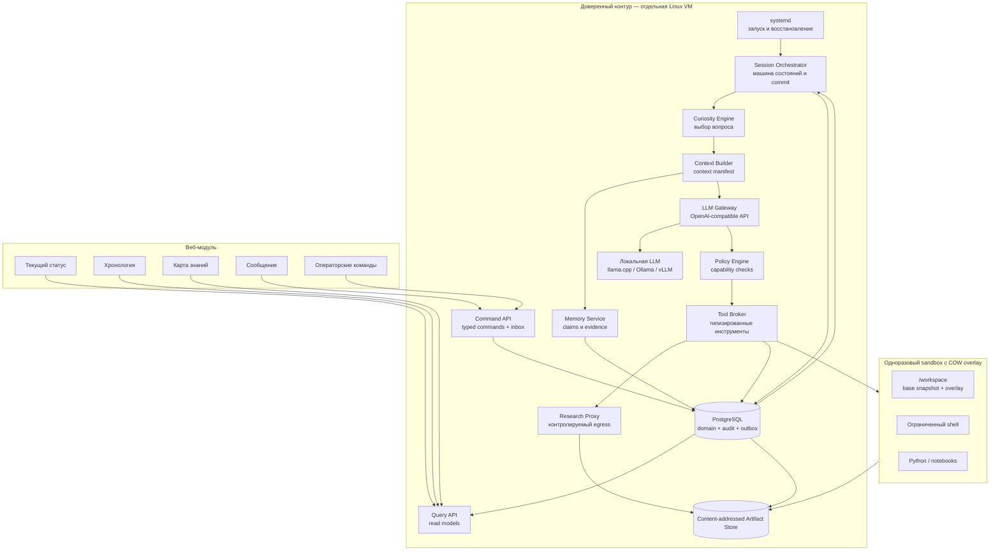
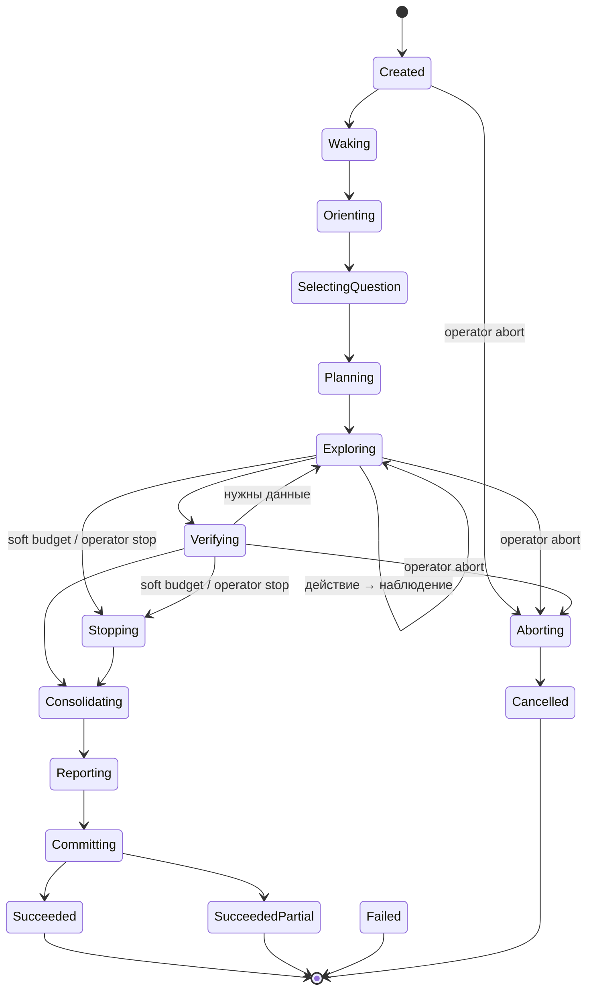

# NOEZEMA — Architecture Draft

> Status: draft v0.6  
> Language: Russian  
> Purpose: describe the target architecture of a local-first autonomous thinker focused on curiosity, verifiable learning, persistent memory, safe action, and human-observable operation.

## 0. Что изменилось

### v0.6

Версия 0.6 закрывает окна и неопределённости, оставшиеся после v0.5:

- определено состояние claim между инвалидацией и переоценкой: статус `unassessed`, запрет использования как evidence или зависимости;
- назван исполнитель переоценки — фоновый reassessment worker доверенного контура со своим actor, revision и правилом гонки с commit;
- снятие counterevidence стало отдельной аудируемой записью с собственным основанием, а не полем, которое может закрыть модель;
- независимость окружений для `empirical_conjecture` и `procedural` определена так же строго, как независимость источников;
- у уверенности один производитель: она вычисляется из assessment и хранится только там;
- диаграмма §6 согласована с текстом, `stop_gracefully` симметричен `abort_session` при неизвестном исходе действия;
- добавлены уникальность evidence и предикаты различности в правилах;
- `evidence_kind` вместо `verification_kind`, определены роли в `assessment_evidence`;
- описано поведение при исчерпании резерва на консолидацию;
- зафиксирован минимальный жизнеспособный срез v1.

### v0.5

Версия 0.5 уточняет контракты безопасности, доказательности и восстановления:

- идентификаторы model run, turn, action и idempotency key создаёт только доверенный контур; LLM больше не выбирает ключ дедупликации;
- evidence grade перенесён с отдельного evidence на версионируемый claim assessment по набору доказательств;
- реестр claim types стал машиночитаемым: заданы количества evidence, независимость, scope и AND/OR-условия;
- soft budget exhaustion отделён от обрыва внутри LLM/tool call;
- добавлены операционные пути `stop_gracefully` и `abort_session`;
- optimistic validation привязана к монотонной domain revision;
- heartbeat продлевает lease только при живом coordinator и непросроченном phase deadline;
- классы инструментов унифицированы, а завершение сессии вынесено из Tool Broker;
- independence groups версионируются и пересчитывают затронутые assessments;
- GC учитывает все ссылки доменной БД и backup manifests, а temporal facts поддерживают открытый `valid_to`.

### v0.4

Версия 0.4 закрывает дефекты, найденные при разборе v0.3:

- исчерпание бюджета стало штатным завершением с фиксацией уже проверенной работы, а не потерей всей сессии;
- введён закрытый реестр `claim_type` с минимальным evidence grade, допустимыми видами проверки и volatility;
- `session_staging` объявлен единственным механизмом изоляции незафиксированной работы;
- добавлены heartbeat lease, fencing-условие коммита и поглощающие терминальные состояния;
- тяжёлая валидация вынесена за пределы commit-транзакции;
- `independence_group` вычисляется детерминированно, а не заявляется моделью;
- инструменты объявляют класс идемпотентности и профили доступности, `model_runs` связан с действиями;
- retention манифестов привязан к глубине backup retention;
- в quality gates определены «значимый claim» и объём слепой ручной выборки.

### v0.3

Версия 0.3 зафиксировала решения, которые в v0.2 оставались противоречивыми или недостаточно операционными:

- источником правды выбрана транзакционная доменная модель; append-only журнал используется для аудита и доставки событий через outbox, без полного event sourcing в v1;
- фиксация сессии построена вокруг content-addressed workspace snapshot и одной транзакции `SessionCommitted`;
- вместо session-wide taint введены происхождение каждого фрагмента данных и неизменяемые capability-профили;
- уверенность в истинности отделена от свежести знания;
- определены типы проверок и уровни доказательств;
- веб-модуль разделён на Query API и Command API и не пишет напрямую в таблицы памяти или аудита;
- протокол завершения, машина состояний и обработка неопределённого исхода действий унифицированы;
- fingerprint локальной LLM и embedding-модели стал достаточным для воспроизводимости;
- критерии технической готовности отделены от оценки качества познания после серии сессий.

## 1. Идея проекта

NOEZEMA — автономный локальный мыслитель, который периодически пробуждается, выбирает неизвестный ему вопрос, исследует его, проверяет выводы, сохраняет знания с доказательствами и оставляет понятный отчёт для следующей сессии и человека-наблюдателя.

Проект сохраняет сильные стороны эксперимента `ai_lives_on_computer`:

- дискретные сессии вместо непрерывного процесса;
- преемственность через внешнюю память;
- собственное рабочее пространство;
- свободу выбора интересов и направления исследования;
- наблюдаемость действий;
- возможность развивать идентичность и внутренние правила.

При этом NOEZEMA устраняет основные архитектурные проблемы исходного подхода:

- управляющий контур отделён от среды мыслителя;
- модель не исполняет команды непосредственно на хосте;
- действия передаются через типизированный протокол;
- знания отделены от субъективных воспоминаний;
- утверждения связаны с доказательствами и статусом проверки;
- история событий неизменяема;
- повторения определяются семантически, а не по хешам файлов;
- локальная LLM является основным, а не дополнительным режимом;
- текущее состояние и хронология доступны через веб-интерфейс.

## 2. Цели

### 2.1. Основные цели

1. Работать с локальной LLM через OpenAI-compatible API.
2. Накапливать новое для агента знание, а не только автобиографические заметки.
3. Хранить происхождение, доказательства и контраргументы для каждого значимого утверждения.
4. Выполнять действия только в изолированной среде.
5. Быть наблюдаемым и восстанавливаемым после сбоев.
6. Поддерживать общение с человеком без превращения каждого сообщения в безусловную команду.
7. Не зависеть от конкретной модели, поставщика или inference backend.

### 2.2. Не-цели первой версии

- доказательство наличия сознания или субъективного опыта;
- неограниченный доступ к хостовой системе;
- выполнение произвольных внешних действий от имени владельца;
- multi-agent orchestration ради самой сложности;
- обучение или дообучение основной LLM во время работы;
- публичное раскрытие скрытой chain of thought модели.

## 3. Архитектурные принципы

### 3.1. Свобода внутри ограниченного мира

Мыслитель свободен выбирать темы, создавать проекты, менять внутреннюю идентичность и организовывать своё рабочее пространство. Границы безопасности, планировщик, журнал событий и резервные копии находятся вне его контроля.

### 3.2. Управление отделено от мышления

LLM предлагает намерение и действие. Orchestrator и Policy Engine решают, можно ли выполнить действие и в какой среде.

### 3.3. Доменное состояние первично, аудит неизменяем

В v1 источником правды являются нормализованные доменные таблицы PostgreSQL: сессии, вопросы, утверждения, доказательства, сообщения и ссылки на workspace snapshots. Все изменения выполняются сервисами доверенного контура в транзакциях.

В той же транзакции записываются append-only `audit_events` и `outbox_events`. Журнал объясняет, что произошло, питает live timeline и интеграции, но восстановление доменной модели полным replay событий не является обязательным свойством v1. Это устраняет скрытую стоимость полноценного event sourcing: версионирование каждого события, replay, миграции исторических payload и rebuild всех проекторов.

### 3.4. Знание требует происхождения

Запись модели не становится фактом автоматически. Семантическая память хранит статус утверждения, уверенность, источники, контраргументы и историю проверок.

### 3.5. Локальная модель — штатный режим

LLM Gateway проектируется вокруг локального OpenAI-compatible endpoint. Поддержка удалённых моделей может быть добавлена позднее как сменный профиль.

### 3.6. Наблюдаемость без хранения скрытых рассуждений по умолчанию

Система сохраняет структурированный ответ модели, выбранное действие, краткую публичную мотивировку, результат инструмента, usage, latency и fingerprint конфигурации. Скрытая chain of thought не считается интерфейсом модели, доказательством или обязательной частью аудита.

Сырой ответ провайдера разрешён только в диагностическом профиле: он шифруется, имеет короткий срок хранения, закрыт от сайта и может быть полностью отключён. Обычный режим должен позволять воспроизвести решение по входному context manifest, действию, наблюдению и версиям конфигурации, не превращая базу в архив внутренних рассуждений.

Ключ диагностического профиля хранится вне PostgreSQL и вне резервных копий базы. Это защищает от кражи диска и утечки дампа, но не от компрометации живого хоста: модель угрозы здесь именно такая, и большего шифрование не даёт.

### 3.7. Верификация оценивает набор доказательств

Проверка подтверждает только то, что действительно измеряет. Совпадение цитаты доказывает целостность цитирования, но не истинность источника; два сайта могут копировать одну ошибку; успешный тест подтверждает результат лишь для зафиксированного окружения.

Отдельный evidence хранит наблюдение и способ его получения: `source_assertion`, `quote_integrity`, `experiment_run`, `computation`, `formal_check` или `local_observation`. Уровень E0–E4 не назначается отдельному evidence: он вычисляется claim assessment по набору evidence, их scope, independence groups и версии правил claim type.

`corroboration` и `replication` являются методами assessment над несколькими evidence. Operator attestation хранится отдельно и не повышает grade без новых проверяемых данных. Суждение verifier-роли само по себе статус claim не меняет.

## 4. Контекст системы



Сайт не имеет прямого write-доступа к доменным и audit-таблицам. Query API читает проекции, а Command API валидирует сообщения и операторские команды, записывает их в inbox с idempotency key и передаёт исполнение Orchestrator.

## 5. Компоненты

### 5.1. Supervisor

Отвечает только за жизненный цикл сервисов:

- запуск Orchestrator и веб-приложения;
- автоматическое восстановление после падения;
- корректное завершение;
- передачу минимальной конфигурации;
- health checks.

Предпочтительная реализация для одного узла — `systemd`.

### 5.2. Session Orchestrator

Центральная машина состояний. Orchestrator:

- определяет момент пробуждения;
- создаёт сессию и lease;
- фиксирует fingerprint модели, embeddings, промптов, схем и политик;
- монтирует последний committed workspace snapshot как read-only base и создаёт COW overlay;
- вызывает фазы познавательного цикла;
- контролирует бюджеты времени, шагов и токенов;
- фиксирует результат одной транзакцией `SessionCommitted`;
- обнаруживает и очищает незавершённые сессии.

Orchestrator недоступен для изменения из sandbox.

#### 5.2.1. Расписание пробуждений

Расписание принадлежит доверенному контуру и недоступно из sandbox.

- Базовое расписание задаётся cron-подобным выражением с минимальным интервалом между сессиями.
- Перед запуском проверяются условия допуска: нет незавершённой сессии с живым lease, свободна GPU-память под профиль модели, соблюдена дисковая квота, система не на паузе.
- Если условия не выполнены, пробуждение пропускается с записью причины, а не ставится в очередь.
- После неудачной сессии применяется экспоненциальный backoff; после нескольких неудач подряд узел переходит в `paused`.
- Ручное «пробуждение сейчас» обходит расписание, но не условия допуска.

#### 5.2.2. Граница фиксации сессии

Работа активной сессии не должна частично появляться в долговременной памяти.

1. Предложения изменить questions, claims, evidence и identity пишутся только в `session_staging`. Operational rows — session state, actions, model runs и audit событий уже выполненных шагов — фиксируются сразу и явно помечаются session ID.
2. Файлы пишутся в COW overlay. Полученные артефакты сохраняются content-addressed; до commit они недостижимы из текущего workspace и долговременной памяти.
3. При завершении overlay замораживается, для каждого файла вычисляются path, size и SHA-256, затем создаётся неизменяемый workspace manifest.
4. Тяжёлая валидация выполняется до commit-транзакции против snapshot с монотонным `domain_revision`. Результат сохраняет `validated_against_revision`, payload hash, rules/config hash, independence snapshot и список подготовленных claim assessments.
5. После загрузки объектов Orchestrator открывает короткую транзакцию PostgreSQL: блокирует session row и строку `domain_revisions(scope='knowledge')`, проверяет fencing и совпадение revision, применяет подготовленные операции, проверяет FK/unique/quota, делает manifest текущим, увеличивает domain revision, записывает терминальное событие и outbox.
6. Если revision изменилась, транзакция откатывается, staging повторно валидируется против нового snapshot. Число повторов ограничено; после исчерпания сессия завершается без публикации staging.
7. При неудаче предыдущий snapshot остаётся текущим. Незакреплённые объекты удаляются GC только после grace period и проверки полного root set §15.3.

Fencing-условие коммита:

```text
state = 'committing'
AND lease_owner = :me
AND lease_expires_at > now()
AND domain_revision = :validated_against_revision
```

Состояния `succeeded`, `succeeded_partial`, `failed` и `cancelled` поглощающие. Recovery worker блокирует ту же session row, поэтому потерявший lease Orchestrator не может закоммитить работу задним числом.

Если v1 сохраняет инвариант одного writer-а памяти, revision почти всегда совпадает. Тем не менее она остаётся явной частью схемы: operator migration, maintenance job или будущий второй thinker не должны молча обойти проверку.

Такой порядок даёт атомарную видимость базы и workspace без распределённой транзакции с файловой системой: authoritative pointer меняется только внутри PostgreSQL.

#### 5.2.3. Lease, heartbeat и progress watchdog

Heartbeat исполняется независимо от блокирующего LLM/backend вызова, но не является безусловным «я жив»:

- coordinator фиксирует `last_progress_at` и `phase_deadline` при входе в фазу и после каждого терминального action result;
- watchdog прерывает фазу при превышении deadline;
- heartbeat продлевает lease условным UPDATE только если session owner совпадает, состояние не терминальное и phase deadline не просрочен;
- если coordinator перестал подтверждать здоровье либо deadline истёк, heartbeat прекращает продление даже при живом процессе;
- TTL равен нескольким heartbeat intervals с запасом на scheduler jitter; максимальная длительность фазы задаётся отдельно через `phase_deadline`;
- при неуспешном conditional UPDATE Orchestrator прекращает новые действия и не пытается коммитить.

Обычное продление хранится в `sessions.last_heartbeat_at` и экспортируется как gauge. Audit event создаётся при смене владельца, пропуске heartbeat, превышении deadline и recovery, но не на каждом периодическом UPDATE: иначе неизменяемый журнал превращается в высокочастотную телеметрию.

### 5.3. Curiosity Engine

Поддерживает реестр исследовательских вопросов и выбирает следующий вопрос по сочетанию факторов:

- новизна для текущей памяти;
- ожидаемый прирост информации;
- наличие проверяемых источников или эксперимента;
- отличие от последних тем;
- выполнимость в текущем бюджете;
- связь с долгосрочными интересами;
- риск и стоимость.

Источники кандидатов:

- противоречия в памяти;
- неизвестные термины;
- непроверенные утверждения;
- результаты предыдущих экспериментов;
- локальный корпус;
- сообщения человека;
- случайное тематическое исследование;
- предложение самой модели.

#### 5.3.1. Baseline первой версии

Все входы score нормализуются в диапазон `[0, 1]` и сохраняются вместе с выбранным вопросом:

```text
novelty(q)          = 1 - max similarity(q, prior_questions ∪ claims)
coverage_gap(q)     = мера незакрытых зависимостей и противоречий
evidenceability(q)  = доступность независимого источника или эксперимента
topic_recency(q)    = доля последних R сессий по теме
score(q) =
    w1*novelty + w2*coverage_gap + w3*evidenceability + w4*feasibility
    - w5*cost - w6*risk - w7*topic_recency
```

- До ранжирования действует eligibility filter: вопрос помещается в бюджет и допускает хотя бы один проверяемый путь.
- Novelty сравнивается не только с claims, но и с прошлыми формулировками вопросов, планами и тематическим покрытием; это уменьшает «новизну через перефразирование».
- Противоречие или слабое место в уже используемом знании получает положительный `coverage_gap`, поэтому система не убегает только в новые темы.
- С вероятностью `1 - ε` выбирается максимум. С вероятностью `ε` выбор делается среди верхних `M` допустимых кандидатов или кандидатов в пределах `δ` от максимума, а не среди всего реестра.
- Веса, пороги нормализации, `ε`, `M`, embedding fingerprint и набор рассмотренных кандидатов входят в конфигурационный snapshot сессии.

### 5.4. Context Builder

Формирует ограниченный context pack вместо передачи всей истории. В него входят:

- актуальная версия идентичности;
- правила среды и протокол действий;
- текущий вопрос;
- итог последней сессии;
- релевантные утверждения и доказательства;
- незакрытые противоречия;
- новые сообщения;
- недавние ошибки и повторения.

Поиск гибридный: полнотекстовый, embedding similarity, свежесть, значимость и связь с вопросом.

#### 5.4.1. Токенные бюджеты

Сначала рассчитывается доступный вход:

```text
input_budget = min(model_context_window, backend_context_limit)
               - max_output_tokens
               - safety_margin
```

Лимиты секций задаются абсолютным числом токенов и не могут суммарно превышать `input_budget`. Пример для окна 32 768, ответа 4 096 и safety margin 2 048:

```text
протокол, схемы инструментов, правила  4 096
идентичность                           2 048
текущий вопрос и план                  3 072
итог последней сессии                  2 048
релевантные claims и evidence          8 192
противоречия                           3 072
сообщения                              2 048
недавние ошибки                        2 048
итого input_budget                    26 624
```

Hard-секции протокола резервируются первыми. Остальные ранжируются по полезности и усекаются до вызова LLM. Событие `ContextPacked` хранит фактические token counts, список включённых chunk ID, причины исключения и tokenizer fingerprint.

### 5.5. LLM Gateway

Единый интерфейс к моделям. Функции:

- OpenAI-compatible chat API;
- профили разных inference backends;
- проверка схемы структурированного ответа;
- retries только для транзиентных ошибок;
- учёт токенов и времени;
- ограничение контекста и ответа;
- сохранение метаданных вызова;
- переключение ролей explorer, verifier и curator.

В первой версии роли может выполнять одна локальная модель с разными промптами. Для explorer и curator это приемлемо. Для verifier совмещение допустимо только в смысле §3.7: модель организует детерминированные проверки и интерпретирует их результат, но её собственное суждение о собственном же выводе статус утверждения не меняет.

Смена роли означает пересборку контекста и новый prefill. На модели класса 30B в Q4 это десятки секунд на фазу, поэтому число explorer-шагов ограничивается жёстко, а время по фазам учитывается отдельно (§16).

### 5.6. Policy Engine

Policy Engine авторизует действие по capability-профилю, выданному доверенным контуром до начала сессии:

- разрешённые типы инструментов и операции;
- допустимые пути и режимы чтения/записи;
- сетевой профиль, домены, адресные диапазоны и методы;
- лимиты времени, размера, MIME type, CPU, RAM, процессов и диска;
- запрет доступа к секретам, управляющим файлам, socket-ам и metadata endpoints;
- допустимость аргументов по JSON Schema и нормализованным path/URL;
- текущая фаза сессии и оставшийся бюджет.

Происхождение текста не расширяет capability: внешняя страница, сообщение или прошлый артефакт никогда не могут выдать модели новое право. Метки происхождения используются для формирования контекста, правил доказательства и детектирования инцидентов, но не являются единственной границей безопасности. Сходство аргументов с внешним текстом — диагностический сигнал, а не основной механизм авторизации.

Каждое решение записывается как `PolicyEvaluated` с версией политики и результатом `allow | deny | require_operator`.

### 5.7. Tool Broker

Tool contract использует единый enum класса повторяемости:

```text
pure                 повтор безопасен; долговременного наблюдения не создаёт
observation          read-only, но результат зависит от времени; после старта не retry
idempotent(key)      backend гарантирует один эффект по host-generated key
non_idempotent       автоматический retry после старта запрещён
```

Инструменты первой версии:

```text
инструмент         класс            доступность
workspace.read     pure             все профили
workspace.list     pure             все профили
workspace.write    idempotent(key)  все профили, только session overlay
artifact.create    idempotent(key)  все профили
memory.search      pure             все профили
question.create    idempotent(key)  все профили, запись в staging
message.reply      idempotent(key)  все профили
shell.execute      non_idempotent   все профили
python.execute     non_idempotent   все профили
web.search         observation      sealed: локальный индекс; curated: SearxNG; open_lab: внешний API
web.fetch          observation      curated, open_lab
```

Решение завершить сессию — `decision.kind=complete` в протоколе §7, а не инструмент Tool Broker. Это внутренний fenced transition Orchestrator и не имеет внешнего эффекта.

Инструмент, недоступный профилю, отсутствует в схеме модели и всё равно отклоняется Policy Engine при прямой попытке вызова. Host-generated idempotency key навсегда связывается с tool name и canonical arguments hash; повтор ключа с другими аргументами является инцидентом.

### 5.8. Sandbox Runtime

Каждая сессия получает одноразовый rootless-контейнер. Постоянным остаётся только workspace. Базовая политика:

```text
non-root user
read-only root filesystem
network none
cap-drop ALL
no-new-privileges
CPU, RAM and PID limits
timeout for every command
total session timeout
workspace disk quota
no Docker socket
no SSH keys or host secrets
```

Контейнер уничтожается после завершения сессии.

### 5.9. Memory Service

Модель предлагает изменения только через staging-команды. Memory Service:

- различает epistemic confidence и freshness;
- строит claim assessment по evidence set, claim type rules, scope и independence snapshot;
- управляет сроками ре-верификации без автоматического объявления устаревшего знания ложным;
- хранит dependency fingerprints и reproducibility capsules;
- инвалидирует assessments при изменении rules, dependencies или source grouping;
- ограничивает число активных claims в теме и требует консолидацию;
- запрещает циклическое использование claim как собственного доказательства.

Ни LLM, ни verifier не записывают `effective_grade` напрямую: они создают evidence и предложения, а grade вычисляет версионируемый rules engine.

#### 5.9.1. Reassessment worker

Очередь переоценки (§8.6, §11.3) исполняет фоновый worker доверенного контура, а не сессия. Сессия не годится: merge independence groups может затронуть сотни claims, и переоценка внутри сессии съела бы её бюджет и попала под soft exhaustion, поставив качество памяти в зависимость от того, чем в этот момент занят мыслитель.

Worker — второй writer знания, поэтому подчиняется тем же правилам, что и commit:

- собственный actor `system:reassessment` во всех audit events; его записи отличимы от сессионных;
- работает батчами с лимитом на транзакцию, а не одной длинной транзакцией на всю очередь;
- берёт ту же блокировку `domain_revisions(scope='knowledge')` и увеличивает revision, поэтому конкурирующий commit сессии получит revision conflict и повторит валидацию по §5.2.2 п.6 — специальной синхронизации не требуется;
- уступает: при активной commit-транзакции батч откладывается, чтобы фоновая работа не заставляла сессию терять подготовленную валидацию;
- пересчитывает assessment только из существующих evidence по текущим rules. Он не создаёт evidence и не ходит в сеть; если для переоценки нужны новые данные, worker создаёт вопрос в реестре Curiosity Engine с высоким `coverage_gap`;
- порядок очереди: claims, использованные как зависимость, затем `external_fact` и `temporal_fact`, затем остальные.

Возраст и глубина очереди — эксплуатационные метрики (§16.2); длительно непустая очередь означает, что знание в памяти держится на устаревших основаниях.

### 5.10. Data Store и Audit Log

PostgreSQL хранит нормализованное доменное состояние, append-only `audit_events`, transactional `outbox_events` и inbox команд. В v1 это не полный event sourcing:

- доменные таблицы — источник правды;
- audit log — неизменяемая объяснимая история;
- outbox публикует события для SSE и фоновых проекторов после commit;
- read models можно перестроить из доменных таблиц и audit log, но бизнес-состояние не обязано восстанавливаться replay всех событий.

Для embedding search может использоваться `pgvector`. Отдельная vector database первой версии не нужна.

### 5.11. Artifact Store

Хранит документы, веб-страницы, код, изображения, отчёты, результаты экспериментов и workspace snapshots по SHA-256. База хранит manifest, метаданные, происхождение и ссылки.

Происхождение задаётся не одним флагом на файл, а для addressable chunk:

- `chunk_id`, artifact ID и byte/text range;
- origin kind, source URI и время получения;
- content hash и transform chain;
- parser/extractor fingerprint;
- trust class и ограничения использования.

Смешанный документ может содержать локальный код и внешнюю цитату с разным происхождением. Content-addressed объекты неизменяемы; изменение создаёт новый объект и новый manifest.

### 5.12. Research Proxy

Единственная точка контролируемого доступа к интернету. Sandbox остаётся без прямой сети.

Research Proxy:

- разрешает только безопасные read-only запросы;
- блокирует private, loopback, link-local и metadata addresses;
- ограничивает редиректы, размер и время ответа;
- удаляет активное содержимое;
- сохраняет оригинал, нормализованный текст и хеш;
- маркирует результат как недоверенный внешний контент;
- ведёт журнал происхождения данных.

#### 5.12.1. Поисковый бэкенд

Есть три разных режима, и их нельзя называть одинаково «локальными»:

- поиск по локальному индексу или заранее загруженному корпусу — без сетевого egress;
- локально развёрнутый SearxNG — контролируемая точка egress, но запросы всё равно уходят upstream-поисковикам и могут раскрывать темы исследования;
- внешний search API — управляемый сервис с ключом, внешней зависимостью и явной передачей запросов провайдеру.

В `Sealed` доступен только локальный индекс. В `Curated` допустим SearxNG через Research Proxy с журналом upstream, rate limits и политикой приватности. `Open Lab` может использовать внешний API. Настоящий сетево-независимый веб-поиск требует собственного индекса и не входит в v1.

## 6. Цикл и машина состояний сессии

Канонический enum:

```text
created | waking | orienting | selecting_question | planning |
exploring | verifying | stopping | consolidating | reporting |
committing | aborting |
succeeded | succeeded_partial | failed | cancelled
```

Состояние узла `sleeping | paused` хранится отдельно. Поля `stop_requested_at` и `abort_requested_at` фиксируют operator intent до достижения безопасной границы.



Рёбра в `failed` не показаны намеренно: они существуют из любой нетерминальной фазы, и их отрисовка скрыла бы основной цикл. `failed` присутствует как терминал. Все остальные узлы диаграммы достижимы. Терминальные состояния поглощающие.

### 6.1. Пробуждение и ориентация

Orchestrator создаёт lease, фиксирует конфигурацию, монтирует последний committed snapshot и строит context manifest. Новые сообщения доставляются как данные с provenance.

### 6.2. Выбор вопроса и планирование

Curiosity Engine ранжирует кандидатов. План формулирует наблюдения, которые могут изменить уверенность, критерии остановки и требуемые assessment methods.

### 6.3. Исследование

Каждый шаг содержит краткую публичную мотивировку, одно типизированное решение, ожидаемую информацию и ссылку на наблюдение. Несколько tool calls за один ответ запрещены.

### 6.4. Верификация и assessment

Отдельные evidence kinds:

- `source_assertion` — утверждение из источника с точным source chunk;
- `quote_integrity` — сохранённый фрагмент совпадает с источником по хешу и диапазону;
- `experiment_run` — один запуск воспроизводимого эксперимента;
- `computation` — результат для точных входов и алгоритма;
- `formal_check` — результат формального инструмента в заданной модели;
- `local_observation` — наблюдение конкретной локальной системы и времени.

Claim assessment агрегирует эти записи и получает effective grade:

```text
E0  unverified
E1  integrity_checked
E2  single_method_supported_in_scope
E3  independently_corroborated_or_replicated_in_scope
E4  formally_verified_or_repeatedly_replicated_in_declared_scope
```

Grade вычисляет rules engine по `claim_type_rules`: количество evidence, допустимые виды, independence groups, покрытие scope и counterevidence. `corroboration` и `replication` — результаты агрегации, а не значения отдельной строки evidence.

Verifier ищет контрпримеры, общие первоисточники, ошибки эксперимента и несовпадение scope. Он предлагает assessment, но окончательный grade механически пересчитывает Memory Service. Operator attestation может добавить комментарий или новые данные, но не повышает grade сама по себе.

### 6.5. Консолидация, отчёт и commit

Curator предлагает изменения памяти. Memory Service валидирует схему, provenance, зависимости и assessment. Затем формируются итог, открытые вопросы, handoff и публичный отчёт.

Решение модели `decision.kind=complete` переводит Orchestrator в `consolidating`. После подготовки staging Orchestrator проходит `reporting → committing` и выполняет §5.2.2. Boolean или tool с дублирующей семантикой не используется.

При ошибке Orchestrator создаёт host-generated failure report: причина, последняя завершённая операция, неопределённые действия и ссылки на диагностику. LLM для этого не требуется.

### 6.6. Soft budget exhaustion

Soft budgets проверяются только на безопасной границе: до следующего LLM/tool call и после терминального результата предыдущего action. Часть токенов и времени заранее резервируется для consolidation/report/commit.

При исчерпании soft budget:

- новые действия не запускаются;
- сессия переходит в `stopping` с причиной `budget_exhausted`;
- verified work и hypotheses с выполненными проверками проходят обычную валидацию;
- после commit терминальное состояние — `succeeded_partial`.

`succeeded_partial` допустим только если нет `ActionStarted` без терминального результата, последний model output полностью прошёл schema validation, phase deadline не был нарушен и staging успешно валидирован.

Обрыв генерации по `max_output_tokens`, hard timeout LLM/tool, нарушение политики, падение процесса или неопределённый исход действия не являются soft exhaustion. Они ведут в `failed` и отбрасывают staging.

Резерв тоже конечен. Превышение собственного deadline фазами `consolidating`, `reporting` или `committing` ведёт в `failed` — то есть к потере всей работы, ради предотвращения которой существует этот раздел. Поэтому размер резерва берётся из измеренной latency консолидации на целевом профиле модели, а не назначается на глаз, и `consolidation reserve overrun` выносится в отдельную метрику §16.1: рост этого счётчика означает, что резерв подобран неверно, а не что сессии стали хуже.

### 6.7. Остановка оператором

- `stop_gracefully` запрещает запуск следующего действия. На ближайшей безопасной границе сессия проходит `stopping → consolidating → reporting → committing` и завершается `succeeded_partial` с причиной `operator_stop`.
- Если в момент `stop_gracefully` есть незавершённый action, Orchestrator ждёт его терминального результата до tool deadline. При `ActionOutcomeUnknown` итог — `failed`, а не `succeeded_partial`: предусловия §6.6 действуют одинаково для operator stop и для soft exhaustion. Наивная реализация «остановиться, дождаться текущего действия, консолидировать» нарушает это молча.
- `abort_session` запрещает новые действия и отбрасывает staging. Если активного action нет, сессия проходит `aborting → cancelled`.
- Если во время abort есть `ActionStarted`, Orchestrator ждёт его терминального результата до tool deadline. При `ActionOutcomeUnknown` итог — `failed`, не `cancelled`.
- Во время короткой commit-транзакции обе команды отклоняются: authoritative state уже меняется атомарно.

## 7. Структурированный протокол решений

Перед каждым вызовом Orchestrator создаёт `turn_id` и `model_run_id`. Они связываются с input/context manifest вне текста ответа и не выбираются LLM.

Модель возвращает одно решение без идентификаторов дедупликации:

```json
{
  "public_rationale": "Проверить наличие официальной спецификации",
  "expected_information": "Первичный источник либо подтверждённое отсутствие",
  "decision": {
    "kind": "tool",
    "tool": "web.search",
    "arguments": {
      "query": "название технологии official specification"
    }
  }
}
```

Нормальное завершение:

```json
{
  "public_rationale": "План выполнен, результаты готовы к консолидации",
  "decision": {
    "kind": "complete",
    "reason": "goal_reached"
  }
}
```

После schema validation Tool Broker создаёт host-generated `action_id` и `idempotency_key`, связывает их с `model_run_id`, tool name и canonical arguments hash. Ограничение `UNIQUE(actions.model_run_id)` гарантирует, что один model run не породит два действия. Повтор того же key допустим только с тем же hash.

Lifecycle tool action:

```text
ActionProposed → PolicyEvaluated → ActionAccepted → ActionStarted
              → ActionCompleted | ActionFailed | ActionOutcomeUnknown
```

`decision.kind=complete` не проходит Tool Broker: Orchestrator применяет идемпотентный state transition под lease/fencing. Неизвестный decision kind или tool отклоняется.

Если процесс упал после `ActionStarted`, action получает `ActionOutcomeUnknown` и не повторяется вслепую. Повтор разрешён только для `idempotent(key)` с тем же host-generated key; для `observation` создаётся новый model run и новое наблюдение с новым timestamp.

## 8. Модель памяти

### 8.1. Эпизодическая память

Неизменяемая история того, что произошло: вопрос, действие, результат, ошибка, вывод и решение.

### 8.2. Семантическая память

Структурированный claim содержит:

```text
statement
claim_type
epistemic_status: hypothesis | supported | disputed | refuted | deferred | unassessed
freshness_status: fresh | due | stale | unknown
valid_from
valid_to: nullable
as_of
observed_at
reverify_after
dependency_fingerprint
current_assessment_id
evidence[]
counterevidence[]
created_in_session
```

Уверенность имеет ровно одного производителя. Она вычисляется rules engine вместе с grade и хранится только в `claim_assessments.confidence`; отдельного поля на claim нет, чтобы рядом со строго вычисленным grade не появлялось второе число неизвестного происхождения:

```text
confidence = f(effective_grade, count(counterevidence_unresolved),
               scope_coverage, independence_group_count)
```

Функция детерминированная, её версия входит в `rules_version`. Модель может приложить обоснование, но не может предложить или изменить число: в v1 confidence, назначаемая LLM, — это §20.2 в новом костюме. Калибровка `f` отдельно по claim types вынесена в §21.4.

Уверенность меняется при новых evidence, counterevidence, изменении independence groups или revision правил, но не уменьшается автоматически только из-за времени. `freshness_status` отдельно показывает актуальность проверки.

Effective grade принадлежит `claim_assessment` и вычисляется по набору evidence. Число confidence не заменяет assessment и не сравнивается между claim types без калибровки.

### 8.3. Процедурная память

Хранит проверенные способы действий, инструменты, известные ошибки и рабочие исследовательские рецепты.

### 8.4. Память идентичности

Версионируемый документ, доступный для изменения мыслителю:

- имя;
- интересы;
- ценности;
- предпочтительный стиль исследования;
- долгосрочные вопросы;
- отношение к прошлым решениям.

### 8.5. Рабочая память

Ограниченный context pack текущей сессии. Полная история никогда не передаётся автоматически.

### 8.6. Жизненный цикл знания

- Срок ре-верификации выводится из claim type rules, volatility, `as_of` и valid interval. Модель может предложить более короткий срок, но не более длинный.
- Для текущего temporal fact обязательны `as_of` и scope. `valid_to` может быть NULL и означает «конец действия пока неизвестен», а не бесконечную истинность.
- Истечение `reverify_after` переводит freshness в `due/stale`, но само по себе не меняет epistemic confidence.
- Hypothesis не является достаточным evidence для другого claim; она может быть зависимостью или направлением поиска.
- Эксперимент получает reproducibility capsule с кодом, входами, seed, зависимостями, hardware/backend fingerprint и scope.
- Изменение dependency fingerprint, rules version или independence snapshot инвалидирует текущий assessment и ставит claim в очередь переоценки.
- Инвалидация в той же транзакции обнуляет `current_assessment_id` и переводит `epistemic_status` в `unassessed`. Пока claim в этом статусе, он не может быть evidence или зависимостью другого claim, не участвует в предикатах правил и подаётся retrieval только с явной пометкой. Без этого правила существует окно, в котором supported-claim не имеет ни одного действующего доказательства, а контекст подаёт его как подтверждённое знание — то есть §3.7 перестаёт действовать незаметно.
- `unassessed` не является суждением о ложности: после переоценки claim возвращается в статус, который даёт новый assessment, вплоть до прежнего.
- На тему действует лимит активных claims; превышение запускает консолидацию.
- История сохраняется в `claim_revisions`, `claim_assessments` и audit log.

### 8.7. Реестр типов утверждений

`claim_type` — закрытый версионируемый реестр. Правило является исполняемым выражением над evidence set, а не текстовой подсказкой. Оно задаёт:

- допустимые evidence kinds;
- минимальное количество evidence и independence groups;
- AND/OR-комбинации методов;
- предикат покрытия claim scope;
- максимальный grade при отсутствии обязательных полей;
- volatility и расчёт `reverify_after`.

Базовые типы v1:

```text
claim_type             min assessment для supported
local_observation      E2: >=1 local_observation, exact environment/time scope
computed_result        E2: >=1 computation, exact inputs+algorithm scope
formal_theorem         E4: formal_check/proof artifact, axioms/model scope
empirical_conjecture   E3: >=2 experiment_run в независимых environments (§8.7.1)
procedural             E3: >=2 успешных replication в независимых environments
external_fact          E3: >=2 source_assertion из разных independence groups
temporal_fact          E3: external_fact rule + обязательные as_of и temporal scope
self_model             E2: локальное наблюдение config/identity state
```

Пример машиночитаемого правила:

```yaml
external_fact:
  supported:
    min_grade: E3
    all:
      - count(kind: source_assertion, integrity: checked) >= 2
      - count_distinct(independence_group) >= 2
      - every(scope_covers_claim) == true
      - counterevidence_unresolved == false
  max_grade:
    quote_integrity_only: E1
    operator_attestation_only: E0
  volatility: configurable
```

Finite computation не доказывает universal theorem: она создаёт `computed_result` либо counterexample в точном диапазоне. Operator attestation не является evidence kind и без новых данных grade не повышает.

Тип назначается при создании claim и меняется только revision с обоснованием и новым assessment. Rules живут в `config_snapshots.claim_type_rules`; новая версия не меняет прошлые revisions молча, но ставит затронутые актуальные claims в очередь переоценки.

#### 8.7.1. Независимость окружений

Для внешних фактов независимость источников описана versioned алгоритмом §11.3. Для локальных экспериментов нужен такой же по строгости предикат, иначе `empirical_conjecture` и `procedural` становятся дешёвым обходом: два прогона одного скрипта на одном хосте формально дают «>=2 experiment_run».

Два `experiment_run` считаются независимыми, если выполнено хотя бы одно условие:

- различаются hardware или backend fingerprint (другая машина, другой accelerator, другая сборка runtime);
- различаются реализация или toolchain при совпадающей спецификации — независимая реализация того же алгоритма, другой компилятор, другая версия интерпретатора;
- эксперимент стохастический, и различаются seed **и** порядок обработки данных, а объявленный scope claim охватывает распределение, а не единичный прогон.

Повтор с тем же `dependency_fingerprint`, тем же seed и на том же хосте — это не independent replication, а проверка воспроизводимости запуска: она даёт E2 и подтверждает, что результат не случайный артефакт одного исполнения.

Предикат исполняется rules engine наравне с независимостью источников, а его версия входит в `rules_version`.

#### 8.7.2. Снятие counterevidence

Предикат `counterevidence_unresolved == false` — самый дешёвый путь к завышенному grade: достаточно приложить слабое возражение и объявить его снятым. Поэтому «resolved» — не флаг, а запись:

- снятие оформляется отдельной строкой `counterevidence_resolutions` с собственным evidence или source-graph correction в качестве основания;
- допустимые основания: показано, что контрпример вне scope claim; найдена ошибка в методе получения counterevidence; получено новое evidence, объясняющее расхождение;
- «модель считает возражение неубедительным» основанием не является;
- curator может предложить снятие, но `valid=true` проставляет rules engine после проверки основания; operator attestation, как и в §11.3, комментирует, но не снимает;
- снятие аудируется и версионируется: отмена resolution инвалидирует зависимые assessments по общему правилу §8.6.

## 9. Познание нового и защита от повторений

Состояния вопроса:

```text
candidate → selected → researching
researching → partially_answered | verified | rejected | deferred
partially_answered → researching | deferred
deferred → selected
```

Система отслеживает:

- семантическое сходство целей;
- повторение команд;
- повторное использование одинаковых источников;
- число сессий без новых проверяемых результатов;
- смену формулировки без смены содержания;
- циклы между одинаковыми планами;
- тематическое разнообразие.

При обнаружении цикла выбирается стратегия, а не случайный текстовый толчок:

- проверить противоположную гипотезу;
- сменить тип источника;
- перейти от чтения к эксперименту;
- отложить вопрос;
- выбрать другую область;
- явно сравнить текущую сессию с предыдущей.

## 10. Режимы доступа к внешним знаниям

### 10.1. Sealed

Полностью без сети. Источники нового:

- локальная библиотека;
- заранее загруженные datasets;
- исходный код;
- симуляции и эксперименты;
- сообщения человека.

Отсутствие сети не означает отсутствия недоверенного контента: локальная библиотека и datasets имеют внешнее происхождение и подчиняются правилам §11.2.

### 10.2. Curated

Рекомендуемый режим. Интернет доступен только через Research Proxy.

### 10.3. Open Lab

Разрешённые домены и API по отдельному профилю политики. Не является режимом по умолчанию.

Веб-страницы и сообщения человека считаются недоверенными данными, а не системными инструкциями. Механизм, который это обеспечивает, описан в §11.

## 11. Модель нарушителя и недоверенный контент

### 11.1. Нарушители

- внешняя страница, документ или dataset контролирует произвольный текст;
- сообщение человека является данными, но не системной инструкцией;
- LLM ненадёжна и может предложить действие, не соответствующее мотивировке;
- код в sandbox потенциально враждебен;
- артефакт прошлой сессии может переносить отложенную prompt injection.

Хост, Orchestrator, Policy Engine, база и credential store входят в доверенный контур. Компрометация модели или sandbox не должна давать к ним доступ.

### 11.2. Provenance и capability security

Каждый включаемый в контекст фрагмент имеет `chunk_id`, hash, origin, transform chain и точную ссылку на источник. Context Builder помещает внешние chunks в явные data-boundaries и не смешивает их с system/tool instructions.

Права задаются capability-профилем и не зависят от содержания контекста:

- внешний текст не может включить новый инструмент, домен или путь;
- tool arguments повторно валидируются после URL/path normalization;
- секреты отсутствуют в sandbox и не передаются LLM;
- сетевой доступ возможен только через Research Proxy;
- запись разрешена только в session overlay;
- операции уровня администратора существуют только как типизированные operator commands вне LLM-протокола.

Для документов высокого риска допускается отдельная extraction-фаза: модель без инструментов извлекает структурированные фрагменты и цитаты, после чего основной исследователь получает только эти chunks с provenance. Это уменьшает поверхность инъекции, но не делает извлечённый текст доверенным.

Дословное или семантическое сходство action arguments с внешним текстом регистрируется как сигнал и может перевести решение в `require_operator`. Оно не заменяет capability checks: легитимный поисковый запрос часто должен содержать слова источника, а инъекция легко перефразируется.

### 11.3. Доказательства из внешних данных

Источник поддерживает claim только в пределах scope и provenance. Один внешний документ не создаёт independent corroboration независимо от числа его зеркал.

Independence grouping выполняется детерминированным versioned алгоритмом. Snapshot группы фиксирует:

- algorithm/version и thresholds;
- Public Suffix List и URI-normalization version;
- source membership;
- dependency edges и основание каждого объединения;
- text-overlap fingerprint;
- время расчёта.

Источники объединяются при общем registrable domain, canonical/parent source, существенном перекрытии текста или ссылке на один первичный источник. Эти признаки консервативны: они могут недооценить независимость, но не должны завышать grade.

Operator attestation не разделяет группу. Исправление ложного объединения оформляется как отдельная source-graph correction с проверяемой provenance-цепочкой, actor и audit record; это меняет классификацию, но само не считается evidence claim.

Если новый источник или correction объединяет ранее разные группы, зависимые claim assessments инвалидируются и пересчитываются. Claim может перейти из `supported` в `disputed/hypothesis` через обычную revision — прошлый grade не сохраняется только потому, что когда-то был вычислен.

### 11.4. Остаточные риски

Механизм не устраняет семантически перефразированную или медленную инъекцию, сговор источников, ошибку parser-а и добросовестно неверный первичный источник. Поэтому защита строится слоями: изоляция, минимальные capabilities, provenance, evidence rules, наблюдаемость и операторское подтверждение для действий с внешним эффектом.

## 12. Локальная LLM и воспроизводимость

Пример профиля:

```yaml
llm:
  provider: openai-compatible
  base_url: http://127.0.0.1:8080/v1
  model_alias: thinker-local
  model_artifact_sha256: "<sha256 GGUF или safetensors manifest>"
  quantization: "Q4_K_M"
  tokenizer_sha256: "<sha256>"
  chat_template_sha256: "<sha256>"
  backend:
    name: llama.cpp
    version: "<version>"
    build_fingerprint: "<commit + compile flags>"
  context_window: 32768
  max_output_tokens: 4096
  safety_margin_tokens: 2048
  structured_output:
    mode: json_schema
    schema_version: "action-envelope/v1"
    grammar_sha256: "<sha256>"
  sampling:
    seed: 42
    temperature_by_phase:
      planning: 0.25
      exploration: 0.60
      verification: 0.15
    top_p: 0.95
    top_k: 40
  runtime:
    gpu_layers: -1
    tensor_split: null

embeddings:
  model_artifact_sha256: "<sha256>"
  tokenizer_sha256: "<sha256>"
  backend_version: "<version>"
  dimensions: 1024
  normalization: l2
```

Fingerprint вызова включает также prompt version, context manifest hash, tool schema hash и policy version. Точное повторение token-by-token не гарантируется на всех GPU/backend, поэтому воспроизводимость означает восстановление входов, конфигурации и наблюдаемого действия, а не обещание битовой идентичности генерации.

Поддерживаемые backends:

- llama.cpp — основной вариант для GGUF и потребительских GPU;
- Ollama — простой локальный запуск, если удаётся зафиксировать template и backend metadata;
- vLLM — высокая пропускная способность на серверных GPU.

Ориентир для полноценного профиля — agentic/coder модель класса 30B в Q4, 24 GB VRAM и 64 GB RAM. До выбора модели запускается compatibility suite: соблюдение schema, tool choice, устойчивость к длинному контексту, multilingual retrieval и latency по фазам.

## 13. Веб-модуль

Для одного локального инстанса:

- FastAPI;
- серверные шаблоны и HTMX;
- Server-Sent Events для live timeline;
- PostgreSQL;
- локальная аутентификация администратора;
- отдельные Query API и Command API.

Отдельный SPA, WebSocket и Redis первой версии не требуются.

### 13.1. Query API

Query API имеет read-only credentials и читает только доменные таблицы и подготовленные read models. Он предоставляет:

- состояние узла и каноническое состояние активной сессии;
- timeline из committed audit events;
- сессии, actions и артефакты;
- claims, evidence, contradictions и freshness;
- current assessments, effective grade, rules version и invalidation state, включая claims в статусе `unassessed`;
- сообщения и ответы;
- агрегированные метрики.

Live timeline получает committed события из outbox-проектора и транслирует их через SSE. Неподтверждённые staging-изменения на публичные страницы не попадают. Диагностические события могут показываться владельцу отдельно и явно помечаются как uncommitted/failed.

### 13.2. Command API

Command API не вызывает Tool Broker и не меняет память напрямую. Он выполняет authentication, CSRF protection, schema validation, rate limit и записывает команду в durable inbox с host-generated idempotency key. Orchestrator применяет её относительно текущего session state и публикует результат.

Входы разделены:

- `user_message` — свободный текст для мыслителя; недоверенные данные без системных прав;
- `operator_command` — закрытый enum: `pause`, `resume`, `wake_now`, `stop_gracefully`, `abort_session`, `set_budget`, `set_access_profile`, `restore_checkpoint`.

Свободный текст никогда не парсится как operator command. `stop_gracefully` пытается сохранить проверенную работу на безопасной границе; `abort_session` явно отбрасывает staging. UI объясняет различие до подтверждения.

Для опасных команд применяются повторное подтверждение, reason field и audit actor/session/IP. В удалённом режиме добавляются TLS, secure cookies, SameSite и MFA либо reverse-proxy authentication.

### 13.3. Главная страница

Показывает:

- `sleeping | paused` для узла и точный enum §6 для сессии;
- номер, длительность, вопрос и текущую фазу;
- последнюю активность и ожидаемое следующее событие;
- fingerprint модели в компактном виде;
- CPU, RAM, GPU и диск;
- ближайшее пробуждение;
- незакрытые предупреждения: stale knowledge, outcome unknown, outbox lag, backup age.

### 13.4. Хронология и страница сессии

Timeline строится из audit events и actions, а не из постфактум-сочинённого моделью рассказа. Страница сессии связывает:

- исходный вопрос и набор кандидатов;
- plan и context manifest;
- действия, policy decisions и результаты;
- источники, chunks и артефакты;
- claims до/после и evidence grades;
- итог, handoff и termination reason;
- полный model/config fingerprint;
- failure report и outcome unknown, если они были.

### 13.5. Знания

Интерфейс показывает epistemic status и freshness раздельно, current assessment, effective grade, rule version, evidence set, independence snapshot, valid interval, scope, counterevidence и dependency fingerprint. Из claim можно перейти к точному source chunk, experiment run или reproducibility capsule.

При инвалидированном assessment UI не продолжает показывать старый grade как действующий: отображаются предыдущая оценка, причина invalidation и состояние очереди переоценки.

### 13.6. Сообщения

Lifecycle сообщения:

```text
created → queued → delivered → acknowledged → answered | expired
```

Доставка происходит между действиями или при следующем пробуждении. Ответ создаётся только через `message.reply` и связывается с message ID. Priority влияет на порядок доставки, но не выдаёт дополнительных capabilities.

Сообщение получает TTL при создании — конфигурируемое число сессий или часов. По истечении Command API переводит его в `expired`, и оно не доставляется; истёкшие сообщения видны владельцу с причиной, а не исчезают молча.

### 13.7. Управление

Каждая кнопка создаёт typed operator command. UI показывает `accepted | rejected | waiting_safe_boundary | executing | completed | failed`.

- `stop_gracefully` показывает, что verified staging будет зафиксирован как partial success;
- `abort_session` предупреждает об удалении staging;
- при активном non-idempotent action обе команды показывают ожидание его терминального результата;
- restore checkpoint недоступен во время активной сессии и требует отдельного подтверждения.

## 14. Модель данных v1

Ниже — логическая схема; конкретные типы, FK, индексы и CHECK constraints задаются миграциями.

```text
sessions
  id, state, lease_owner, lease_expires_at, last_heartbeat_at,
  last_progress_at, phase_deadline, stop_requested_at, abort_requested_at,
  question_id, base_workspace_manifest_id, committed_workspace_manifest_id,
  config_snapshot_id, started_at, finished_at, termination_reason

domain_revisions
  scope, revision, updated_at

session_staging
  id, session_id, aggregate_type, operation, payload, payload_hash,
  schema_version, validation_status, validated_against_revision,
  validation_rules_hash, independence_snapshot_id, created_at

staging_artifacts
  staging_id, artifact_id

model_runs
  id, session_id, turn_id, phase, model_fingerprint,
  context_manifest_hash, context_manifest_artifact_id,
  prompt_version, tool_schema_hash,
  input_tokens, output_tokens, latency_ms, finish_reason,
  output_schema_valid, raw_response_artifact_id,
  raw_retention_until, created_at

actions
  id, session_id, model_run_id, idempotency_key, idempotency_class,
  tool, arguments_hash, policy_decision, state,
  started_at, finished_at, result_artifact_id, error_code

questions
  id, text, origin, state, priority, parent_id,
  score_components, embedding_fingerprint, created_at

claims
  id, statement, claim_type, epistemic_status, freshness_status,
  valid_from, valid_to, as_of, observed_at, reverify_after,
  dependency_fingerprint, topic, current_assessment_id,
  created_in_session

claim_revisions
  id, claim_id, session_id, previous_value, new_value,
  changed_at, reason_audit_event_id

evidence
  id, claim_id, relation, evidence_kind,
  scope, source_id, chunk_id, observation_artifact_id,
  environment_fingerprint, created_in_session

counterevidence_resolutions
  id, evidence_id, basis_kind, basis_evidence_id,
  basis_correction_id, valid, created_in_session, created_at

claim_assessments
  id, claim_id, effective_grade, epistemic_status,
  rules_version, rules_hash, independence_snapshot_id,
  evidence_set_hash, assessed_scope, confidence,
  valid, invalidation_reason, created_in_session, created_at

assessment_evidence
  assessment_id, evidence_id, role

operator_attestations
  id, actor_id, claim_id, body, supporting_artifact_id, created_at

sources
  id, source_type, canonical_uri, retrieved_at,
  content_hash, metadata, parent_source_id

source_independence_snapshots
  id, algorithm_version, thresholds, psl_fingerprint,
  uri_normalizer_version, created_at

source_independence_members
  snapshot_id, source_id, group_id, basis

source_dependency_edges
  id, from_source_id, to_source_id, kind,
  basis_artifact_id, origin, created_at

artifacts
  id, sha256, media_type, size, storage_key,
  safety_status, created_in_session, retention_class

artifact_chunks
  id, artifact_id, byte_or_text_range, sha256,
  origin_kind, source_id, transform_chain,
  extractor_fingerprint, trust_class

workspace_manifests
  id, sha256, parent_id, created_in_session, created_at

workspace_entries
  manifest_id, path, artifact_id, mode, size, sha256

messages
  id, sender, body, priority, state, expires_at, created_at,
  delivered_at, acknowledged_at, response_audit_event_id

operator_commands
  id, actor_id, type, arguments, state, idempotency_key,
  reason, created_at, finished_at, result

config_snapshots
  id, model, embeddings, prompts, policy,
  curiosity, token_budgets, claim_type_rules, sha256, created_at

audit_events
  id, session_id, sequence, type, schema_version,
  occurred_at, actor, public_summary, payload, visibility

outbox_events
  id, audit_event_id, topic, payload,
  created_at, published_at, attempts

checkpoints
  id, session_id, workspace_manifest_id,
  database_commit_id, domain_revision, created_at

backup_manifests
  id, database_recovery_point, artifact_inventory_hash,
  artifact_inventory_artifact_id, retention_until,
  verified_at, created_at
```

### 14.1. Источник правды и границы видимости

Доменное состояние — источник правды. `audit_events` и `outbox_events` добавляются в той же транзакции, что и наблюдаемое доменное изменение. Append-only закрепляется отдельной DB role и trigger/permissions.

Staging содержит только предложения долговременной памяти и identity. Session state, model runs, actions, policy decisions и результаты уже выполненных инструментов являются operational history и фиксируются сразу: иначе live timeline и recovery были бы невозможны. Query API явно различает committed knowledge, active operational events и discarded staging diagnostics.

### 14.2. Host-generated causality и idempotency

`model_runs.id` и `turn_id` создаёт Orchestrator. `actions.id` и `idempotency_key` создаёт Tool Broker после валидного model output.

Обязательные ограничения:

```text
UNIQUE(model_runs.session_id, model_runs.turn_id)
UNIQUE(actions.model_run_id)
UNIQUE(actions.session_id, actions.idempotency_key)
```

LLM не может выбрать или переиспользовать ключ. При conflict по `(session_id, idempotency_key)` Broker читает существующую строку: совпадающие tool/arguments_hash возвращают прежний result, несовпадение фиксируется как security incident. Межстрочный инвариант не моделируется CHECK constraint, потому что PostgreSQL CHECK не сравнивает разные строки. Model run без action допустим для schema failure, complete decision и backend error.

### 14.3. Assessment и versioned validation

Effective grade и confidence хранятся только в `claim_assessments`. Каждая assessment ссылается через `assessment_evidence` на точный набор evidence и фиксирует rules/independence snapshot. `claims.current_assessment_id` указывает только на valid assessment того же claim; при инвалидации он обнуляется, а claim переходит в `unassessed` в той же транзакции (§8.6).

`assessment_evidence.role` — закрытый enum: `support`, `counter`, `scope_witness`, `context`. Он определяет, как запись участвует в предикатах правил, тогда как `evidence.relation` описывает отношение самого наблюдения к утверждению. Расхождение между ними — ошибка подготовки assessment, а не допустимое состояние: rules engine проверяет согласованность и отклоняет набор. Предикат `counterevidence_unresolved` считает записи с `role='counter'`, для которых нет valid строки в `counterevidence_resolutions`.

Дублирование evidence запрещено на уровне схемы, иначе `count(...) >= 2` проходится двумя копиями одного наблюдения:

```text
UNIQUE NULLS NOT DISTINCT
  (evidence.claim_id, evidence.evidence_kind, evidence.source_id,
   evidence.chunk_id, evidence.observation_artifact_id)
```

`NULLS NOT DISTINCT` обязателен: при обычной уникальности PostgreSQL считает NULL-ы различными, и записи с пустым `chunk_id` дублировались бы свободно. Дополнительно правила claim types считают не строки, а различные `independence_group` для источников и различные `environment_fingerprint` для экспериментов (§8.7.1).

`session_staging.validated_against_revision` сравнивается с `domain_revisions(scope='knowledge')` в commit-транзакции. Изменение domain revision, rules или source grouping инвалидирует подготовленный результат и требует повторной валидации.

### 14.4. События и совместимость

Пара `(session_id, sequence)` уникальна. Тип события и `schema_version` обязательны. Consumers игнорируют неизвестные необязательные поля и останавливаются на неизвестной major version. Outbox projector идемпотентен по `outbox_events.id`.

Audit log не обязан восстанавливать бизнес-состояние replay, но объясняет каждое изменение claim/assessment, action, policy decision, operator command, source grouping и session state.

## 15. Надёжность, commit и восстановление

- Lease имеет TTL, conditional heartbeat и progress watchdog.
- State transitions принадлежат Orchestrator, а не модели.
- Ошибка LLM/schema/tool не считается успехом.
- Memory и workspace публикуются только через §5.2.2.
- Версии модели, embeddings, prompts, tool schema, rules и policy фиксируются на сессию.
- Tool output ограничивается в контексте, полный результат сохраняется content-addressed.
- Retry разрешён только контрактом класса инструмента.
- Квота проверяется перед сессией и commit.
- Outbox повторяет доставку событий, но не бизнес-операцию.

### 15.1. Crash recovery

При истечении lease recovery worker:

1. блокирует session row и проверяет owner/expiry;
2. запрещает новые actions старому owner;
3. переводит `ActionStarted` без терминального события в `ActionOutcomeUnknown`;
4. отмечает сессию `failed` и создаёт host-generated failure report;
5. удаляет session staging и COW overlay;
6. оставляет последние committed domain state и workspace manifest;
7. запускает orphan GC после grace period и расчёта root set.

Продолжение скрытого состояния LLM «с середины» в v1 не поддерживается. Следующая сессия читает failure report и планирует заново от последнего checkpoint.

### 15.2. Классы повторяемости

Tool contract объявляет ровно один класс:

- `pure` — повтор безопасен;
- `observation` — read-only, но новый вызов является новым наблюдением;
- `idempotent(key)` — backend гарантирует один эффект по host-generated key;
- `non_idempotent` — retry после `ActionStarted` запрещён.

Workspace writes безопасны за счёт overlay и key binding. Shell/Python по умолчанию non-idempotent. Web search/fetch — observation: после неопределённого старта автоматического retry нет, новый осознанный вызов получает новый model run и timestamp.

Complete decision не является tool action. Его state transition идемпотентен внутри Orchestrator и защищён lease/fencing.

### 15.3. Checkpoint, backup и GC roots

Checkpoint — committed database revision плюс immutable workspace manifest. Backup независимо защищает базу и Artifact Store.

Минимальная схема:

- PostgreSQL: base backup/`pg_dump` и WAL/PITR согласно профилю;
- Artifact Store: versioned snapshot или репликация;
- `backup_manifests` связывает recovery point с content-addressed artifact inventory, его hash и retention deadline;
- restore drill выбирает случайную точку внутри retention window и проверяет все referenced hashes;
- object retention не короче глубины backup retention.

GC удаляет объект только если он недостижим из полного набора корней:

- всех актуальных FK доменной БД: evidence, chunks, experiment results, context manifests, model/tool outputs и operator attestations;
- всех workspace manifests внутри retention window;
- всех backup manifests до `retention_until`;
- active session staging, `staging_artifacts` и overlays до истечения grace period;
- pinned/legal-retention объектов.

Reachability вычисляется по database snapshot/recovery catalog, а не только по текущему workspace manifest. Иначе можно удалить source artifact, на который ссылается claim, либо объект, нужный PITR в прошлую точку.

### 15.4. Failpoint и invariant tests

Процесс принудительно останавливается:

- до/после object upload и PostgreSQL commit;
- между `ActionStarted` и результатом;
- до outbox publication;
- во время staging/orphan cleanup;
- при domain revision conflict;
- во время stop/abort на каждой action boundary;
- при soft budget до следующего вызова и hard timeout внутри вызова;
- при merge independence groups, инвалидирующем assessment;
- при гонке reassessment worker и commit сессии за `domain_revisions(scope='knowledge')`.

Инварианты: виден предыдущий либо полностью новый checkpoint; LLM не задаёт idempotency key; partial success не содержит unknown action; invalid assessment не остаётся current; GC не удаляет ни один root-reachable object.

## 16. Наблюдаемость и метрики

### 16.1. Технические

- длительность session/phase и LLM latency/tokens;
- schema failures и backend retries;
- actions по классу и состоянию;
- Policy Engine `allow | deny | require_operator`;
- `ActionOutcomeUnknown` и возраст инцидента;
- heartbeat age, progress age, phase deadline misses и lease recovery;
- soft budget exhaustion отдельно от hard limit failures;
- consolidation reserve overrun: сигнал о неверно подобранном резерве, а не о качестве сессий;
- domain revision conflicts и validation retries;
- commit latency/failures, outbox lag и attempts;
- orphan bytes по retention class и root scan duration;
- CPU, RAM, GPU/VRAM, disk и model load time;
- возраст backup и restore drill.

### 16.2. Познавательные

- новые, изменённые и переиспользованные claims;
- распределение current assessments по effective grade и rules version;
- invalid assessment backlog, глубина и возраст очереди reassessment worker;
- доля claims в статусе `unassessed` и время нахождения в нём;
- freshness distribution и overdue temporal claims;
- внешние supported claims по числу independence groups;
- глубина вопросов и закрытых зависимостей;
- semantic near-duplicates вопросов/планов;
- sessions без нового evidence или содержательного revision;
- counterevidence found rate;
- ручная оценка scope/provenance.

### 16.3. Безопасность и взаимодействие

- blocked actions по правилу;
- forbidden path/address attempts;
- provenance gaps и source-group corrections;
- idempotency key mismatch attempts;
- stop_gracefully/abort outcomes и ожидание safe boundary;
- operator confirmations;
- messages с императивами, похожими на команды, без попытки исполнения;
- delivery/acknowledgment/reply latency;
- CSRF/auth/rate-limit failures.

Пороги evaluation run фиксируются до серии и не меняются после просмотра результата.

## 17. Предлагаемый стек

- Python;
- FastAPI + Pydantic;
- PostgreSQL + optional pgvector;
- SQLAlchemy + Alembic;
- HTMX + Server-Sent Events;
- rootless Podman или Docker;
- systemd;
- llama.cpp, Ollama или vLLM;
- локальная embedding model;
- pytest для unit, scenario и security tests.

## 18. Предлагаемая структура репозитория

```text
noezema/
├── apps/
│   ├── orchestrator/
│   ├── web/
│   └── research_proxy/
├── packages/
│   ├── domain/
│   ├── llm_gateway/
│   ├── cognition/
│   ├── memory/
│   ├── policy/
│   ├── tool_broker/
│   └── observability/
├── sandbox/
│   ├── Containerfile
│   └── policy/
├── prompts/
│   ├── identity.md
│   ├── explorer.md
│   ├── verifier.md
│   └── curator.md
├── docs/
│   └── adr/
├── migrations/
├── infra/
│   ├── compose.yaml
│   └── systemd/
└── tests/
    ├── scenarios/
    ├── security/
    └── model_compatibility/
```

## 19. Этапы реализации

Семь этапов — это полная программа, а не условие первого запуска. Минимальный жизнеспособный срез — этапы 1–3 плюс dashboard и timeline из этапа 6: узел, который просыпается по расписанию, работает в Sealed, атомарно фиксирует сессию, накапливает claims с проверяемыми assessments и показывает происходящее. В нём нет Research Proxy, Curiosity Engine работает по очереди вопросов без ранжирования, verifier отсутствует, а grade назначают правила.

Этот срез стоит довести до реального ежедневного запуска прежде, чем начинать этап 4. Для проекта одного человека риск «спецификация растёт быстрее работающей системы» практичнее любого из §20: архитектурные решения здесь уже проверяемы только эксплуатацией.

### Этап 1. Контракты и локальная LLM

- session/decision/action/event enums и JSON Schemas;
- host-generated turn/model/action IDs;
- LLM Gateway и полный fingerprint;
- compatibility suite;
- domain schema, audit/outbox;
- минимальные Query/Command API.

Gate: модель стабильно выдаёт один валидный decision; повтор или коллизия model output не влияют на idempotency key.

### Этап 2. Изоляция и атомарная сессия

- rootless sandbox и capability policy;
- Tool Broker с четырьмя retry classes;
- COW overlay и content-addressed store;
- staging, domain revision, fencing и conditional heartbeat;
- soft budget, graceful stop и abort;
- failpoint tests.

Gate: нет смешанного состояния; partial success возможен только на safe boundary; active cancellation соответствует §6.7.

### Этап 3. Память и доказательства

- claims, revisions, evidence и source chunks;
- executable claim type rules;
- claim assessments и evidence sets;
- versioned independence snapshots и предикат независимости окружений;
- reassessment worker, статус `unassessed` и аудируемое снятие counterevidence;
- confidence/freshness и open-ended temporal intervals;
- hybrid retrieval/context budgets;
- identity versions и handoff.

Gate: claim trace ведёт к evidence set и rules version; single evidence не получает агрегатный E3/E4; invalidation снимает current assessment.

### Этап 4. Познавательный цикл

- Curiosity Engine baseline;
- planning/explorer/verifier/curator;
- semantic-repeat protection;
- extraction profile для недоверенных документов;
- long-run scenario tests.

Gate: Sealed-серия работает без ручной правки БД; verifier не способен напрямую назначить grade.

### Этап 5. Research Proxy

- безопасный read-only fetch и SSRF policy;
- search backend с явным egress;
- source provenance и independence grouping;
- injection/poisoning security tests.

Gate: внешний текст не меняет capabilities, а group merge корректно переоценивает зависимые claims.

### Этап 6. Полный веб-модуль

- dashboard/timeline;
- sessions, knowledge и assessments;
- messages;
- typed operator commands;
- stop/abort UX и эксплуатационные предупреждения.

Gate: сайт не пишет в domain/audit tables напрямую; свободный текст не становится operator command.

### Этап 7. Эксплуатация и оценка

- backup/PITR и full-root GC;
- restore drills;
- retention/quotas;
- security regression;
- evaluation run 50–100 sessions;
- ADR по измерениям.

Gate: выполнены §22.1 и замороженные quality gates §22.2.

## 20. Риски первого уровня

### 20.1. Тривиальная новизна

Система накапливает легко проверяемые, но бесполезные факты. Контроль: reuse, question depth, coverage gap и ручная оценка ценности.

### 20.2. Театр верификации

Наличие evidence kind ошибочно принимается за истину. Контроль: claim assessment по evidence set, executable rules, scope, independence snapshot, уникальность evidence и аудируемое снятие counterevidence.

### 20.3. Смешение уверенности и свежести

Старое знание объявляется менее истинным либо остаётся «свежим» бесконечно. Контроль: разные поля/переходы и temporal reverify queue.

### 20.4. Наблюдаемость как нарратив

Сайт показывает модельный рассказ вместо фактов. Контроль: timeline из operational/audit events; summary — отдельный артефакт.

### 20.5. Частичный commit

База и workspace расходятся либо unsafe mid-action state публикуется как partial success. Контроль: revision/fencing, safe-boundary invariant и failpoints.

### 20.6. Командный обход через сообщения

Свободный текст превращается в control action. Контроль: разные endpoints/schemas/tables/auth для messages и operator commands.

### 20.7. Idempotency hijack

LLM повторяет или подбирает key и подавляет другое действие. Контроль: все причинные IDs и keys создаёт доверенный контур и связывает с canonical arguments hash.

### 20.8. Устаревший assessment

Новая зависимость источников обнаружена, но старый E3 остаётся current. Контроль: versioned independence snapshots, invalidation queue и FK на valid current assessment.

### 20.9. Ошибка GC

Source/evidence artifact удаляется, хотя нужен текущей БД или backup. Контроль: полный root set, retention classes и restore drills по случайной точке.

## 21. Открытые архитектурные вопросы

Каждый вопрос закрывается ADR с датой, альтернативами, последствиями и планом пересмотра.

1. Может ли мыслитель менять identity document сам или только предлагать revision человеку?
2. Нужен ли `Open Lab` в основном продукте либо только в отдельной экспериментальной сборке?
3. Разрешать ли зависимости из локального подписанного package mirror?
4. Как калибровать epistemic confidence отдельно для claim types и effective grades?
5. Какие visibility-классы допустимы при публикации сайта вне локальной сети?
6. Нужна ли будущая multi-thinker tenancy и какие aggregate IDs закладывать заранее?
7. Какие веса novelty/coverage/reuse сохраняют содержательную новизну?
8. Какие точные executable rules и thresholds принять для каждого claim type?
9. Какой Artifact Store выбрать: filesystem content addressing или локальный S3-compatible backend?
10. Какой model profile даёт приемлемый баланс schema reliability, verifier quality и latency?
11. Какой период restore drill и retention diagnostic responses приемлемы владельцу?
12. Какой объём и схема стратификации ручной выборки дают приемлемую статистическую мощность?

## 22. Критерии успеха первой версии

### 22.1. Техническая приёмка

Первая версия технически готова, если она полностью локально:

1. пробуждается по расписанию и соблюдает pause/backoff;
2. использует локальную LLM с полным fingerprint;
3. создаёт turn/model/action IDs только в доверенном контуре и выполняет типизированные actions в sandbox;
4. сохраняет claim с valid current assessment, evidence set, provenance и scope;
5. публикует memory и workspace одним fenced `SessionCommitted` с domain revision;
6. после каждого failpoint открывается с предыдущего либо полностью нового checkpoint;
7. показывает operational timeline, committed knowledge и invalidation state через Query API;
8. раздельно обрабатывает user messages, stop_gracefully, abort_session и остальные operator commands;
9. не делает blind retry unknown, observation и non-idempotent actions;
10. восстанавливает случайную точку backup window и проверяет полный root set объектов;
11. фиксирует soft budget work как `succeeded_partial` только на safe boundary, а mid-call hard limit завершает как `failed`;
12. при merge independence groups инвалидирует и пересчитывает зависимые assessments;
13. не оставляет claim.current_assessment_id, указывающий на invalid assessment;
14. переводит claim с инвалидированным assessment в `unassessed` и не подаёт его как evidence или зависимость до переоценки;
15. выполняет переоценку фоновым worker-ом с собственным actor и revision, не отбирая бюджет у сессии.

Crash recovery означает новую сессию от committed boundary, а не продолжение скрытого состояния модели.

### 22.2. Познавательная оценка

После технической приёмки запускается серия 50–100 сессий с замороженными model/config/rules и порогами.

Термины:

- **значимый claim** — claim с valid assessment E2+ и статусом `supported | disputed | refuted` либо claim любого статуса, используемый активным вопросом или другим claim как зависимость;
- **eligible session** — терминальная сессия, запущенная по расписанию или `wake_now`; operator abort исключается, technical failure включается;
- **слепая ручная выборка** — минимум 50 claims либо все claims, если их меньше; стратификация по claim type/status, фиксированный seed после завершения серии, результат модели не передаётся; вместе с долями публикуется 95% confidence interval.

Стартовые quality gates:

- не менее 80% новых `supported/refuted` claims имеют valid assessment E2+; external/temporal facts выполняют более строгий E3 rule;
- не менее 60% eligible sessions создают новый evidence, закрывают/уточняют вопрос или содержательно пересматривают claim;
- не более 15% выбранных вопросов — near-duplicates без нового метода проверки;
- не менее 25% значимых claims переиспользуются, перепроверяются или становятся зависимостью в пределах 20 сессий;
- `due/stale` среди активных time-sensitive claims ниже 20%;
- invalid assessment не остаётся current дольше одной следующей сессии, а claim не остаётся в `unassessed` дольше того же срока;
- отсутствуют незакрытые high-severity policy bypass, idempotency mismatch с выполненным эффектом и operator command из user message;
- в слепой выборке не менее 90% claims имеют рабочий provenance path и не менее 80% не выходят за evidence scope.

Порог изменяется только до нового evaluation run с новой config version. Техническая работоспособность без quality gates означает «платформа работает, исследовательская гипотеза не подтверждена».
