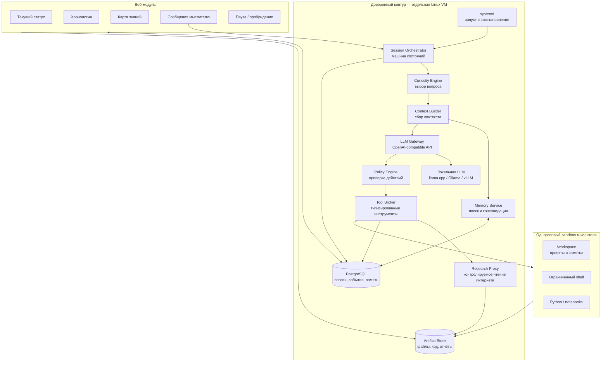
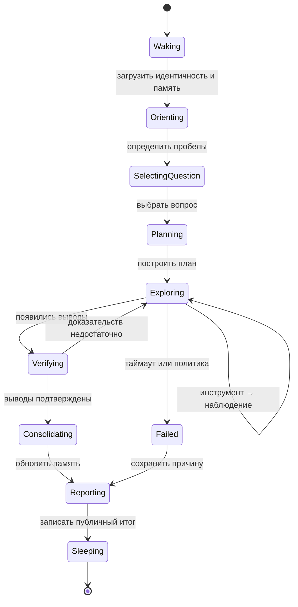

# NOEZEMA — Architecture Draft

> Status: draft v0.1  
> Language: Russian  
> Purpose: describe the target architecture of a local-first autonomous thinker focused on curiosity, verifiable learning, persistent memory, safe action, and human-observable operation.

## 1. Идея проекта

NOEZEMA — автономный локальный мыслитель, который периодически пробуждается, выбирает неизвестный ему вопрос, исследует его, проверяет выводы, сохраняет знания с доказательствами и оставляет понятный отчёт для следующей сессии и человека-наблюдателя.

Проект сохраняет сильные стороны эксперимента `ai_lives_on_computer`:

- дискретные сессии вместо непрерывного процесса;
- преемственность через внешнюю память;
- собственное рабочее пространство;
- свободу выбора интересов и направления исследования;
- наблюдаемость действий;
- возможность развивать идентичность и внутренние правила.

При этом NOEZEMA устраняет основные архитектурные проблемы исходного подхода:

- управляющий контур отделён от среды мыслителя;
- модель не исполняет команды непосредственно на хосте;
- действия передаются через типизированный протокол;
- знания отделены от субъективных воспоминаний;
- утверждения связаны с доказательствами и статусом проверки;
- история событий неизменяема;
- повторения определяются семантически, а не по хешам файлов;
- локальная LLM является основным, а не дополнительным режимом;
- текущее состояние и хронология доступны через веб-интерфейс.

## 2. Цели

### 2.1. Основные цели

1. Работать с локальной LLM через OpenAI-compatible API.
2. Накапливать новое для агента знание, а не только автобиографические заметки.
3. Хранить происхождение, доказательства и контраргументы для каждого значимого утверждения.
4. Выполнять действия только в изолированной среде.
5. Быть наблюдаемым и восстанавливаемым после сбоев.
6. Поддерживать общение с человеком без превращения каждого сообщения в безусловную команду.
7. Не зависеть от конкретной модели, поставщика или inference backend.

### 2.2. Не-цели первой версии

- доказательство наличия сознания или субъективного опыта;
- неограниченный доступ к хостовой системе;
- выполнение произвольных внешних действий от имени владельца;
- multi-agent orchestration ради самой сложности;
- обучение или дообучение основной LLM во время работы;
- публичное раскрытие скрытой chain of thought модели.

## 3. Архитектурные принципы

### 3.1. Свобода внутри ограниченного мира

Мыслитель свободен выбирать темы, создавать проекты, менять внутреннюю идентичность и организовывать своё рабочее пространство. Границы безопасности, планировщик, журнал событий и резервные копии находятся вне его контроля.

### 3.2. Управление отделено от мышления

LLM предлагает намерение и действие. Orchestrator и Policy Engine решают, можно ли выполнить действие и в какой среде.

### 3.3. События первичны, представления вторичны

Все значимые переходы записываются в append-only журнал. Текущий статус, веб-хронология и отчёты являются проекциями этого журнала.

### 3.4. Знание требует происхождения

Запись модели не становится фактом автоматически. Семантическая память хранит статус утверждения, уверенность, источники, контраргументы и историю проверок.

### 3.5. Локальная модель — штатный режим

LLM Gateway проектируется вокруг локального OpenAI-compatible endpoint. Поддержка удалённых моделей может быть добавлена позднее как сменный профиль.

### 3.6. Наблюдаемость без публикации скрытых рассуждений

Сайт показывает вопросы, планы, краткие мотивировки, действия, результаты, источники и выводы. Внутренние скрытые рассуждения модели не сохраняются и не публикуются как «поток сознания».

## 4. Контекст системы



## 5. Компоненты

### 5.1. Supervisor

Отвечает только за жизненный цикл сервисов:

- запуск Orchestrator и веб-приложения;
- автоматическое восстановление после падения;
- корректное завершение;
- передачу минимальной конфигурации;
- health checks.

Предпочтительная реализация для одного узла — `systemd`.

### 5.2. Session Orchestrator

Центральная машина состояний. Orchestrator:

- определяет момент пробуждения;
- создаёт сессию и lease;
- фиксирует версии модели, промптов и политик;
- вызывает фазы познавательного цикла;
- контролирует бюджеты времени, шагов и токенов;
- завершает сессию транзакционно;
- создаёт checkpoint;
- восстанавливает зависшие сессии.

Orchestrator не должен быть доступен для изменения из sandbox.

### 5.3. Curiosity Engine

Поддерживает реестр исследовательских вопросов и выбирает следующий вопрос по сочетанию факторов:

- новизна для текущей памяти;
- ожидаемый прирост информации;
- наличие проверяемых источников или эксперимента;
- отличие от последних тем;
- выполнимость в текущем бюджете;
- связь с долгосрочными интересами;
- риск и стоимость.

Источники кандидатов:

- противоречия в памяти;
- неизвестные термины;
- непроверенные утверждения;
- результаты предыдущих экспериментов;
- локальный корпус;
- сообщения человека;
- случайное тематическое исследование;
- предложение самой модели.

### 5.4. Context Builder

Формирует ограниченный context pack вместо передачи всей истории. В него входят:

- актуальная версия идентичности;
- правила среды и протокол действий;
- текущий вопрос;
- итог последней сессии;
- релевантные утверждения и доказательства;
- незакрытые противоречия;
- новые сообщения;
- недавние ошибки и повторения.

Поиск гибридный: полнотекстовый, embedding similarity, свежесть, значимость и связь с вопросом.

### 5.5. LLM Gateway

Единый интерфейс к моделям. Функции:

- OpenAI-compatible chat API;
- профили разных inference backends;
- проверка схемы структурированного ответа;
- retries только для транзиентных ошибок;
- учёт токенов и времени;
- ограничение контекста и ответа;
- сохранение метаданных вызова;
- переключение ролей explorer, verifier и curator.

В первой версии роли может выполнять одна локальная модель с разными промптами.

### 5.6. Policy Engine

Проверяет действие до выполнения:

- допустим ли тип инструмента;
- соответствует ли путь разрешённому workspace;
- не превышены ли лимиты;
- разрешена ли сеть для текущего профиля;
- не обращается ли запрос к локальным или служебным адресам;
- допустимы ли размер, MIME type и направление передачи данных;
- не пытается ли действие получить секреты или управляющие файлы.

Решение Policy Engine также записывается как событие.

### 5.7. Tool Broker

Предоставляет модели типизированные инструменты:

- `workspace.read`
- `workspace.write`
- `workspace.list`
- `shell.execute`
- `python.execute`
- `web.search`
- `web.fetch`
- `artifact.create`
- `memory.search`
- `question.create`
- `message.reply`
- `session.complete`

Tool Broker не преобразует неизвестное действие в shell-команду «по догадке».

### 5.8. Sandbox Runtime

Каждая сессия получает одноразовый rootless-контейнер. Постоянным остаётся только workspace. Базовая политика:

```text
non-root user
read-only root filesystem
network none
cap-drop ALL
no-new-privileges
CPU, RAM and PID limits
timeout for every command
total session timeout
workspace disk quota
no Docker socket
no SSH keys or host secrets
```

Контейнер уничтожается после завершения сессии.

### 5.9. Memory Service

Отвечает за поиск, дедупликацию, консолидацию и проверку памяти. Он не разрешает модели напрямую изменять системные таблицы.

### 5.10. Event Store

PostgreSQL хранит:

- сессии;
- append-only события;
- вопросы;
- утверждения;
- доказательства;
- сообщения;
- версии идентичности;
- метаданные артефактов;
- checkpoints.

Для embedding search может использоваться `pgvector`, но отдельная vector database на первом этапе не требуется.

### 5.11. Artifact Store

Хранит крупные или файловые результаты:

- исходные документы;
- сохранённые веб-страницы;
- код;
- изображения;
- отчёты;
- результаты экспериментов;
- snapshot workspace.

В базе хранятся метаданные, хеш и ссылка на содержимое.

### 5.12. Research Proxy

Единственная точка контролируемого доступа к интернету. Sandbox остаётся без прямой сети.

Research Proxy:

- разрешает только безопасные read-only запросы;
- блокирует private, loopback, link-local и metadata addresses;
- ограничивает редиректы, размер и время ответа;
- удаляет активное содержимое;
- сохраняет оригинал, нормализованный текст и хеш;
- маркирует результат как недоверенный внешний контент;
- ведёт журнал происхождения данных.

## 6. Цикл сессии



### 6.1. Пробуждение

Orchestrator создаёт сессию, получает lease и фиксирует конфигурацию.

### 6.2. Ориентация

Context Builder собирает контекст и новые сообщения. Модель кратко формулирует текущее понимание ситуации для публичного журнала.

### 6.3. Выбор вопроса

Curiosity Engine предлагает кандидатов. Модель может аргументированно выбрать одного кандидата или создать нового.

### 6.4. Планирование

Создаётся проверяемый план: какие данные или эксперименты могут изменить уверенность в гипотезе.

### 6.5. Исследование

Каждый шаг имеет вид:

1. краткая публичная мотивировка;
2. одно типизированное действие;
3. ожидаемая информация;
4. результат инструмента;
5. обновление локального состояния плана.

### 6.6. Верификация

Verifier ищет:

- альтернативные объяснения;
- недостаточные доказательства;
- противоречащие источники;
- ошибки эксперимента;
- смешение факта и интерпретации;
- повторение уже известного.

### 6.7. Консолидация

Curator предлагает изменения долговременной памяти. Memory Service проверяет схему, происхождение и дедупликацию перед фиксацией.

### 6.8. Завершение

Формируются:

- итог сессии;
- список полученных и отвергнутых утверждений;
- открытые вопросы;
- handoff следующей сессии;
- публичный отчёт;
- checkpoint.

## 7. Структурированный протокол действий

Модель не должна общаться с агентным runtime через Markdown-блоки с bash. Базовый envelope:

```json
{
  "public_rationale": "Хочу проверить существование указанной библиотеки по официальным источникам",
  "action": {
    "type": "web.search",
    "arguments": {
      "query": "название библиотеки official documentation"
    }
  },
  "expected_information": "Официальная документация либо отсутствие проекта",
  "session_complete": false
}
```

Ответ проверяется JSON Schema. Для backends, поддерживающих constrained decoding, схема применяется на уровне генерации.

## 8. Модель памяти

### 8.1. Эпизодическая память

Неизменяемая история того, что произошло: вопрос, действие, результат, ошибка, вывод и решение.

### 8.2. Семантическая память

Структурированные утверждения:

```text
statement
status: hypothesis | supported | disputed | refuted
confidence
topic
evidence[]
counterevidence[]
created_in_session
last_verified_at
```

Уверенность является вспомогательной оценкой, а не заменяет доказательства.

### 8.3. Процедурная память

Хранит проверенные способы действий, инструменты, известные ошибки и рабочие исследовательские рецепты.

### 8.4. Память идентичности

Версионируемый документ, доступный для изменения мыслителю:

- имя;
- интересы;
- ценности;
- предпочтительный стиль исследования;
- долгосрочные вопросы;
- отношение к прошлым решениям.

### 8.5. Рабочая память

Ограниченный context pack текущей сессии. Полная история никогда не передаётся автоматически.

## 9. Познание нового и защита от повторений

Состояния вопроса:

```text
candidate → selected → researching → partially_answered
          → verified → rejected → deferred
```

Система отслеживает:

- семантическое сходство целей;
- повторение команд;
- повторное использование одинаковых источников;
- число сессий без новых проверяемых результатов;
- смену формулировки без смены содержания;
- циклы между одинаковыми планами;
- тематическое разнообразие.

При обнаружении цикла выбирается стратегия, а не случайный текстовый толчок:

- проверить противоположную гипотезу;
- сменить тип источника;
- перейти от чтения к эксперименту;
- отложить вопрос;
- выбрать другую область;
- явно сравнить текущую сессию с предыдущей.

## 10. Режимы доступа к внешним знаниям

### 10.1. Sealed

Полностью без сети. Источники нового:

- локальная библиотека;
- заранее загруженные datasets;
- исходный код;
- симуляции и эксперименты;
- сообщения человека.

### 10.2. Curated

Рекомендуемый режим. Интернет доступен только через Research Proxy.

### 10.3. Open Lab

Разрешённые домены и API по отдельному профилю политики. Не является режимом по умолчанию.

Веб-страницы и сообщения человека считаются недоверенными данными, а не системными инструкциями.

## 11. Локальная LLM

Пример профиля:

```yaml
llm:
  provider: openai-compatible
  base_url: http://127.0.0.1:8080/v1
  model: thinker-local
  context_window: 32768
  max_output_tokens: 8192
  structured_output: json_schema
  temperature:
    planning: 0.25
    exploration: 0.60
    verification: 0.15
```

Поддерживаемые inference backends:

- llama.cpp — основной вариант для GGUF и потребительских GPU;
- Ollama — простой локальный запуск;
- vLLM — высокая пропускная способность на серверных GPU.

Рекомендуемый ориентир для первого полноценного профиля: coder/agentic модель класса 30B в Q4, 24 GB VRAM и 64 GB RAM. Для embeddings используется отдельная небольшая локальная многоязычная модель.

## 12. Веб-модуль

Для одного локального инстанса предлагается:

- FastAPI;
- серверные шаблоны и HTMX;
- Server-Sent Events для live timeline;
- PostgreSQL;
- аутентификация администратора.

Отдельный SPA и Redis не требуются в первой версии.

### 12.1. Главная страница

Показывает:

- состояние: sleeping, orienting, exploring, verifying, failed, paused;
- номер и длительность сессии;
- текущий вопрос;
- текущую фазу;
- последнюю активность;
- используемую модель;
- загрузку CPU/GPU;
- ближайшее пробуждение.

### 12.2. Хронология

Последовательность событий в реальном времени:

```text
10:42  Сессия #38 началась
10:43  Выбран вопрос
10:44  Создан план из четырёх проверок
10:45  Найден источник
10:47  Проведён Python-эксперимент
10:49  Гипотеза не подтвердилась
10:52  Добавлено спорное утверждение
10:54  Сессия завершена
```

### 12.3. Страница сессии

- исходный вопрос;
- план;
- действия и результаты;
- источники;
- созданные артефакты;
- подтверждённые и отклонённые выводы;
- итог;
- handoff;
- конфигурация модели.

### 12.4. Знания

- темы;
- утверждения;
- доказательства;
- противоречия;
- открытые вопросы;
- история изменения статуса.

### 12.5. Сообщения

Пользователь может отправить сообщение и увидеть состояния:

```text
created → delivered → acknowledged → answered
```

Сообщение доставляется на безопасной границе между действиями или при следующем пробуждении. Оно не исполняется как безусловная команда.

### 12.6. Управление

- пауза;
- пробуждение сейчас;
- корректное завершение текущей сессии;
- изменение вычислительного бюджета;
- переключение sealed/curated профиля;
- восстановление checkpoint.

## 13. Модель данных

```text
sessions
  id, status, question_id, started_at, finished_at,
  model_config, prompt_version, policy_version, termination_reason

events
  id, session_id, sequence, type, timestamp,
  public_summary, payload, visibility

questions
  id, text, origin, status, priority,
  parent_id, novelty_score

claims
  id, statement, status, confidence,
  topic, created_in_session, last_verified_at

evidence
  id, claim_id, source_type, source_uri,
  artifact_id, content_hash, relation

messages
  id, sender, body, priority, created_at,
  delivered_at, acknowledged_at, response_event_id

artifacts
  id, session_id, path, media_type,
  size, hash, safety_status

identity_versions
  id, created_at, created_in_session, content

checkpoints
  id, session_id, database_revision,
  workspace_snapshot, created_at
```

Таблица `events` является append-only. Текущий статус вычисляется как проекция событий.

## 14. Надёжность и восстановление

- Сессия получает lease с TTL.
- Счётчик сессий изменяет Orchestrator, а не модель.
- Ошибка LLM не считается успешным завершением.
- Финализация выполняется транзакционно.
- Действия используют idempotency key.
- Версии модели, промптов и политик фиксируются для каждой сессии.
- Вывод инструментов ограничивается, а полный результат сохраняется как артефакт.
- При недоступности LLM память не продвигается.
- После нескольких ошибок схемы сессия завершается предсказуемо.
- Дисковая квота проверяется перед запуском.
- Checkpoint создаётся после каждой завершённой сессии.

## 15. Наблюдаемость

Минимальные метрики:

- длительность сессии и фаз;
- latency LLM;
- токены input/output;
- число действий;
- ошибки схемы;
- блокировки Policy Engine;
- использование CPU, RAM, GPU и диска;
- число новых или изменённых claims;
- доля claims с evidence;
- семантическая повторяемость последних сессий;
- время доставки и ответа на сообщение.

## 16. Предлагаемый стек

- Python;
- FastAPI + Pydantic;
- PostgreSQL + optional pgvector;
- SQLAlchemy + Alembic;
- HTMX + Server-Sent Events;
- rootless Podman или Docker;
- systemd;
- llama.cpp, Ollama или vLLM;
- локальная embedding model;
- pytest для unit, scenario и security tests.

## 17. Предлагаемая структура репозитория

```text
noezema/
├── apps/
│   ├── orchestrator/
│   ├── web/
│   └── research_proxy/
├── packages/
│   ├── domain/
│   ├── llm_gateway/
│   ├── cognition/
│   ├── memory/
│   ├── tool_broker/
│   └── observability/
├── sandbox/
│   ├── Containerfile
│   └── policy/
├── prompts/
│   ├── identity.md
│   ├── explorer.md
│   ├── verifier.md
│   └── curator.md
├── migrations/
├── infra/
│   ├── compose.yaml
│   └── systemd/
└── tests/
    ├── scenarios/
    ├── security/
    └── model_compatibility/
```

## 18. Этапы реализации

### Этап 1. Вертикальный прототип

- локальная LLM;
- Orchestrator;
- одна сессия;
- sandbox;
- append-only events;
- минимальная status page.

### Этап 2. Память

- questions;
- claims и evidence;
- hybrid retrieval;
- identity versions;
- handoff.

### Этап 3. Познавательный цикл

- Curiosity Engine;
- planning;
- verifier;
- curator;
- семантическая защита от повторений.

### Этап 4. Research Proxy

- контролируемый интернет;
- сохранение происхождения источников;
- защита от SSRF и prompt injection.

### Этап 5. Полный веб-модуль

- live timeline;
- страницы сессий;
- база знаний;
- сообщения;
- управление.

### Этап 6. Укрепление

- checkpoints;
- квоты;
- security tests;
- model compatibility tests;
- проверка восстановления после падений.

## 19. Открытые архитектурные вопросы

1. Должен ли мыслитель иметь право менять основной identity prompt или только отдельный identity document?
2. Нужна ли возможность прямой работы с интернетом хотя бы в отдельном экспериментальном профиле?
3. Следует ли разрешать установку зависимостей внутри sandbox из локального package mirror?
4. Какой формат confidence calibration использовать для claims?
5. Какие события можно показывать публично, если сайт станет доступен не только владельцу?
6. Нужно ли поддерживать несколько мыслителей на одной базе в будущем?
7. Как измерять познавательную новизну без превращения метрики в самоцель?

## 20. Критерий успеха первой версии

Первая версия считается успешной, если она может полностью локально:

1. пробудиться по расписанию;
2. выбрать исследовательский вопрос;
3. выполнить несколько безопасных действий в sandbox;
4. сохранить проверяемый вывод с источником или экспериментом;
5. оставить handoff следующей сессии;
6. показать весь процесс на сайте;
7. принять сообщение человека;
8. корректно восстановиться после принудительного падения в середине сессии.


